# HỆ THỐNG QUẢN TRỊ NỘI DUNG WEBSITE CIC

## Tài liệu giới thiệu chức năng dành cho lãnh đạo

> Tài liệu cung cấp bức tranh tổng thể về phạm vi quản trị, cách các bộ phận phối hợp và giá trị vận hành của hệ thống CMS. Nội dung tập trung vào nghiệp vụ, không phải hướng dẫn thao tác chi tiết.

| Thông tin tài liệu | Nội dung |
| --- | --- |
| Phạm vi | Hệ thống CMS/Admin quản trị Website CIC |
| Đối tượng sử dụng | Ban lãnh đạo, cán bộ quản lý và các bộ phận vận hành CMS |
| Quy mô chức năng | 28 chức năng thuộc 10 nhóm nghiệp vụ |
| Cơ sở đối chiếu | Danh sách chức năng chuẩn và các màn quản trị hiện có |
| Trạng thái tài liệu | Phiên bản hoàn chỉnh sau rà soát |

---

## 1. Tóm tắt điều hành

CMS là trung tâm quản trị giúp công ty chủ động vận hành Website và phối hợp công việc giữa các bộ phận Nội dung, Kinh doanh, Chăm sóc khách hàng và Quản trị hệ thống. Thay vì quản lý rời rạc, hệ thống kết nối toàn bộ quá trình từ tạo nội dung đến công bố, từ tiếp nhận nhu cầu đến phân công xử lý, đồng thời kiểm soát người dùng và lịch sử hoạt động.

### Phạm vi quản lý trong một trang

| Nhóm nghiệp vụ | Số chức năng | Nội dung quản lý trọng tâm | Kết quả chính |
| --- | ---: | --- | --- |
| Tổng quan | 1 | Chỉ số vận hành và công việc cần chú ý | Nắm tình hình nhanh, ưu tiên đúng việc |
| Quản lý nội dung | 5 | Tin tức, danh mục, trang nội dung, sự kiện, dự án | Nội dung Website được cập nhật có kiểm soát |
| Sản phẩm/Dịch vụ | 7 | Sản phẩm, dữ liệu phân loại, đầu mối kinh doanh, dịch vụ | Thông tin kinh doanh thống nhất và dễ tra cứu |
| Trình bày Website | 1 | Cấu trúc menu và điều hướng | Người xem tiếp cận nội dung thuận tiện |
| Media | 1 | Ảnh, video, tài liệu và album | Tài nguyên truyền thông được quản lý tập trung |
| Tương tác khách hàng | 5 | CTA, biểu mẫu, yêu cầu, email và liên hệ sản phẩm | Nhu cầu khách hàng được tiếp nhận và theo dõi |
| Người dùng & phân quyền | 2 | Tài khoản, vai trò và phạm vi làm việc | Đúng người, đúng quyền, đúng trách nhiệm |
| Cấu hình hệ thống | 4 | Thiết lập, ngôn ngữ, nhật ký và thùng rác | Vận hành ổn định, có khả năng kiểm soát và phục hồi |
| SEO | 1 | Thông tin hiển thị trên công cụ tìm kiếm | Tăng tính nhất quán và khả năng tiếp cận |
| Tiện ích CMS | 1 | Tìm kiếm trên toàn hệ thống | Rút ngắn thời gian tra cứu và điều hướng |
| **Tổng cộng** | **28** | **10 nhóm nghiệp vụ** | **Quản trị Website tập trung, minh bạch và chủ động** |

### Ba luồng vận hành cốt lõi

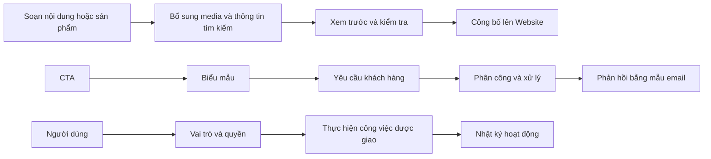
```mermaid
flowchart LR
    A[Soạn nội dung hoặc sản phẩm] --> B[Bổ sung media và thông tin tìm kiếm]
    B --> C[Xem trước và kiểm tra]
    C --> D[Công bố lên Website]

    E[CTA] --> F[Biểu mẫu]
    F --> G[Yêu cầu khách hàng]
    G --> H[Phân công và xử lý]
    H --> I[Phản hồi bằng mẫu email]

    J[Người dùng] --> K[Vai trò và quyền]
    K --> L[Thực hiện công việc được giao]
    L --> M[Nhật ký hoạt động]
```

## 2. CMS là gì?

CMS là hệ thống quản trị tập trung giúp công ty cập nhật nội dung Website, quản lý sản phẩm và dịch vụ, tiếp nhận yêu cầu khách hàng, phân quyền người sử dụng và kiểm soát hoạt động vận hành. Nhờ CMS, các phòng ban có thể chủ động quản lý thông tin theo trách nhiệm mà không cần thao tác kỹ thuật.

### Ai sử dụng CMS?

| Nhóm người dùng | Công việc điển hình |
| --- | --- |
| Ban lãnh đạo và quản lý | Theo dõi tình hình vận hành, nội dung và yêu cầu khách hàng |
| Bộ phận truyền thông/nội dung | Quản lý tin tức, trang nội dung, sự kiện, dự án và media |
| Bộ phận sản phẩm/kinh doanh | Quản lý sản phẩm, dịch vụ, đầu mối phụ trách và yêu cầu tư vấn |
| Bộ phận chăm sóc khách hàng | Tiếp nhận, phân công và theo dõi yêu cầu đến khi hoàn thành |
| Bộ phận quản trị hệ thống | Quản lý người dùng, quyền hạn, cấu hình và nhật ký hoạt động |

## 3. Danh mục chức năng CMS

Mỗi chức năng dưới đây được trình bày theo năm nội dung: **dùng để làm gì, quản lý được gì, tình huống thực tế, cách sử dụng cơ bản và kết quả mang lại**.

> **Quy ước hình ảnh:** Mỗi chức năng có một ảnh chụp màn hình tổng quan từ CMS hiện tại. Ảnh được chọn để thể hiện rõ nhất phạm vi quản lý chính; dữ liệu hiển thị trong ảnh mang tính minh họa và có thể thay đổi khi hệ thống được đưa vào vận hành chính thức.

---

### 3.1. Tổng quan

> Trung tâm theo dõi tình hình và điều phối các công việc cần ưu tiên.

#### Tổng quan

**Mục đích:** Cung cấp bức tranh nhanh về tình hình nội dung, yêu cầu khách hàng và các công việc cần chú ý trong CMS.

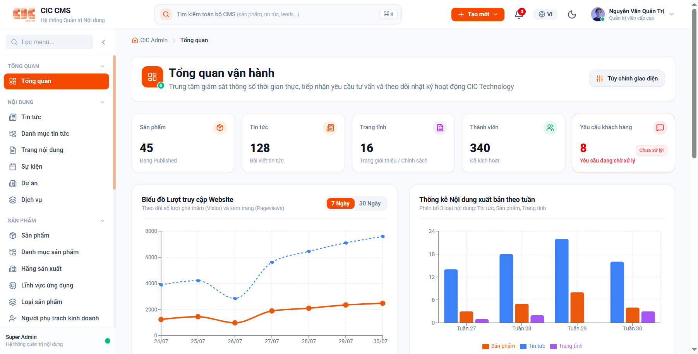

*Hình 1. Màn hình Tổng quan với các chỉ số và khu vực công việc cần chú ý.*

**Chức năng chính:**

- Theo dõi các chỉ số tổng hợp quan trọng.
- Xem nội dung đang chờ xử lý hoặc cần cập nhật.
- Nắm các liên hệ, đăng ký và hoạt động gần đây.
- Lọc số liệu theo khoảng thời gian và thay đổi thứ tự, ẩn/hiện các khu vực theo nhu cầu theo dõi.
- Đi nhanh tới các công việc ưu tiên.

**Ví dụ thực tế:** Lãnh đạo chọn khoảng thời gian “30 ngày gần nhất” để xem lượng nội dung mới và yêu cầu khách hàng; cán bộ vận hành chọn một bài đang chờ xử lý hoặc một yêu cầu chưa phân công để đi thẳng tới màn hình làm việc.

**Cách sử dụng:** Vào Tổng quan → xem số liệu và danh sách cần chú ý → chọn nội dung hoặc yêu cầu cần xử lý.

**Giá trị:** Giúp lãnh đạo và người vận hành nắm tình hình chung mà không phải mở từng phân hệ.

---

### 3.2. Quản lý nội dung

> Quản lý vòng đời nội dung từ chuẩn bị, kiểm tra đến công bố trên Website.

#### Tin tức

**Mục đích:** Quản lý toàn bộ bài viết truyền thông, tin doanh nghiệp và tin chuyên ngành đăng trên Website.

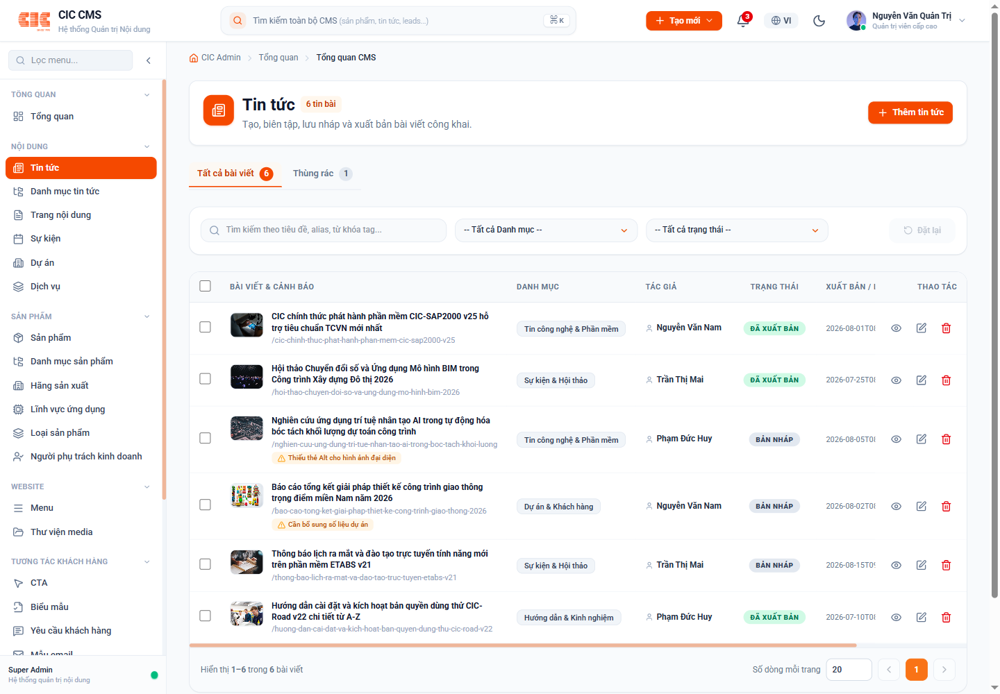

*Hình 2. Danh sách Tin tức và các công cụ theo dõi, tìm kiếm, quản lý trạng thái.*

**Chức năng chính:**

- Tạo, chỉnh sửa, xem trước và xuất bản bài viết.
- Quản lý ảnh đại diện, nội dung tóm tắt và thông tin tìm kiếm.
- Phân loại, tìm kiếm, lọc và theo dõi trạng thái bài viết.
- Đánh dấu tin nổi bật; xuất bản hoặc chuyển về bản nháp cho nhiều bài cùng lúc.
- Xem lịch sử thay đổi và các phiên bản nội dung.
- Chuyển bài vào thùng rác, phục hồi hoặc xóa vĩnh viễn khi cần.

**Ví dụ thực tế:** Khi đăng tin về một hội thảo, người biên tập chọn danh mục, nhập phần tóm tắt, nội dung chi tiết, ảnh đại diện và thông tin tìm kiếm; sau đó xem trước bài như trên Website rồi mới xuất bản. Nếu cần chỉnh nhiều bài cũ, có thể chọn đồng thời để chuyển về bản nháp.

**Cách sử dụng:** Vào Tin tức → tạo hoặc chọn bài viết → nhập nội dung và hình ảnh → xem trước → lưu hoặc xuất bản.

**Giá trị:** Giúp hoạt động truyền thông được cập nhật nhanh, thống nhất và có kiểm soát.

#### Danh mục tin tức

**Mục đích:** Tổ chức tin tức thành các nhóm rõ ràng để người đọc dễ tìm và bộ phận nội dung dễ quản lý.

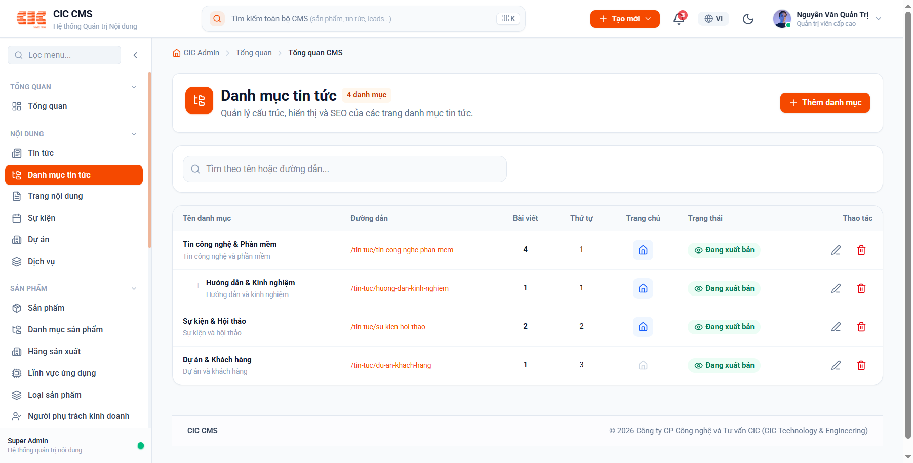

*Hình 3. Màn hình tổ chức và quản lý Danh mục tin tức.*

**Chức năng chính:**

- Tạo và chỉnh sửa danh mục.
- Sắp xếp danh mục theo cấp cha–con.
- Quản lý trạng thái, thứ tự và việc xuất hiện trên trang chủ.
- Thiết lập thông tin hỗ trợ tìm kiếm cho từng danh mục.
- Theo dõi số bài trong danh mục và xóa danh mục khi không còn ràng buộc sử dụng.

**Ví dụ thực tế:** Có thể tạo danh mục cha “Tin chuyên ngành”, bên dưới gồm “BIM”, “GIS” và “Chuyển đổi số”; đặt thứ tự hiển thị và chỉ xóa một danh mục sau khi đã kiểm tra các bài viết đang thuộc danh mục đó.

**Cách sử dụng:** Vào Danh mục tin tức → tạo hoặc chọn danh mục → khai báo tên, vị trí và trạng thái → lưu.

**Giá trị:** Tạo cấu trúc nội dung nhất quán và nâng cao khả năng tìm kiếm tin tức.

#### Trang nội dung

**Mục đích:** Quản lý nội dung của các trang có bố cục riêng như **Trang chủ, Giới thiệu, Cơ cấu tổ chức, Năng lực & Kinh nghiệm, Liên hệ**, đồng thời cho phép tạo thêm các trang thông tin đơn giản theo mẫu dùng chung của **Chính sách bảo mật** và **Điều khoản sử dụng**. Người quản trị cập nhật nội dung trong từng khu vực (section), còn bố cục tổng thể được hệ thống giữ cố định để không làm sai thiết kế Website.

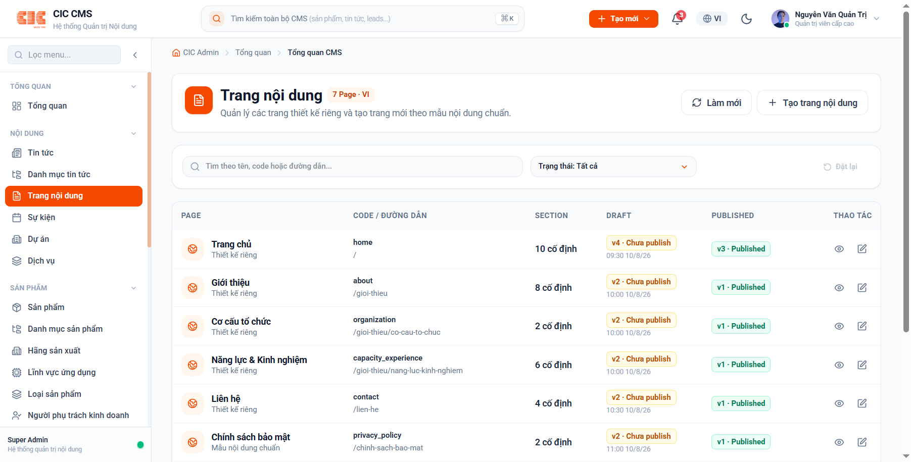

*Hình 4. Danh sách Trang nội dung cùng trạng thái và phiên bản quản lý.*

**Chức năng chính:**

- Quản lý các trang thiết kế riêng bằng danh sách section tương ứng với từng khu vực đang hiển thị trên Website.
- Vào từng section để sửa đúng loại nội dung của khu vực đó: tiêu đề, mô tả, ảnh, video, số liệu, CTA, biểu mẫu hoặc nội dung được lựa chọn từ chức năng khác.
- Với **Trang chủ**, có thể chỉnh riêng các khu vực như banner mở đầu, giới thiệu ngắn, số liệu nổi bật, hệ sinh thái sản phẩm–dịch vụ, dự án, sự kiện, tin tức, đối tác và khu vực tư vấn.
- Với nhóm **Giới thiệu**, có thể chỉnh các khu vực như tổng quan doanh nghiệp, tiến trình phát triển, tầm nhìn–sứ mệnh, thành tựu, đối tác, cơ cấu tổ chức và năng lực–kinh nghiệm.
- Tạo trang nội dung mới theo **mẫu nội dung chuẩn** giống Chính sách bảo mật và Điều khoản sử dụng; hệ thống tự tạo đường dẫn, còn người dùng nhập phần đầu trang và nội dung bài.
- Lưu thay đổi thành bản nháp, xem trước toàn trang trên máy tính, máy tính bảng hoặc điện thoại rồi mới công bố; nội dung Website hiện tại không bị thay đổi khi bản nháp chưa được công bố.
- Theo dõi rõ phiên bản bản nháp, phiên bản đã công bố và các trang còn thay đổi chưa xuất bản.

**Ví dụ thực tế:**

- Muốn đổi banner Trang chủ: mở **Trang chủ → section Hero** → thay tiêu đề, mô tả, ảnh nền hoặc CTA → xem trước → công bố.
- Muốn cập nhật lịch sử công ty: mở **Giới thiệu → section Tiến trình phát triển** → sửa hoặc bổ sung các mốc năm → xem trước → công bố.
- Muốn tạo trang “Quy chế hoạt động”: chọn **Tạo trang nội dung** → nhập tên trang → hệ thống tạo đường dẫn và một bản nháp theo layout Chính sách/Điều khoản → nhập tiêu đề và nội dung → xem trước → công bố.

**Cách sử dụng:** Vào Trang nội dung → chọn trang cần quản lý → chọn section ngay trên danh sách hoặc vùng xem trước → cập nhật đúng nội dung của section → lưu bản nháp → xem trước toàn trang → công bố khi đã kiểm tra.

**Giá trị:** Cho phép các bộ phận tự cập nhật từng khu vực quan trọng của Website và tạo thêm trang thông tin thông thường, nhưng vẫn giữ nguyên bố cục đã được thiết kế, giảm phụ thuộc vào nhân sự kỹ thuật và hạn chế rủi ro làm vỡ giao diện.

#### Sự kiện

**Mục đích:** Quản lý thông tin hội thảo, đào tạo, chương trình giới thiệu sản phẩm và các sự kiện của công ty.

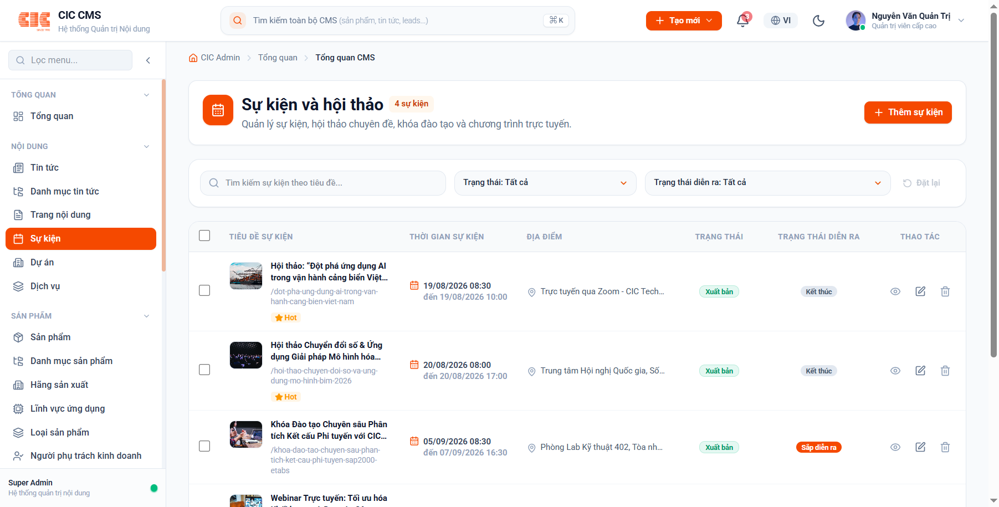

*Hình 5. Màn hình quản lý Sự kiện theo thời gian và trạng thái công bố.*

**Chức năng chính:**

- Tạo và cập nhật nội dung sự kiện.
- Quản lý thời gian, địa điểm và thông tin đăng ký.
- Theo dõi trạng thái sắp diễn ra, đang diễn ra hoặc đã kết thúc.
- Quản lý sự kiện, tin tức và sản phẩm liên quan; đánh dấu sự kiện nổi bật hoặc hiển thị trên trang chủ.
- Tìm kiếm, lọc, xem trước, xuất bản hoặc xóa một hay nhiều sự kiện.

**Ví dụ thực tế:** Khi chuẩn bị hội thảo BIM, cán bộ nội dung nhập thời gian bắt đầu–kết thúc, địa điểm, đường dẫn đăng ký, ảnh và nội dung chương trình; gắn các sản phẩm liên quan rồi đánh dấu nổi bật để sự kiện xuất hiện ở vị trí ưu tiên trên Website.

**Cách sử dụng:** Vào Sự kiện → tạo sự kiện → nhập nội dung, thời gian, địa điểm và thông tin đăng ký → xem trước → công bố.

**Giá trị:** Giúp thông tin sự kiện được truyền tải đầy đủ, đúng thời điểm và thuận tiện cho khách hàng đăng ký.

#### Dự án

**Mục đích:** Giới thiệu và quản lý hồ sơ các dự án tiêu biểu nhằm thể hiện năng lực và kinh nghiệm của công ty.

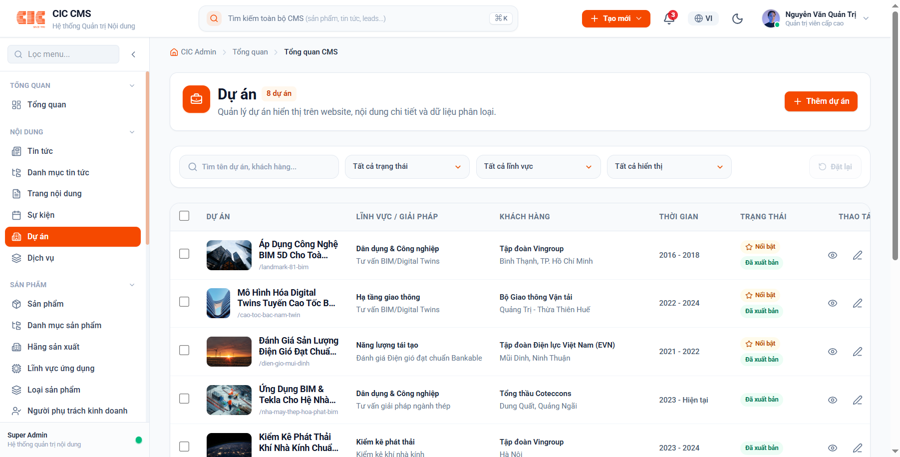

*Hình 6. Danh sách Dự án và các thông tin phục vụ quản lý hồ sơ năng lực.*

**Chức năng chính:**

- Quản lý mô tả, hình ảnh, tài liệu và thông tin dự án.
- Quản lý khách hàng, địa điểm, lĩnh vực, giải pháp, công nghệ và thời gian thực hiện.
- Gắn sản phẩm và dịch vụ liên quan.
- Đánh dấu dự án nổi bật và sắp xếp thứ tự hiển thị.
- Tìm kiếm, lưu nháp, xem trước, công bố hoặc xóa một hay nhiều dự án.

**Ví dụ thực tế:** Với một dự án triển khai GIS, người quản trị nhập khách hàng, địa điểm, thời gian thực hiện, giải pháp và công nghệ áp dụng; bổ sung thư viện ảnh, tài liệu, sản phẩm–dịch vụ liên quan rồi xem trước hồ sơ dự án trước khi công bố.

**Cách sử dụng:** Vào Dự án → tạo hoặc chỉnh sửa dự án → bổ sung nội dung và liên kết liên quan → xem trước → công bố.

**Giá trị:** Hệ thống hóa hồ sơ năng lực để hỗ trợ truyền thông, bán hàng và xây dựng uy tín doanh nghiệp.

---

### 3.3. Sản phẩm/Dịch vụ

> Chuẩn hóa thông tin kinh doanh và kết nối sản phẩm, dịch vụ với đúng nhóm khách hàng, nhu cầu và người phụ trách.

#### Sản phẩm

**Mục đích:** Quản lý tập trung danh mục sản phẩm, phần mềm và giải pháp mà công ty cung cấp.

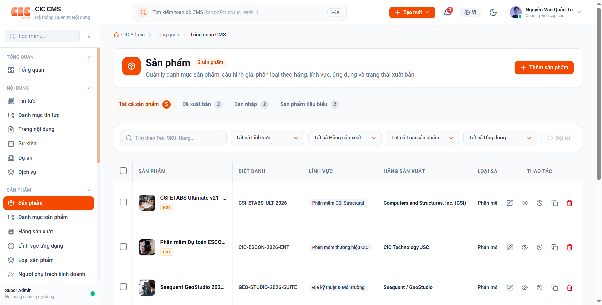

*Hình 7. Màn hình quản lý tập trung danh mục Sản phẩm.*

**Chức năng chính:**

- Tạo và cập nhật thông tin chi tiết sản phẩm.
- Phân loại theo danh mục, hãng, lĩnh vực ứng dụng và loại sản phẩm.
- Quản lý hình ảnh, video, tài liệu và nội dung tải xuống.
- Gắn người phụ trách và kiểm soát trạng thái hiển thị.
- Đánh dấu sản phẩm tiêu biểu; tìm kiếm và lọc theo nhiều tiêu chí phân loại.
- Xem trước, nhân bản và theo dõi hoạt động liên quan đến sản phẩm.
- Xuất bản, chuyển về bản nháp hoặc xóa nhiều sản phẩm cùng lúc.

**Ví dụ thực tế:** Khi bổ sung một phần mềm mới, bộ phận sản phẩm nhập tên/mã sản phẩm, mô tả, ảnh, video và tài liệu tải xuống; chọn hãng, danh mục, loại, lĩnh vực ứng dụng và người phụ trách. Sau khi xuất bản, khách hàng xem đúng thông tin sản phẩm và được chuyển tới đúng đầu mối tư vấn.

**Cách sử dụng:** Vào Sản phẩm → tạo hoặc chọn sản phẩm → nhập nội dung, phân loại, tài liệu và người phụ trách → xem trước → công bố.

**Giá trị:** Tạo một nguồn thông tin sản phẩm thống nhất cho truyền thông, tư vấn và bán hàng.

#### Danh mục sản phẩm

**Mục đích:** Sắp xếp sản phẩm thành hệ thống danh mục để phục vụ quản lý và tra cứu.

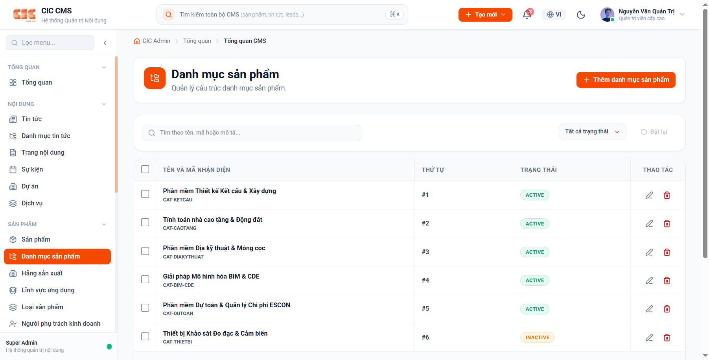

*Hình 8. Màn hình tổ chức Danh mục sản phẩm theo cấu trúc phân cấp.*

**Chức năng chính:**

- Tạo và chỉnh sửa danh mục sản phẩm.
- Xây dựng cấu trúc danh mục nhiều cấp.
- Sắp xếp thứ tự và kiểm soát trạng thái hiển thị.
- Xem số lượng và phạm vi sản phẩm đang sử dụng danh mục trước khi thay đổi hoặc ngừng sử dụng.

**Ví dụ thực tế:** Có thể tổ chức “Phần mềm” thành các nhánh “Thiết kế”, “Quản lý dự án” và “Mô phỏng”; trước khi đổi hoặc xóa một nhánh, người quản trị kiểm tra danh sách sản phẩm đang được phân loại tại đó.

**Cách sử dụng:** Vào Danh mục sản phẩm → tạo hoặc chọn danh mục → xác định cấp và thứ tự → lưu.

**Giá trị:** Giúp danh mục sản phẩm rõ ràng, hạn chế phân loại sai và hỗ trợ khách hàng tìm sản phẩm phù hợp.

#### Hãng sản xuất

**Mục đích:** Quản lý thông tin các hãng sản xuất, nhà phát triển hoặc đối tác gắn với sản phẩm.

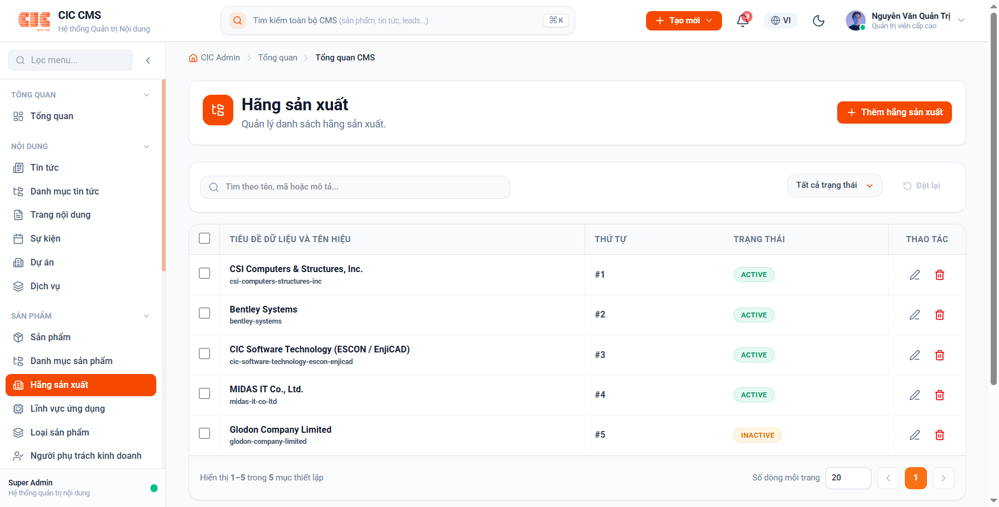

*Hình 9. Danh sách Hãng sản xuất và thông tin nhận diện liên quan.*

**Chức năng chính:**

- Tạo và cập nhật hồ sơ hãng.
- Quản lý tên, nhận diện, quốc gia và Website của hãng.
- Kiểm soát trạng thái và vị trí hiển thị.
- Xem các sản phẩm đang sử dụng thông tin hãng.
- Tìm kiếm, sắp xếp và ngừng sử dụng một hoặc nhiều hãng khi cần.

**Ví dụ thực tế:** Khi thêm một đối tác phần mềm, người quản trị nhập tên hãng, logo, quốc gia và Website chính thức, sau đó bật trạng thái hiển thị và kiểm tra các sản phẩm đã gắn với hãng.

**Cách sử dụng:** Vào Hãng sản xuất → thêm hoặc chọn hãng → cập nhật thông tin và hình ảnh → lưu.

**Giá trị:** Bảo đảm thông tin đối tác nhất quán và tăng độ tin cậy cho danh mục sản phẩm.

#### Lĩnh vực ứng dụng

**Mục đích:** Phân nhóm sản phẩm theo ngành nghề hoặc nhu cầu ứng dụng thực tế.

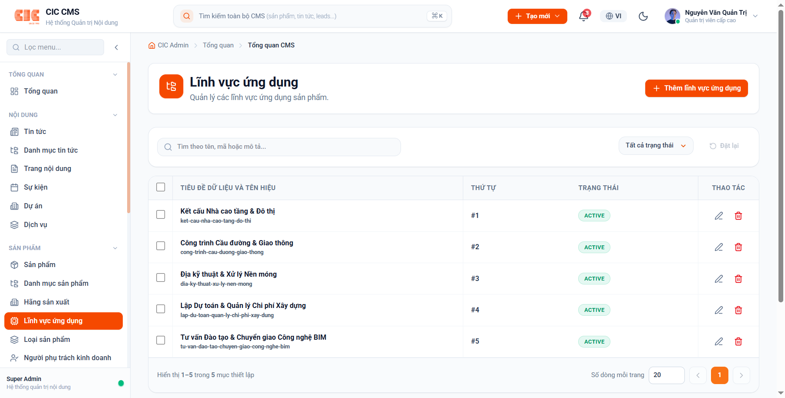

*Hình 10. Màn hình quản lý các Lĩnh vực ứng dụng của sản phẩm.*

**Chức năng chính:**

- Tạo và chỉnh sửa lĩnh vực ứng dụng.
- Quản lý tên, biểu tượng, màu nhận diện và trạng thái.
- Dùng lĩnh vực để phân loại các sản phẩm liên quan và xem phạm vi đang sử dụng.
- Hỗ trợ lọc và trình bày danh mục sản phẩm.

**Ví dụ thực tế:** Tạo lĩnh vực “Xây dựng và hạ tầng”, chọn biểu tượng và màu nhận diện rồi gắn các sản phẩm phù hợp; khách hàng có thể dùng lĩnh vực này để thu hẹp danh sách sản phẩm theo nhu cầu thực tế.

**Cách sử dụng:** Vào Lĩnh vực ứng dụng → tạo hoặc chọn lĩnh vực → cập nhật thông tin hiển thị → lưu và sử dụng khi phân loại sản phẩm.

**Giá trị:** Giúp khách hàng tiếp cận sản phẩm theo đúng bài toán và ngành nghề quan tâm.

#### Loại sản phẩm

**Mục đích:** Chuẩn hóa cách phân biệt các nhóm sản phẩm theo đặc điểm cung cấp hoặc hình thức sử dụng.

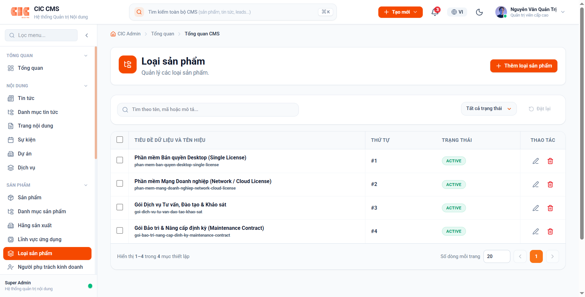

*Hình 11. Danh sách Loại sản phẩm dùng cho phân loại và tra cứu.*

**Chức năng chính:**

- Tạo và chỉnh sửa loại sản phẩm.
- Quản lý tên, biểu tượng và trạng thái.
- Sử dụng loại sản phẩm trong phân loại và bộ lọc.
- Theo dõi các sản phẩm đang thuộc từng loại.
- Tìm kiếm, sắp xếp và kiểm soát trạng thái sử dụng.

**Ví dụ thực tế:** Tạo loại “Phần mềm bản quyền” hoặc “Thiết bị”, gắn cho các sản phẩm tương ứng và dùng loại này trong bộ lọc quản trị cũng như cách trình bày trên Website.

**Cách sử dụng:** Vào Loại sản phẩm → thêm hoặc chỉnh sửa loại → cập nhật thông tin → lưu và gán cho sản phẩm.

**Giá trị:** Giúp dữ liệu sản phẩm được chuẩn hóa và thuận tiện cho việc thống kê, tìm kiếm.

#### Người phụ trách kinh doanh

**Mục đích:** Quản lý đầu mối chịu trách nhiệm tư vấn, kinh doanh và hỗ trợ đối với từng nhóm sản phẩm.

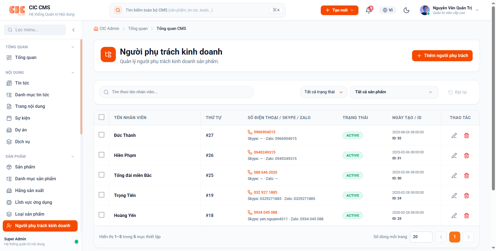

*Hình 12. Màn hình quản lý đầu mối kinh doanh và phạm vi sản phẩm phụ trách.*

**Chức năng chính:**

- Quản lý thông tin liên hệ của nhân sự phụ trách.
- Xác định vai trò tư vấn, kinh doanh hoặc hỗ trợ kỹ thuật.
- Gắn người phụ trách với sản phẩm và khu vực phù hợp.
- Kiểm soát trạng thái hiển thị thông tin liên hệ.
- Tìm kiếm, sắp xếp và xem phạm vi sản phẩm đang được mỗi người phụ trách.

**Ví dụ thực tế:** Một nhân sự có thể được gắn vai trò tư vấn chung, kinh doanh miền Bắc cho nhóm sản phẩm A và hỗ trợ kỹ thuật cho nhóm sản phẩm B; khi khách hàng gửi yêu cầu từ sản phẩm, hệ thống có cơ sở xác định đúng đầu mối liên hệ.

**Cách sử dụng:** Vào Người phụ trách kinh doanh → thêm hoặc chọn nhân sự → cập nhật thông tin liên hệ và phạm vi sản phẩm → lưu.

**Giá trị:** Giúp yêu cầu của khách hàng được chuyển đúng đầu mối và rút ngắn thời gian phản hồi.

#### Dịch vụ

**Mục đích:** Quản lý các dịch vụ tư vấn, triển khai và hỗ trợ mà công ty cung cấp.

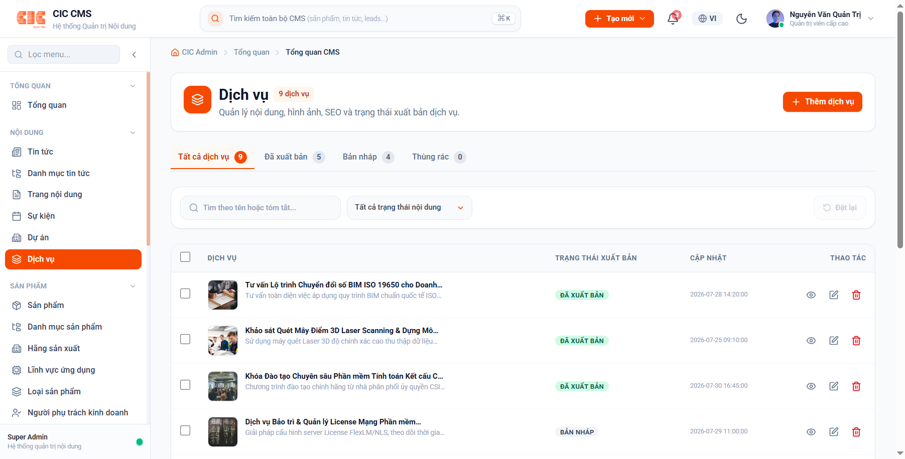

*Hình 13. Danh sách Dịch vụ và trạng thái nội dung trên Website.*

**Chức năng chính:**

- Tạo và chỉnh sửa nội dung dịch vụ.
- Quản lý hình ảnh, mô tả và thông tin hỗ trợ tìm kiếm.
- Gắn các sản phẩm liên quan tới dịch vụ.
- Xem các yêu cầu liên hệ liên quan và những vị trí đang sử dụng dịch vụ.
- Theo dõi lịch sử phiên bản và hoạt động chỉnh sửa.
- Tìm kiếm, lọc, lưu nháp, xem trước, công bố hoặc chuyển dịch vụ vào thùng rác.

**Ví dụ thực tế:** Với dịch vụ “Tư vấn BIM”, người quản trị nhập nội dung giới thiệu, hình ảnh và thông tin tìm kiếm, sau đó gắn các phần mềm BIM liên quan. Trước khi công bố có thể xem dịch vụ đang được sử dụng ở đâu và những yêu cầu khách hàng nào liên quan.

**Cách sử dụng:** Vào Dịch vụ → tạo hoặc chọn dịch vụ → cập nhật nội dung và sản phẩm liên quan → xem trước → công bố.

**Giá trị:** Giúp công ty trình bày rõ năng lực phục vụ và kết nối dịch vụ với giải pháp phù hợp.

---

### 3.4. Trình bày Website

> Kiểm soát cách người xem di chuyển và tiếp cận các khu vực nội dung chính.

#### Menu

**Mục đích:** Quản lý hệ thống điều hướng để người xem dễ tiếp cận các khu vực và nội dung trên Website.

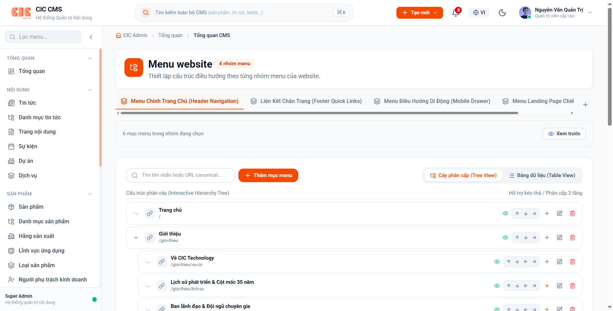

*Hình 14. Màn hình quản lý cấu trúc Menu và thứ tự điều hướng Website.*

**Chức năng chính:**

- Quản lý các nhóm menu theo vị trí sử dụng.
- Tạo cấu trúc menu nhiều cấp.
- Cập nhật tên, liên kết, cách mở, biểu tượng, thứ tự và trạng thái hiển thị.
- Di chuyển mục lên/xuống hoặc thay đổi cấp cha–con trong cây menu.
- Xem trước cấu trúc menu trước khi áp dụng.

**Ví dụ thực tế:** Trong nhóm menu đầu trang, người quản trị tạo mục cha “Sản phẩm”, thêm các danh mục con, kéo chúng về đúng thứ tự và chọn mở liên kết trong cùng trang hoặc tab mới; vùng xem trước giúp kiểm tra cây điều hướng trước khi lưu.

**Cách sử dụng:** Vào Menu → chọn nhóm menu → thêm, sửa hoặc sắp xếp mục menu → xem trước → lưu.

**Giá trị:** Bảo đảm Website có cấu trúc điều hướng rõ ràng và có thể thay đổi theo nhu cầu truyền thông.

---

### 3.5. Media

> Tạo kho tài nguyên dùng chung, giảm trùng lặp và bảo đảm hình ảnh doanh nghiệp nhất quán.

#### Thư viện media

**Mục đích:** Lưu trữ và tổ chức tập trung hình ảnh, video và tài liệu dùng trong CMS.

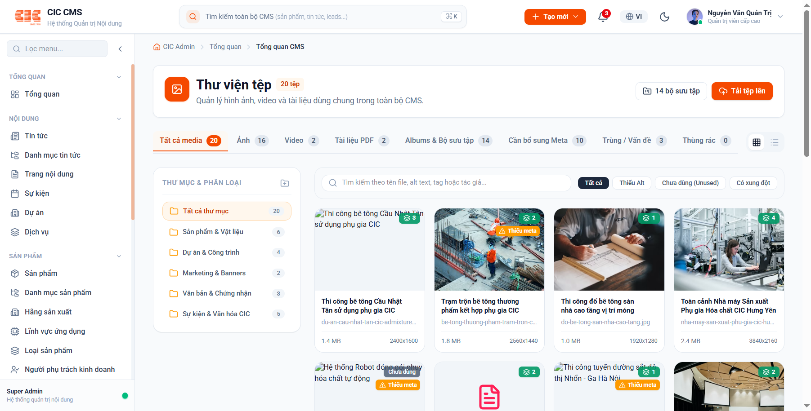

*Hình 15. Thư viện media với khu vực thư mục, bộ lọc và danh sách tài nguyên.*

**Chức năng chính:**

- Tải lên, tìm kiếm và phân loại tệp media.
- Tổ chức tệp theo thư mục và album.
- Quản lý tiêu đề, mô tả, nội dung thay thế và thông tin bản quyền.
- Theo dõi nơi sử dụng và lịch sử thay thế tệp.
- Phát hiện tệp thiếu thông tin, trùng lặp hoặc không còn sử dụng.
- Thay thế tệp đang dùng mà vẫn giữ liên kết hiện có; chuyển tệp vào thùng rác khi không còn cần thiết.

**Ví dụ thực tế:** Khi logo đối tác thay đổi, người quản trị mở đúng tài nguyên và dùng chức năng thay thế để cập nhật file mới cho mọi nơi đang sử dụng mà không phải sửa từng bài. Với ảnh mới tải lên, có thể bổ sung nội dung thay thế, bản quyền, thẻ và đưa vào album chiến dịch.

**Cách sử dụng:** Vào Thư viện media → tải lên hoặc chọn tệp → bổ sung thông tin và sắp xếp → sử dụng trong nội dung cần thiết.

**Giá trị:** Giảm thất lạc và trùng lặp tài nguyên, đồng thời nâng cao tính nhất quán của hình ảnh doanh nghiệp.

---

### 3.6. Tương tác khách hàng

> Kết nối các điểm thu hút khách hàng với quy trình tiếp nhận, phân công, theo dõi và phản hồi.

#### CTA

**Mục đích:** Quản lý các lời kêu gọi khách hàng thực hiện hành động như đăng ký tư vấn, tải tài liệu hoặc liên hệ.

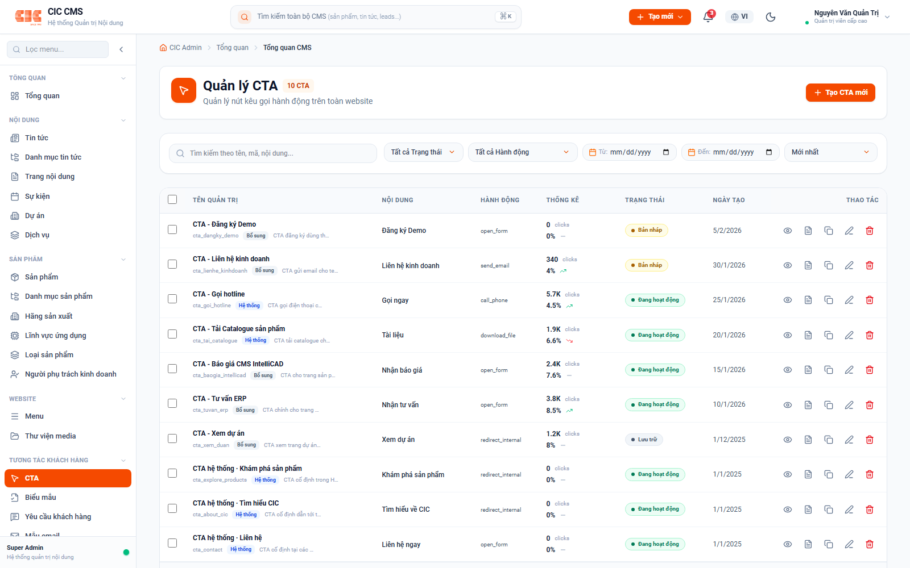

*Hình 16. Màn hình quản lý CTA và các trạng thái sử dụng.*

**Chức năng chính:**

- Tạo và chỉnh sửa nội dung CTA.
- Chọn hình thức hiển thị và hành động khi khách hàng chọn CTA.
- Liên kết CTA với biểu mẫu, tài liệu hoặc kênh liên hệ.
- Xem trước và kiểm tra các vị trí đang sử dụng.
- Tìm kiếm, lọc, nhân bản và quản lý trạng thái hoạt động, bản nháp, lưu trữ hoặc thùng rác.

**Ví dụ thực tế:** Tạo CTA “Đăng ký tư vấn” để mở một biểu mẫu, CTA “Tải hồ sơ năng lực” để cung cấp tài liệu hoặc CTA “Gọi ngay” để mở kênh liên hệ. Một CTA có thể được tái sử dụng tại nhiều trang và người quản trị kiểm tra được các vị trí đang dùng trước khi sửa.

**Cách sử dụng:** Vào CTA → tạo CTA → nhập nội dung và chọn hành động → xem trước → công bố và gắn vào vị trí cần dùng.

**Giá trị:** Chuẩn hóa điểm chuyển đổi và giúp các chiến dịch sử dụng lời kêu gọi nhất quán.

#### Biểu mẫu

**Mục đích:** Tạo các biểu mẫu thu thập thông tin khách hàng cho nhiều nhu cầu khác nhau.

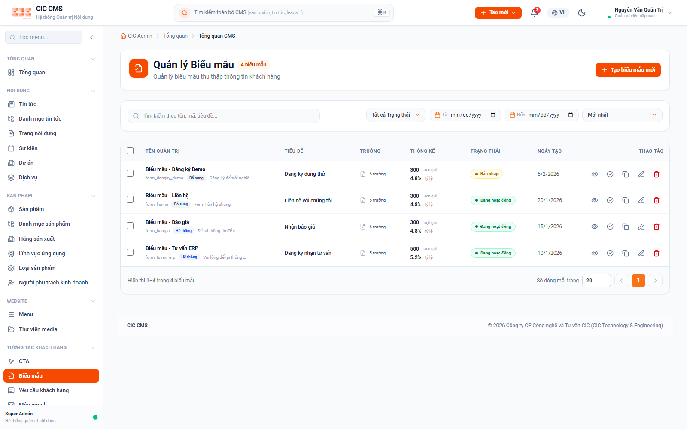

*Hình 17. Danh sách Biểu mẫu phục vụ các nhu cầu thu thập thông tin.*

**Chức năng chính:**

- Tạo biểu mẫu và sắp xếp các trường thông tin.
- Thiết lập nội dung bắt buộc và quy tắc nhập liệu.
- Cấu hình lưu yêu cầu khách hàng, thông báo cho bộ phận phụ trách và email xác nhận cho khách hàng.
- Xem trước biểu mẫu và theo dõi các lượt gửi.
- Tìm kiếm, lọc, nhân bản và quản lý trạng thái hoạt động, bản nháp, lưu trữ hoặc thùng rác.

**Ví dụ thực tế:** Với biểu mẫu “Yêu cầu báo giá”, người quản trị thêm các trường Họ tên, Công ty, Email, Điện thoại, Sản phẩm quan tâm và Nội dung yêu cầu; quy định trường bắt buộc, chọn mẫu email xác nhận rồi công bố để CTA trên trang sản phẩm sử dụng.

Khi khách gửi biểu mẫu từ một sản phẩm cụ thể, lượt gửi có thể lưu nguồn là **Sản phẩm** cùng mã sản phẩm và đường dẫn phát sinh. Nhờ đó, bộ phận tiếp nhận biết khách đang quan tâm sản phẩm nào thay vì chỉ nhận một nội dung liên hệ chung.

**Cách sử dụng:** Vào Biểu mẫu → tạo biểu mẫu → thêm và sắp xếp trường thông tin → thiết lập cách tiếp nhận và thông báo → xem trước → công bố để CTA hoặc trang nội dung sử dụng.

**Giá trị:** Giúp công ty thu thập dữ liệu khách hàng có cấu trúc và phù hợp với từng mục tiêu kinh doanh.

#### Yêu cầu khách hàng

**Mục đích:** Quản lý tập trung quá trình tiếp nhận và xử lý nhu cầu của khách hàng từ nhiều nguồn.

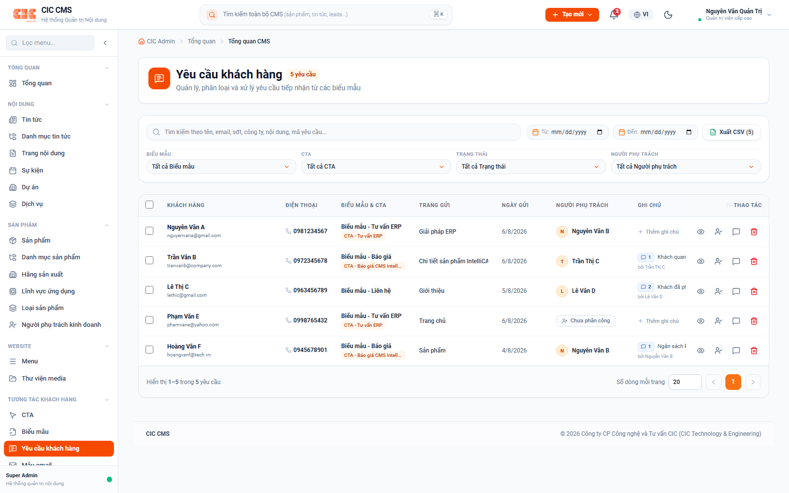

*Hình 18. Màn hình tổng hợp Yêu cầu khách hàng với bộ lọc và trạng thái xử lý.*

**Chức năng chính:**

- Lọc yêu cầu theo trạng thái, mức ưu tiên và nguồn tiếp nhận.
- Xem đầy đủ thông tin và nội dung khách hàng gửi.
- Phân công hoặc đổi người phụ trách; cập nhật trạng thái và mức ưu tiên.
- Ghi chú, gắn thẻ và theo dõi lịch sử xử lý.
- Xử lý một hoặc nhiều yêu cầu cùng lúc và chuyển yêu cầu không còn sử dụng vào thùng rác.
- Xuất danh sách phục vụ báo cáo hoặc phối hợp công việc.

**Ví dụ thực tế:** Một yêu cầu gửi từ biểu mẫu tư vấn sản phẩm được tiếp nhận với nguồn phát sinh rõ ràng; trưởng nhóm đặt mức ưu tiên “Cao”, giao cho nhân viên kinh doanh phụ trách và thêm ghi chú. Nhân viên cập nhật trạng thái từ “Mới” → “Đang xử lý” → “Hoàn thành”, toàn bộ diễn biến được giữ trong lịch sử.

**Cách sử dụng:** Vào Yêu cầu khách hàng → chọn yêu cầu → kiểm tra thông tin → phân công → cập nhật trạng thái và ghi chú đến khi hoàn thành.

**Giá trị:** Hạn chế bỏ sót khách hàng tiềm năng và tạo quy trình phối hợp rõ ràng giữa các bộ phận.

#### Mẫu email

**Mục đích:** Chuẩn hóa nội dung email gửi cho khách hàng hoặc nội bộ trong các tình huống nghiệp vụ thường gặp.

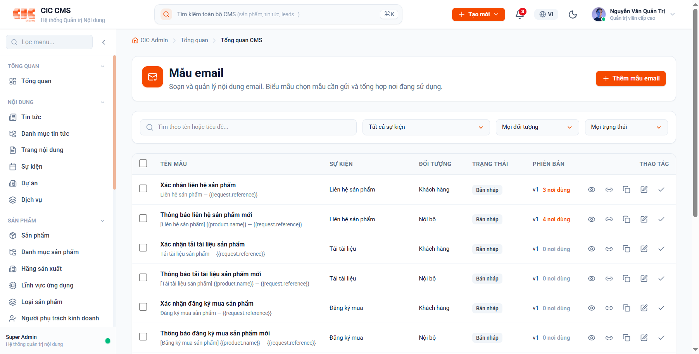

*Hình 19. Danh sách Mẫu email theo tình huống và trạng thái sử dụng.*

**Chức năng chính:**

- Tạo mẫu email theo từng sự kiện sử dụng.
- Quản lý tiêu đề, nội dung và đối tượng nhận.
- Chèn thông tin khách hàng, sản phẩm hoặc yêu cầu vào mẫu.
- Tìm kiếm và lọc theo sự kiện, đối tượng nhận hoặc trạng thái.
- Lưu bản nháp, xem trước bằng dữ liệu mẫu, nhân bản và công bố phiên bản sử dụng.
- Xem biểu mẫu, CTA và vị trí Website đang sử dụng từng mẫu email.

**Ví dụ thực tế:** Tạo mẫu “Xác nhận đã nhận yêu cầu tư vấn”, chèn các thông tin như tên khách hàng và sản phẩm quan tâm, xem trước bằng dữ liệu mẫu rồi công bố. Biểu mẫu phù hợp sẽ dùng mẫu này để gửi phản hồi thống nhất ngay sau khi khách đăng ký.

**Cách sử dụng:** Vào Mẫu email → tạo hoặc chọn mẫu → soạn nội dung và chọn tình huống sử dụng → xem trước → công bố.

**Giá trị:** Giúp phản hồi nhanh, đúng thông tin và đồng nhất hình ảnh giao tiếp của công ty.

#### Liên hệ & đăng ký sản phẩm

**Mục đích:** Tổng hợp các liên hệ chung, yêu cầu báo giá và đăng ký liên quan tới sản phẩm để bộ phận vận hành tiếp nhận.

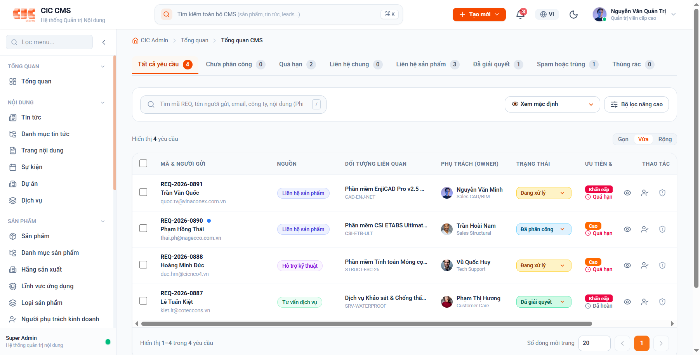

*Hình 20. Màn hình tiếp nhận Liên hệ và đăng ký sản phẩm.*

**Chức năng chính:**

- Phân loại yêu cầu theo nguồn và nội dung quan tâm.
- Lọc các yêu cầu chưa phân công, quá hạn hoặc đã giải quyết.
- Phân công đầu mối xử lý và cập nhật trạng thái.
- Đặt mức ưu tiên, thêm ghi chú nội bộ và theo dõi lịch sử xử lý.
- Nhận diện yêu cầu rác hoặc trùng lặp, đồng thời bảo vệ việc xem thông tin cá nhân nhạy cảm.
- Thực hiện phân công hoặc đổi trạng thái cho nhiều yêu cầu cùng lúc.

**Ví dụ thực tế:** Khách chọn “Đăng ký mua” ngay trên thẻ một sản phẩm ở trang danh sách. Khi yêu cầu xuất hiện trong CMS, cán bộ xử lý có thể thấy nguồn là đăng ký sản phẩm và sản phẩm khách đang xem, sau đó phân công cho đúng người phụ trách kinh doanh.

**Mối liên hệ với Yêu cầu khách hàng:** Đây là màn tiếp nhận chuyên biệt cho dữ liệu liên hệ và đăng ký sản phẩm hiện có. “Yêu cầu khách hàng” là góc nhìn quản lý hợp nhất nhiều nguồn; hai màn có phạm vi gần nhau nhưng phục vụ hai cách theo dõi khác nhau.

**Cách sử dụng:** Vào Liên hệ & đăng ký sản phẩm → chọn yêu cầu → kiểm tra nguồn và sản phẩm quan tâm → phân công → cập nhật kết quả xử lý.

**Giá trị:** Giúp các liên hệ phát sinh từ Website được tiếp nhận có hệ thống và chuyển đúng bộ phận.

---

### 3.7. Người dùng & phân quyền

> Bảo đảm mỗi nhân sự chỉ tiếp cận và thực hiện đúng công việc thuộc trách nhiệm được giao.

#### Người dùng

**Mục đích:** Quản lý những người được phép sử dụng CMS và thông tin tài khoản của họ.

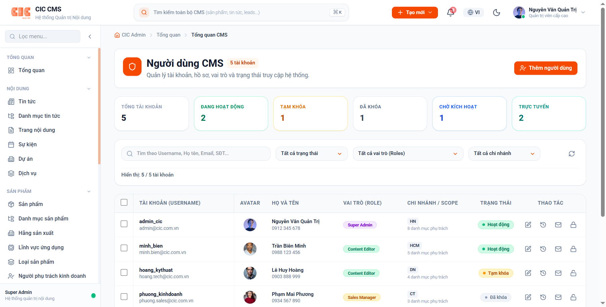

*Hình 21. Danh sách Người dùng và trạng thái tài khoản CMS.*

**Chức năng chính:**

- Tạo và cập nhật hồ sơ người dùng.
- Kích hoạt, tạm khóa hoặc ngừng sử dụng tài khoản.
- Gán vai trò, xem quyền đang có hiệu lực và quản lý phạm vi phụ trách.
- Quản lý thông tin bảo mật, thay đổi mật khẩu và gửi yêu cầu đặt lại mật khẩu.
- Theo dõi lịch sử thay đổi trạng thái tài khoản.
- Tìm kiếm, lọc và thay đổi trạng thái cho nhiều tài khoản cùng lúc.

**Ví dụ thực tế:** Khi có nhân sự mới, quản trị viên tạo tài khoản, gán vai trò “Biên tập nội dung” và giới hạn phạm vi phù hợp. Khi nhân sự nghỉ việc, tài khoản được chuyển sang ngừng hoạt động mà không làm mất lịch sử công việc trước đó.

**Cách sử dụng:** Vào Người dùng → tạo hoặc chọn tài khoản → cập nhật hồ sơ, trạng thái và phạm vi → lưu.

**Giá trị:** Bảo đảm chỉ đúng nhân sự được truy cập và mỗi tài khoản có thông tin quản lý rõ ràng.

#### Vai trò & quyền

**Mục đích:** Quy định mỗi nhóm người dùng được xem và thực hiện những công việc nào trong CMS.

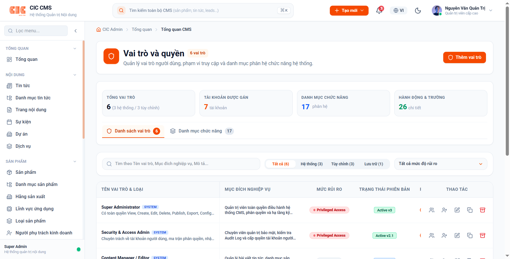

*Hình 22. Màn hình quản lý Vai trò, quyền hạn và phạm vi áp dụng.*

**Chức năng chính:**

- Tạo và quản lý vai trò theo trách nhiệm công việc.
- Thiết lập quyền xem, tạo, sửa, xóa, công bố, xuất dữ liệu hoặc cấu hình theo từng nhóm chức năng.
- Xác định phạm vi áp dụng của vai trò và lưu bản nháp trước khi kích hoạt.
- Gán hoặc thu hồi vai trò của người dùng; xem quyền thực tế mà người dùng nhận được.
- Nhân bản, thay thế hoặc lưu trữ vai trò khi tổ chức thay đổi.
- Quản lý danh mục chức năng được dùng làm cơ sở phân quyền.

**Ví dụ thực tế:** Vai trò “Biên tập viên Tin tức” có thể được phép xem, tạo và sửa bài nhưng không được xuất bản hoặc thay đổi cấu hình hệ thống; vai trò “Trưởng phòng Truyền thông” được bổ sung quyền công bố và xuất dữ liệu. Sau khi kiểm tra, vai trò mới được kích hoạt và gán cho người dùng.

**Cách sử dụng:** Vào Vai trò & quyền → chọn vai trò → xác định phạm vi và quyền → kiểm tra → áp dụng cho người dùng phù hợp.

**Giá trị:** Giảm rủi ro truy cập sai thẩm quyền và hỗ trợ phân công trách nhiệm minh bạch.

---

### 3.8. Cấu hình hệ thống

> Duy trì các thiết lập dùng chung, khả năng truy vết và cơ chế phục hồi an toàn.

#### Cấu hình hệ thống

**Mục đích:** Quản lý các thiết lập dùng chung ảnh hưởng đến cách CMS và Website vận hành.

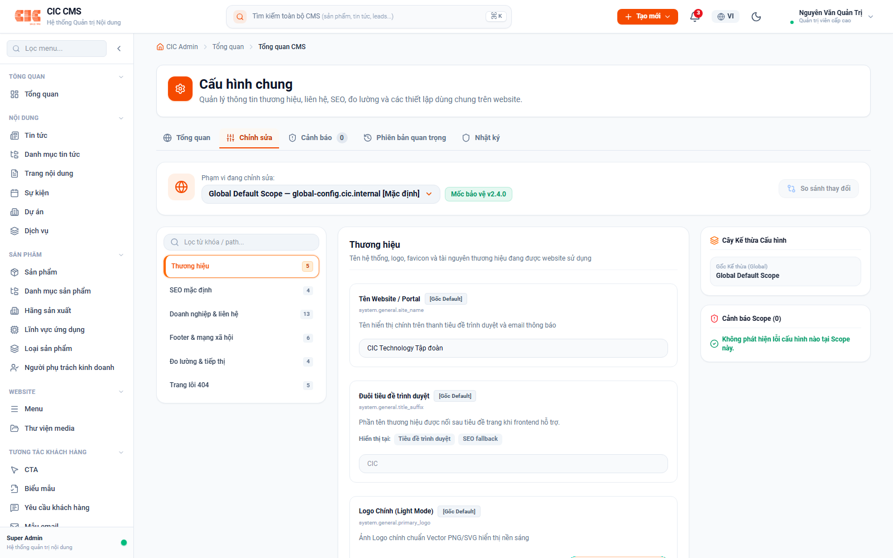

*Hình 23. Khu vực Cấu hình hệ thống theo các nhóm thiết lập vận hành.*

**Chức năng chính:**

- Xem và chỉnh sửa cấu hình theo từng nhóm nghiệp vụ.
- Phân biệt thiết lập dùng chung và thiết lập theo ngôn ngữ.
- Kiểm tra thay đổi trước khi áp dụng.
- Theo dõi lịch sử và so sánh các lần thay đổi.

**Ví dụ thực tế:** Quản trị viên chọn nhóm thông tin liên hệ doanh nghiệp để cập nhật số điện thoại hoặc email dùng chung; trước khi áp dụng có thể kiểm tra giá trị cũ–mới và phạm vi ảnh hưởng, thay vì sửa rải rác tại nhiều màn hình.

**Cách sử dụng:** Vào Cấu hình hệ thống → chọn nhóm thiết lập → cập nhật giá trị → kiểm tra → lưu và áp dụng.

**Giá trị:** Tập trung các thiết lập quan trọng tại một nơi và giảm sai lệch trong vận hành.

#### Ngôn ngữ giao diện

**Mục đích:** Quản lý các câu chữ dùng trên giao diện tiếng Việt và tiếng Anh của Website và CMS.

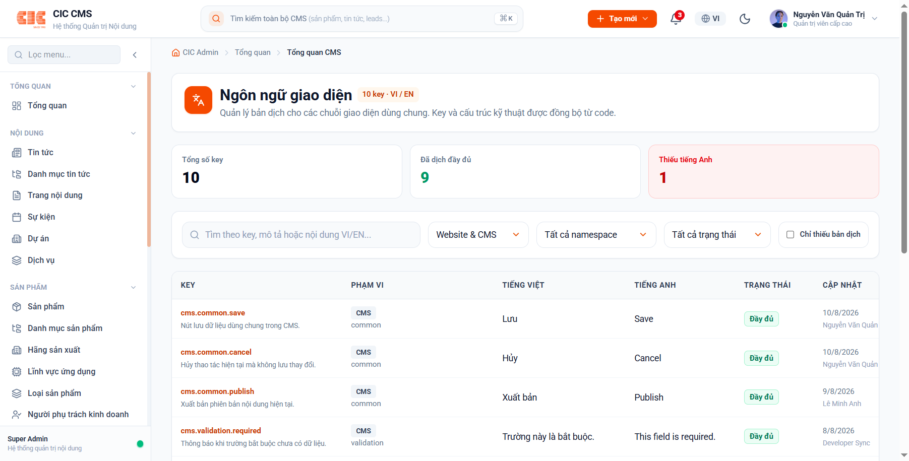

*Hình 24. Màn hình quản lý câu chữ giao diện theo phạm vi và ngôn ngữ.*

**Chức năng chính:**

- Tìm kiếm và chỉnh sửa chuỗi hiển thị.
- Quản lý nội dung theo Website/CMS, nhóm sử dụng và ngôn ngữ.
- Phát hiện nội dung còn thiếu hoặc chưa đồng nhất.
- Kiểm tra độ dài và các thông tin bắt buộc phải giữ nguyên trong bản dịch.

**Ví dụ thực tế:** Tìm khóa hiển thị của nút “Gửi yêu cầu”, cập nhật đồng thời câu tiếng Việt và tiếng Anh rồi lưu. Bộ lọc nội dung còn thiếu giúp phát hiện nhanh câu chữ chưa có bản dịch hoặc chưa thống nhất giữa Website và CMS.

**Cách sử dụng:** Vào Ngôn ngữ giao diện → chọn khu vực và ngôn ngữ → tìm câu chữ cần sửa → cập nhật → lưu.

**Giá trị:** Bảo đảm cách diễn đạt thống nhất và hỗ trợ vận hành Website đa ngôn ngữ.

#### Nhật ký hoạt động

**Mục đích:** Ghi nhận và tra cứu các hoạt động quản trị để biết ai đã thực hiện việc gì và vào thời điểm nào.

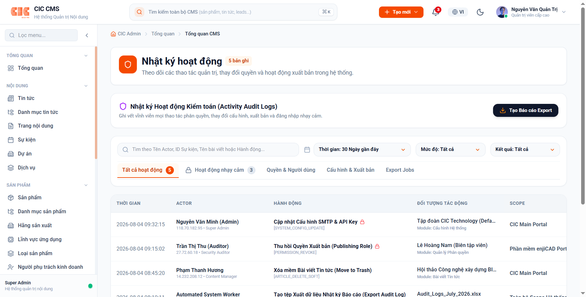

*Hình 25. Nhật ký hoạt động phục vụ theo dõi và truy vết thao tác quản trị.*

**Chức năng chính:**

- Lọc hoạt động theo người dùng, thời gian, chức năng và kết quả.
- Xem chi tiết nội dung thay đổi trước và sau thao tác.
- Theo dõi các hoạt động quan trọng hoặc nhạy cảm.
- Tạo và theo dõi yêu cầu xuất thông tin phục vụ kiểm tra, đối soát và báo cáo.

**Ví dụ thực tế:** Khi cần xác minh một bài viết bị thay đổi, quản trị viên lọc theo chức năng Tin tức và thời gian xảy ra, mở sự kiện để xem người thao tác, kết quả và nội dung trước–sau. Các hoạt động nhạy cảm như thay đổi quyền hoặc xóa dữ liệu có thể được rà soát riêng.

**Cách sử dụng:** Vào Nhật ký hoạt động → chọn điều kiện cần kiểm tra → mở sự kiện → xem người thực hiện, kết quả và nội dung thay đổi.

**Giá trị:** Tăng khả năng kiểm soát, truy vết trách nhiệm và hỗ trợ xử lý sự cố.

#### Thùng rác

**Mục đích:** Quản lý các nội dung đã xóa trước khi quyết định phục hồi hoặc loại bỏ vĩnh viễn.

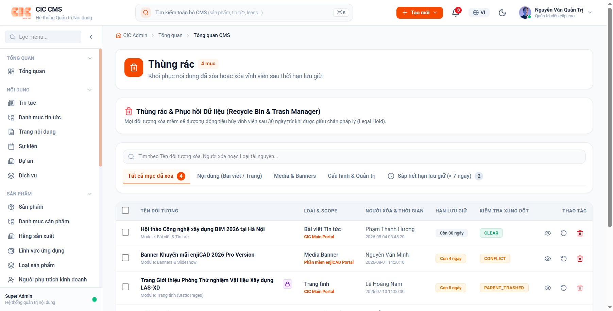

*Hình 26. Màn hình Thùng rác với các lựa chọn phục hồi hoặc xử lý nội dung đã xóa.*

**Chức năng chính:**

- Tìm và lọc nội dung đã xóa.
- Xem thông tin, thời điểm và người thực hiện xóa.
- Phục hồi nội dung và xử lý trường hợp bị trùng khi khôi phục.
- Xóa vĩnh viễn hoặc giữ lại nội dung cần bảo toàn.

**Ví dụ thực tế:** Một bài viết bị xóa nhầm có thể được tìm theo tên và phục hồi về trạng thái an toàn. Trước khi xóa vĩnh viễn một sản phẩm, người quản trị xem các liên kết phụ thuộc và chỉ tiếp tục khi đã xác nhận không ảnh hưởng tới dữ liệu liên quan.

**Cách sử dụng:** Vào Thùng rác → chọn nội dung đã xóa → kiểm tra ảnh hưởng → phục hồi hoặc xác nhận xóa vĩnh viễn.

**Giá trị:** Giảm rủi ro mất dữ liệu do thao tác nhầm và tăng kiểm soát đối với việc xóa nội dung.

---

### 3.9. SEO

> Kiểm soát cách các nhóm trang quan trọng được mô tả và tiếp cận qua công cụ tìm kiếm.

#### Cấu hình SEO chức năng

**Mục đích:** Quản lý cách các trang chức năng chính được mô tả và xuất hiện trên công cụ tìm kiếm.

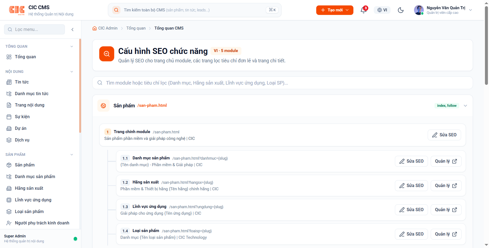

*Hình 27. Màn hình Cấu hình SEO theo từng nhóm trang chức năng.*

**Chức năng chính:**

- Cập nhật tiêu đề và mô tả tìm kiếm theo từng chức năng.
- Quản lý từ khóa định hướng nội dung.
- Cho phép hoặc hạn chế công cụ tìm kiếm lập chỉ mục.
- Quản lý riêng trang chính, trang lọc, trang danh mục và trang chi tiết khi chức năng có hỗ trợ.
- Chuyển nhanh tới nơi quản lý nội dung chi tiết để hoàn thiện thông tin tìm kiếm liên quan.

**Ví dụ thực tế:** Chọn chức năng “Sản phẩm” để cấu hình tiêu đề và mô tả tìm kiếm cho trang danh sách sản phẩm; quyết định trang có được lập chỉ mục hay không. SEO của từng sản phẩm cụ thể vẫn được cập nhật tại màn hình Sản phẩm để tránh nhầm giữa SEO cấp chức năng và SEO cấp nội dung.

**Cách sử dụng:** Vào Cấu hình SEO chức năng → chọn chức năng và cấp trang cần tối ưu → cập nhật tiêu đề, mô tả và chính sách lập chỉ mục → lưu.

**Giá trị:** Giúp Website có thông tin tìm kiếm nhất quán và hỗ trợ nâng cao khả năng tiếp cận khách hàng.

---

### 3.10. Tiện ích CMS

> Giúp người vận hành tìm đúng nội dung và đi tới đúng chức năng nhanh hơn.

#### Tìm kiếm toàn cục

**Mục đích:** Giúp người dùng tìm nhanh nội dung và chức năng trên toàn bộ CMS từ một điểm duy nhất.

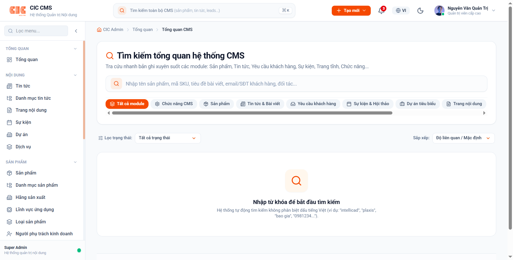

*Hình 28. Màn hình Tìm kiếm toàn cục trên nhiều nhóm dữ liệu CMS.*

**Chức năng chính:**

- Tìm theo từ khóa trên nhiều nhóm dữ liệu.
- Lọc kết quả theo chức năng CMS, sản phẩm, tin tức, yêu cầu khách hàng, sự kiện, dự án, trang nội dung, dịch vụ, biểu mẫu, CTA hoặc media.
- Xem thông tin tóm tắt của kết quả.
- Sao chép thông tin cần thiết và đi thẳng tới chức năng hoặc nội dung cần xử lý.

**Ví dụ thực tế:** Nhập tên một sản phẩm để nhận đồng thời kết quả sản phẩm, tin tức có liên quan và yêu cầu khách hàng nhắc tới sản phẩm đó; chọn kết quả phù hợp để đi thẳng tới màn hình chi tiết thay vì lần lượt mở từng phân hệ.

**Cách sử dụng:** Vào Tìm kiếm toàn cục → nhập từ khóa → lọc kết quả nếu cần → chọn kết quả để mở nội dung tương ứng.

**Giá trị:** Rút ngắn thời gian tra cứu và điều hướng khi số lượng nội dung ngày càng lớn.

## 4. Giá trị tổng thể của CMS

| Giá trị | Ý nghĩa đối với công ty |
| --- | --- |
| **Quản lý tập trung** | Nội dung, sản phẩm, dịch vụ, khách hàng và cấu hình được quản lý trong cùng một hệ thống. |
| **Chủ động vận hành** | Các phòng ban có thể cập nhật thông tin theo trách nhiệm mà không phụ thuộc vào nhân sự kỹ thuật. |
| **Thông tin nhất quán** | Danh mục dùng chung, mẫu nội dung và quy trình công bố giúp hạn chế sai lệch dữ liệu. |
| **Hỗ trợ kinh doanh** | Yêu cầu khách hàng được tiếp nhận, phân công và theo dõi rõ ràng, giảm nguy cơ bỏ sót cơ hội. |
| **Kiểm soát trách nhiệm** | Vai trò, quyền hạn và nhật ký hoạt động giúp xác định rõ người thực hiện và phạm vi công việc. |
| **Giảm rủi ro** | Bản nháp, xem trước, lịch sử và thùng rác hỗ trợ kiểm tra trước khi công bố và phục hồi khi cần. |
| **Nâng cao hiệu quả truyền thông** | Nội dung, media và thông tin tìm kiếm được tổ chức đồng bộ, giúp Website chuyên nghiệp và dễ tiếp cận hơn. |

> **Kết luận điều hành:** CMS không chỉ là công cụ đăng nội dung. Đây là nền tảng phối hợp vận hành Website, kết nối truyền thông với kinh doanh, kiểm soát trách nhiệm và lưu giữ thông tin quản trị tập trung.

## 5. Báo cáo kiểm tra cuối tài liệu

### Kiểm tra độ đầy đủ

| Chỉ tiêu kiểm tra | Kết quả |
| --- | ---: |
| Tổng số chức năng CMS trong Inventory | **28** |
| Tổng số chức năng đã được mô tả | **28** |
| Số màn hình minh họa từ CMS hiện tại | **28** |
| Số chức năng có ví dụ nghiệp vụ thực tế | **28** |
| Số chức năng thiếu | **0** |
| Số chức năng còn cần bổ sung/chỉnh sửa sau khi review | **0** |

### Phạm vi cần lưu ý khi trình bày

- **CTA:** đã có các luồng quản lý chính như tạo, sửa, xem trước, nhân bản, thay đổi trạng thái và xem nơi sử dụng; một số thao tác đồng thời trên nhiều CTA chưa hoàn thiện nên không được giới thiệu như khả năng chính.
- **Biểu mẫu:** đã có các luồng tạo, sửa, xem trước, nhân bản, cấu hình gửi và xem lượt gửi; một số thao tác đồng thời trên nhiều biểu mẫu và dữ liệu lượt gửi thực tế vẫn cần hoàn thiện.
- **Liên hệ & đăng ký sản phẩm:** màn quản lý vẫn tồn tại và có đầy đủ luồng phân loại, phân công, cập nhật trạng thái, ghi chú, xử lý rác/trùng; tuy nhiên chức năng này hiện không xuất hiện trong menu bên trái và có phạm vi gần với Yêu cầu khách hàng.
- **Vai trò & quyền:** tài liệu chỉ mô tả các khả năng đang được mở cho người dùng gồm vai trò, ma trận quyền, phạm vi, gán/thu hồi vai trò và danh mục chức năng; không đưa các màn thử nghiệm chưa tham gia luồng sử dụng hiện tại vào nội dung giới thiệu.

### Checklist hoàn thành

- [x] Đã kiểm tra toàn bộ chức năng CMS.
- [x] Không bỏ sót chức năng trong Inventory.
- [x] Đã kiểm tra chức năng chính của từng phân hệ.
- [x] Đã mô tả mục đích.
- [x] Đã mô tả khả năng chính.
- [x] Đã bổ sung ví dụ nghiệp vụ thực tế cho từng chức năng.
- [x] Đã mô tả cách sử dụng cơ bản.
- [x] Đã mô tả giá trị/kết quả.
- [x] Nội dung phù hợp với người không chuyên kỹ thuật.
- [x] Không đi sâu vào nội dung hoặc kiến trúc kỹ thuật.

Kết quả đối chiếu cuối: tài liệu đã bao phủ đủ 28 chức năng trong `CMS_FUNCTION_INVENTORY.md`, giữ đúng phạm vi CMS/Admin và không bổ sung chức năng ngoài danh sách kiểm kê.
