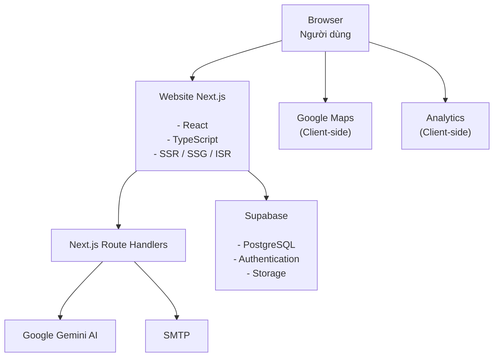
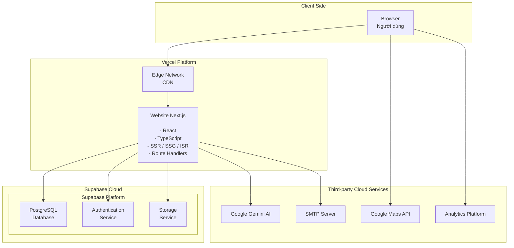
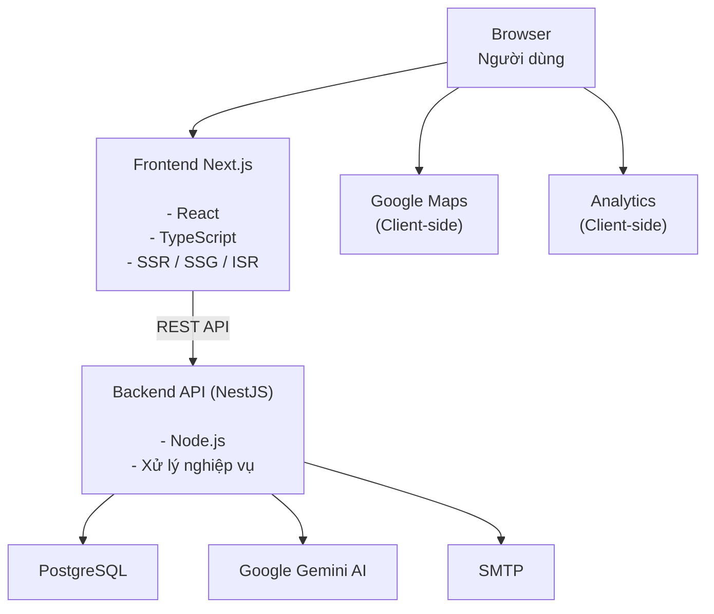
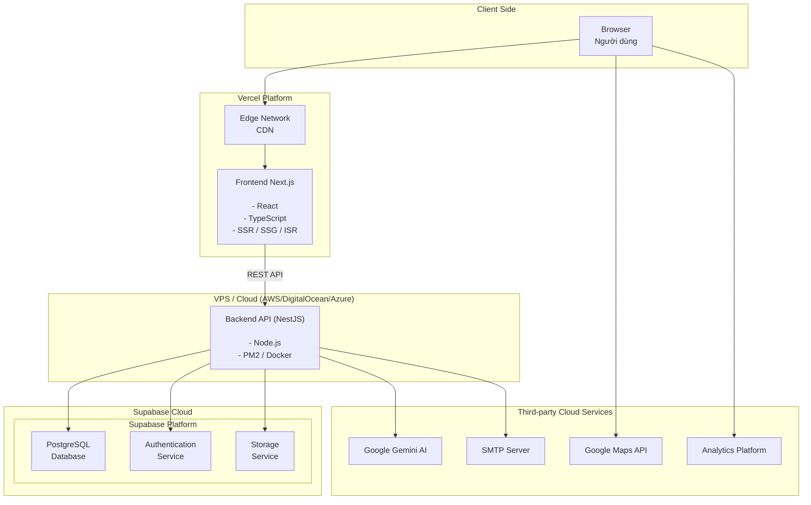
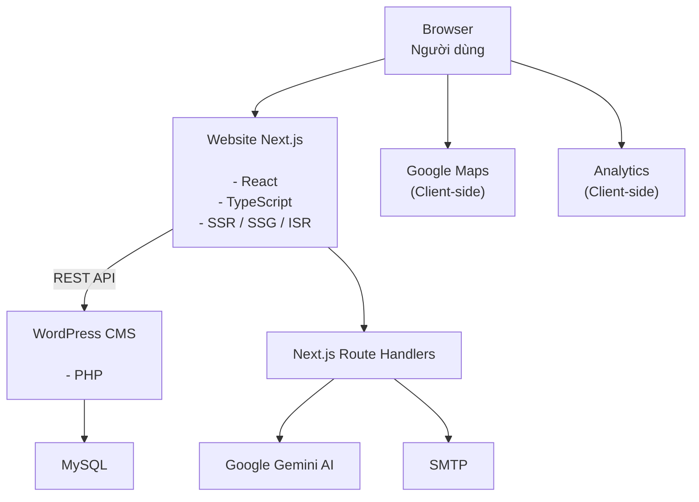
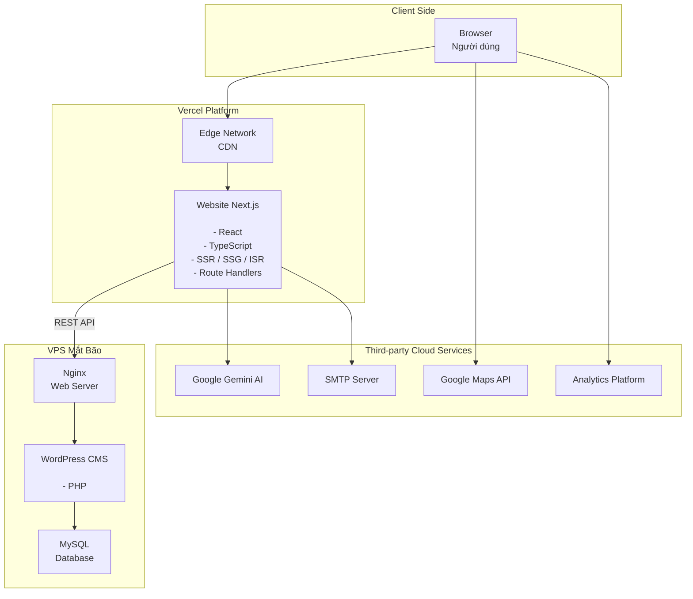
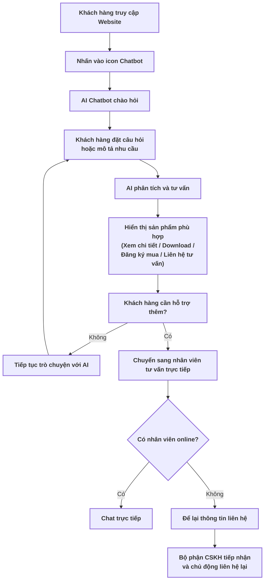
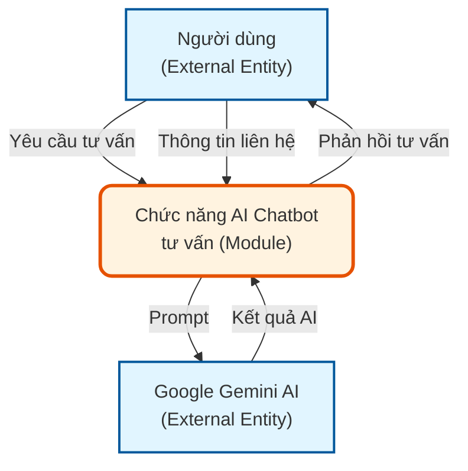
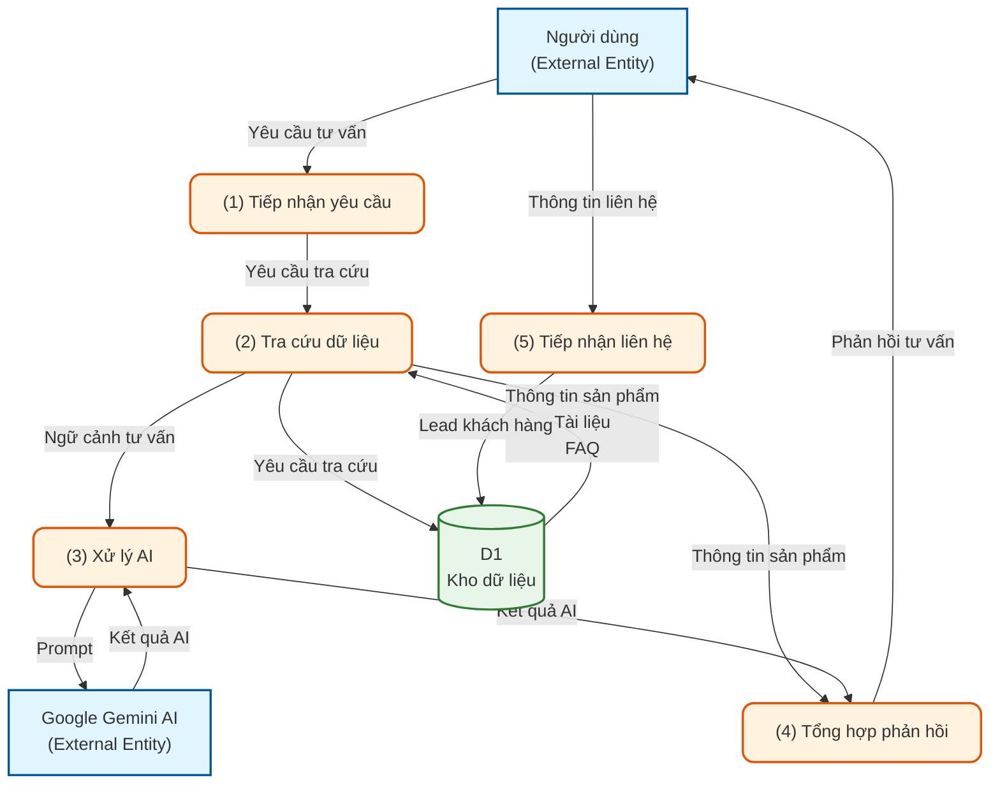

# BÁO CÁO ĐÁNH GIÁ VÀ ĐỀ XUẤT PHƯƠNG ÁN NÂNG CẤP

## Phần 1: Hiện trạng hệ thống

### 1. Công nghệ và bảo mật

#### 1.1. Công nghệ

- **Ngôn ngữ**: PHP
- **Framework**: FS Framework (Framework tự phát triển cũ)
- **Cơ sở dữ liệu**: MySQL (quản lý bằng phpMyAdmin)
- **Hosting**: Mắt Bão

Hệ thống hiện tại vẫn đáp ứng được nhu cầu vận hành, tuy nhiên kiến trúc công nghệ đã cũ, gây nhiều hạn chế trong việc mở rộng tính năng, nâng cấp giao diện, tối ưu hiệu năng và tích hợp các công nghệ mới như AI hoặc API từ bên thứ ba.

#### 1.2. Chức năng website hiện tại

**Trang chính:**

- **Sản phẩm**: Lọc theo
  - Lĩnh vực
  - Hãng sản xuất
  - Ứng dụng
  - Danh sách sản phẩm
  - Tìm kiếm theo từ khóa
- **Dịch vụ**
- **Tin tức**
- **Sự kiện**
- **Giới thiệu**
- **Liên hệ**
- **Chính sách**

Toàn bộ nội dung được lấy từ cơ sở dữ liệu và quản lý thông qua trang quản trị.

**Chức năng quản trị (Admin):**

- Quản lý người dùng Admin
- Quản lý sản phẩm (Lĩnh vực, Hãng sản xuất, Ứng dụng, Loại sản phẩm...)
- Quản lý Banner, Slideshow
- Quản lý Menu
- Quản lý Trang tĩnh
- Quản lý Tin tức
- Quản lý Dịch vụ
- Quản lý Sự kiện
- Quản lý Thư viện ảnh
- Quản lý Địa điểm & Liên hệ
- Quản lý đa ngôn ngữ
- Quản lý cấu hình Website và SEO

#### 1.3. Hạn chế của hệ thống

**Hạn chế về Hiệu năng:**

**Shared Hosting (Mắt Bão)**

- Chia sẻ tài nguyên: Website chia sẻ tài nguyên máy chủ với nhiều website khác, có thể bị ảnh hưởng khi các website khác có lưu lượng truy cập cao
- Giới hạn tài nguyên: Có giới hạn về CPU, RAM, băng thông
- Không kiểm soát được: Không thể cấu hình sâu máy chủ theo nhu cầu riêng

**Framework nội bộ (FS Framework)**

- Không có cộng đồng: Không được cộng đồng hỗ trợ, không có tài liệu rộng rãi
- Khó bảo trì: Nếu người phát triển rời đi, rất khó tìm người thay thế
- Cập nhật chậm: Không có cập nhật định kỳ từ cộng đồng, có thể có lỗ hổng bảo mật không được phát hiện

**Hạn chế về Bảo mật:**

**Cấu hình và Hạ tầng máy chủ**

- Lộ thông tin nhạy cảm: Thông tin kết nối cơ sở dữ liệu và một số tệp cấu hình có nguy cơ bị truy cập từ bên ngoài.
- Công nghệ lỗi thời: Nền tảng và thư viện cũ, tiềm ẩn các lỗ hổng bảo mật đã được công bố.

**Mã nguồn ứng dụng**

- Nguy cơ SQL Injection: Dữ liệu đầu vào chưa được kiểm soát và xử lý đầy đủ trước khi truy vấn cơ sở dữ liệu.
- Kiểm tra tệp tải lên chưa chặt chẽ: Chưa xác thực đầy đủ nội dung tệp, có nguy cơ tải lên tệp độc hại.
- Lọc dữ liệu đầu vào chưa hiệu quả: Cơ chế lọc thủ công dễ bị vượt qua bởi các kỹ thuật tấn công phổ biến.
- Xác thực chưa an toàn: Thiếu cơ chế chống CSRF, giới hạn đăng nhập và bảo vệ trước tấn công Brute Force.

---

### 2. Tốc độ và hiệu năng

#### 2.1. Tổng quan điểm số

| Chỉ số                            | Mobile              | Desktop             |
| --------------------------------- | ------------------- | ------------------- |
| Điểm Performance (Lab)            | 36/100 ❌           | 48/100 ❌           |
| Core Web Vitals (thực tế 28 ngày) | ✅ ĐẠT              | ❌ KHÔNG ĐẠT        |
| Tổng dung lượng trang             | 8.311 KiB (~8.1 MB) | 8.207 KiB (~8.0 MB) |

**Tóm tắt:** Cả hai thiết bị đều bị chấm điểm hiệu năng thấp trong bài test mô phỏng (lần tải đầu tiên), nhưng vì hai lý do khác nhau - Mobile chậm vì nội dung chính hiện quá lâu, Desktop chậm vì JavaScript "khoá" trang lại dù nội dung hiện ra nhanh.

#### 2.2. Core Web Vitals - Dữ liệu người dùng thực tế (28 ngày gần nhất)

Đây là số liệu đo từ người dùng Chrome thật, phản ánh trải nghiệm thực tế hàng ngày:

| Chỉ số       | Định nghĩa                                     | Chuẩn Google                                            | Mobile                 | Desktop               |
| ------------ | ---------------------------------------------- | ------------------------------------------------------- | ---------------------- | --------------------- |
| LCP          | Thời gian nội dung lớn nhất hiển thị hoàn toàn | <2.5s Tốt / 2.5-4s Cần cải thiện / >4s Kém        | 1.7s ✅                | 1.1s ✅               |
| INP          | Độ trễ phản hồi sau khi người dùng bấm/gõ      | <200ms Tốt / 200-500ms Cần cải thiện / >500ms Kém | 105ms ✅               | 62ms ✅               |
| CLS          | Mức độ bố cục bị xê dịch ngoài ý muốn          | <0.1 Tốt / 0.1-0.25 Cần cải thiện / >0.25 Kém     | 0 ✅                   | 0.38 ❌               |
| FCP          | Thời điểm nội dung đầu tiên xuất hiện          | <1.8s Tốt / 1.8-3s Cần cải thiện / >3s Kém        | 1.2s ✅                | 0.8s ✅               |
| TTFB         | Thời gian máy chủ phản hồi byte đầu tiên       | <0.8s Tốt / 0.8-1.8s Cần cải thiện / >1.8s Kém    | 0.6s ✅                | 0.5s ✅               |
| Kết quả cuối | -                                              | -                                                       | ✅ ĐẠT Core Web Vitals | ❌ KHÔNG ĐẠT (do CLS) |

**Nhận xét:** Người dùng thật trải nghiệm rất tốt trên cả hai thiết bị, ngoại trừ một điểm đáng lo: Desktop không đạt chuẩn Core Web Vitals chỉ vì CLS = 0.38 - bố cục trang bị nhảy vượt quá mức cho phép (0.1), đây là vấn đề đang xảy ra thật với người dùng, không chỉ trên lý thuyết.

#### 2.3. Dữ liệu phòng thí nghiệm (Lab) - Lượt tải trang đầu tiên

Đây là bài kiểm tra mô phỏng điều kiện xấu nhất (Mobile: mạng 4G chậm, thiết bị yếu; Desktop: chưa có cache), phản ánh khả năng tối ưu kỹ thuật thuần tuý của website.

**Bảng 5 chỉ số chính**

| Chỉ số      | Ý nghĩa                            | Chuẩn Google | 📱 Mobile        | 💻 Desktop   |
| ----------- | ---------------------------------- | ------------ | ---------------- | ------------ |
| FCP         | Nội dung đầu tiên xuất hiện        | <1.8s Tốt    | 1.1s ✅          | 0.3s ✅      |
| LCP         | Nội dung lớn nhất hiển thị xong    | <2.5s Tốt    | 7.9s ❌ Rất kém  | 1.4s ✅      |
| TBT         | Tổng thời gian JS chặn luồng chính | <200ms Tốt   | 410ms ⚠️         | 600ms ❌ Kém |
| CLS         | Bố cục bị xê dịch                  | <0.1 Tốt     | 0.782 ❌ Rất kém | 0.538 ❌ Kém |
| Speed Index | Tốc độ hiển thị toàn trang         | <3.4s Tốt    | 6.4s ❌ Kém      | 1.9s ✅      |

- **Mobile**: Trang bắt đầu hiện khá nhanh (FCP 1.1s), nhưng phần nội dung chính (ảnh banner, khối lớn nhất) phải đợi tới 7.9 giây mới hiện xong - quá chậm, người dùng cảm giác trang bị "treo". Đây là điểm yếu nặng nhất trên Mobile.
- **Desktop**: Ngược lại, nội dung hiện rất nhanh (FCP 0.3s, LCP 1.4s đều tốt), nhưng JavaScript chạy ngầm chiếm dụng trình duyệt tới 600ms, khiến người dùng thấy trang nhưng chưa _thao tác được_ ngay.
- **CLS** là vấn đề chung ở cả hai thiết bị trong bài test lab - bố cục bị nhảy rất nhiều trong lúc tải (0.782 Mobile, 0.538 Desktop), dù dữ liệu thực tế cho thấy Mobile không gặp vấn đề này.

#### 2.4. Vì sao điểm Performance thấp? (Breakdown điểm theo từng chỉ số)

Google tính điểm Performance 0-100 bằng cách cộng điểm từ 5 chỉ số. Bảng dưới cho thấy rõ "thủ phạm" ở mỗi thiết bị:

| Chỉ số      | Mobile              | Desktop             |
| ----------- | ------------------- | ------------------- |
| FCP         | +10                 | +10                 |
| LCP         | +1 ⬅ thủ phạm chính | +21                 |
| TBT         | +20                 | +6 ⬅ thủ phạm chính |
| CLS         | +1 ⬅ thủ phạm chính | +4                  |
| Speed Index | +4                  | +7                  |
| Tổng điểm   | 36                  | 48                  |

→ Mobile bị kéo điểm bởi LCP + CLS (nội dung hiện chậm, bố cục nhảy nhiều) → Desktop bị kéo điểm chủ yếu bởi TBT (JavaScript chặn tương tác quá lâu)

#### 2.5. Nguyên nhân kỹ thuật cụ thể gây chậm

**Nguyên nhân chung - ảnh hưởng cả 2 thiết bị**

| Vấn đề                              | Mobile            | Desktop           | Khuyến nghị khắc phục                           |
| ----------------------------------- | ----------------- | ----------------- | ----------------------------------------------- |
| Thời gian JS phải thực thi          | 2.8 giây          | 3.4 giây          | Tối ưu code, lazy loading, code splitting       |
| Trình duyệt bận xử lý (main thread) | 6.6 giây          | 9.8 giây          | Chuyển tác vụ nặng sang Web Workers             |
| JavaScript thừa, không dùng đến     | 631 KiB           | 631 KiB           | Tree-shaking, loại bỏ code chết                 |
| CSS thừa, không dùng đến            | 194 KiB           | 194 KiB           | Loại bỏ CSS không dùng, dùng CSS modules        |
| Ảnh thiếu khai báo width/height     | Có                | Có                | Khai báo kích thước rõ ràng, tránh layout shift |
| Số "tác vụ nặng" (long tasks)       | 12 việc           | 14 việc           | Phân tích và chia nhỏ tác vụ                    |
| Tài nguyên chặn hiển thị ban đầu    | 1.260 ms          | 460 ms            | Inline CSS quan trọng, defer/async JS           |
| Cache trình duyệt chưa tận dụng     | tiết kiệm 733 KiB | tiết kiệm 735 KiB | Cache headers phù hợp, service workers          |
| JavaScript chưa rút gọn (minify)    | tiết kiệm 3 KiB   | tiết kiệm 3 KiB   | Dùng build tools để minify                      |
| JavaScript cũ (legacy)              | tiết kiệm 55 KiB  | tiết kiệm 55 KiB  | Cập nhật thư viện lên bản mới                   |

**Nguyên nhân Mobile:**

- LCP rất kém (7.9s): cần preload tài nguyên quan trọng, tối ưu ảnh LCP, sử dụng CDN
- Tổng tài nguyên mạng: 8.311 KiB (~8.3 MB) - khá nặng cho mạng di động, cần nén hình ảnh, dùng WebP/AVIF, lazy loading
- Cải thiện phân phối ảnh: có thể tiết kiệm 4.186 KiB bằng cách dùng srcset/sizes, responsive images

**Nguyên nhân Desktop:**

- TBT cao (600ms): cần tối ưu JavaScript, giảm blocking time
- Buộc chỉnh lại luồng (Forced Reflow): trình duyệt phải tính lại bố cục nhiều lần do code đọc/ghi DOM không tối ưu - cần tránh đọc DOM ngay sau khi ghi DOM, batch DOM operations
- Cải thiện phân phối ảnh: có thể tiết kiệm 4.400 KiB
- DOM quá lớn: cây HTML có quá nhiều phần tử - cần giảm số lượng phần tử DOM, tránh lồng nhiều cấp, cân nhắc virtualization cho danh sách dài

#### 2.6. Kết luận

Desktop có phần cứng mạnh hơn nên tải nội dung nhanh hơn Mobile ở hầu hết chỉ số tốc độ, nhưng lại thua Mobile ở độ ổn định bố cục (CLS) - đây là lý do dù nhanh hơn, Desktop vẫn KHÔNG ĐẠT chuẩn Core Web Vitals trong khi Mobile ĐẠT.

---

### 3. Đánh giá Trải nghiệm người dùng (UI/UX)

#### 3.1. Đánh giá giao diện trên điện thoại

**• Tính đáp ứng giao diện (Responsive):**  
Website được thiết kế theo chuẩn Responsive, đảm bảo giao diện hiển thị ổn định trên các thiết bị di động. Các thành phần như menu, banner, nội dung, hình ảnh và nút chức năng tự động điều chỉnh theo kích thước màn hình, giúp người dùng thao tác thuận tiện mà không cần phóng to, thu nhỏ hoặc cuộn ngang. Qua quá trình kiểm tra, chưa ghi nhận các lỗi vỡ bố cục hoặc sai lệch giao diện trên các trang được đánh giá.

**• Lỗi hiển thị nội dung sự kiện:**  
Tại một số trang sự kiện, khi tiêu đề có độ dài lớn, hệ thống chưa tự động điều chỉnh khoảng cách (padding/margin) và chiều cao vùng hiển thị phù hợp. Điều này dẫn đến hiện tượng văn bản bị tràn, làm xô lệch bố cục và che khuất một phần nội dung hoặc thành phần giao diện phía dưới trên thiết bị di động. Mặc dù lỗi chỉ xuất hiện trong các trường hợp có tiêu đề dài, nhưng làm giảm tính thẩm mỹ và ảnh hưởng đến khả năng tiếp cận thông tin của người dùng.

**Cách xử lý:** Cần điều chỉnh CSS của khối hiển thị tiêu đề để hỗ trợ tự động xuống dòng, thiết lập chiều cao linh hoạt và khoảng cách phù hợp, đảm bảo bố cục luôn ổn định với các tiêu đề có độ dài khác nhau trên mọi kích thước màn hình.

#### 3.2. Đánh giá về luồng khách hàng điền form đăng ký tư vấn sản phẩm

**Các hạng mục đã tối ưu:**

Website mang lại trải nghiệm sử dụng tương đối tốt trên thiết bị di động và luồng đăng ký tư vấn được xây dựng đầy đủ, đáp ứng nhu cầu thao tác của người dùng.

- **Tính đáp ứng giao diện (Responsive):** Website được thiết kế theo chuẩn Responsive, đảm bảo giao diện hiển thị ổn định trên các thiết bị di động. Các thành phần như menu, banner, nội dung, hình ảnh và nút chức năng tự động điều chỉnh theo kích thước màn hình, không ghi nhận hiện tượng vỡ bố cục hoặc phải cuộn ngang trong quá trình kiểm tra.
- **Luồng đăng ký tư vấn rõ ràng:** Người dùng có thể dễ dàng truy cập biểu mẫu thông qua các nút chức năng như Liên hệ hoặc Đăng ký mua ngay tại trang sản phẩm. Biểu mẫu hiển thị đầy đủ các trường thông tin cần thiết và quy trình đăng ký diễn ra xuyên suốt, không phát sinh lỗi trong quá trình thao tác.
- **Kiểm tra dữ liệu đầu vào (Form Validation):** Hệ thống đã triển khai cơ chế kiểm tra dữ liệu cho các trường bắt buộc. Khi người dùng bỏ trống hoặc nhập thiếu thông tin, hệ thống hiển thị thông báo lỗi tương ứng, giúp hạn chế việc gửi các biểu mẫu không hợp lệ và nâng cao chất lượng dữ liệu tiếp nhận.

**Các hạng mục chưa tối ưu:**

Mặc dù luồng đăng ký tư vấn hoạt động ổn định, vẫn còn một số điểm có thể ảnh hưởng đến trải nghiệm người dùng.

- **Biểu tượng hỗ trợ trực tuyến trên điện thoại che khuất nút thao tác:** Trong một số trường hợp, biểu tượng hỗ trợ trực tuyến (Chat Widget) hiển thị chồng lên nút Gửi của biểu mẫu đăng ký tư vấn trên thiết bị di động. Hiện tượng này không xảy ra thường xuyên nhưng có thể gây khó khăn cho người dùng khi hoàn tất biểu mẫu, đặc biệt trên các thiết bị có màn hình nhỏ.
- **Biểu mẫu yêu cầu nhiều thông tin:** Biểu mẫu hiện tại thu thập nhiều trường thông tin ngay từ bước đầu, bao gồm họ tên, đơn vị công tác, địa chỉ, tỉnh/thành phố, email, số điện thoại, ghi chú và mã xác thực. Việc phải nhập nhiều dữ liệu trên thiết bị di động có thể làm tăng thời gian thao tác và ảnh hưởng đến tỷ lệ hoàn thành biểu mẫu của người dùng.

**Cách xử lý:**

- Điều chỉnh vị trí hoặc thứ tự hiển thị (z-index) của Chat Widget, hoặc tự động thu gọn widget khi người dùng mở biểu mẫu đăng ký để tránh che khuất các nút thao tác quan trọng.
- Rà soát và tối ưu số lượng trường thông tin trong biểu mẫu. Có thể chỉ giữ lại các trường bắt buộc như Họ tên, Số điện thoại, Email và Nhu cầu tư vấn ở bước đầu, các thông tin còn lại sẽ được nhân viên kinh doanh thu thập trong quá trình liên hệ nhằm giảm thao tác nhập liệu và tăng tỷ lệ gửi biểu mẫu thành công.
- Cân nhắc tích hợp chatbot hoặc AI tư vấn để hỗ trợ giải đáp các câu hỏi phổ biến về sản phẩm trước khi người dùng gửi yêu cầu. Giải pháp này giúp người dùng tiếp cận thông tin nhanh hơn, đồng thời giảm số lượng yêu cầu tư vấn lặp lại và nâng cao hiệu quả chăm sóc khách hàng.

---

### 4. Đánh giá Tối ưu SEO

**Tình trạng chung:** Hệ thống đang gặp các lỗi cấu trúc rất nặng và mang tính đồng bộ. Đây là lỗi phát sinh từ bộ khung lập trình gốc (Template Code) của website, nghĩa là toàn bộ các trang con khác trên hệ thống (Giới thiệu, Liên hệ, Chi tiết sản phẩm...) đều đang lặp lại các lỗi cấu trúc này, gây ảnh hưởng trực tiếp đến khả năng thu thập dữ liệu và xếp hạng của Google.

**Các hạn chế mang tính hệ thống:**

- **Thẻ tiêu đề chính (`<H1>`) bị gán cứng sai mục đích:** Hệ thống đang tự động đặt từ khóa định danh chính `<H1>` là cic.com.vn cho tất cả các trang danh mục thay vì tên riêng của trang đó. Việc lặp đi lặp lại tên miền ở thẻ `<H1>` khiến Google không thể nhận diện được chủ đề cốt lõi của từng trang con.
- **Lạm dụng và phân cấp sai cấu trúc thẻ tiêu đề (`<H3>`, `<H4>`):** Hệ thống đang gom và gán thẻ tiêu đề một cách máy móc, làm loãng cấu trúc dữ liệu.
  - _Dẫn chứng trang Sản phẩm:_ Biến toàn bộ thông tin địa chỉ, số điện thoại ở chân trang (Footer) thành thẻ `<H3>`.
  - _Dẫn chứng trang Tin tức:_ Bê nguyên danh sách toàn bộ bài viết ra ngoài danh mục và cấu hình hàng loạt thành 1.009 thẻ `<H3>` và 998 thẻ `<H4>` trên cùng một trang, khiến bot của Google bị quá tải và đánh giá cấu trúc trang là spam.
- **Thẻ mô tả (Meta Description) sinh tự động quá sơ sài:** Hệ thống đang tự tạo phần mô tả theo công thức cố định: \[Tên trang\],CIC (Trang sản phẩm đạt 12 ký tự, Trang tin tức đạt 11 ký tự). Nội dung này hoàn toàn không đạt chuẩn tối ưu của Google (yêu cầu từ 120 - 160 ký tự) và không có ô cấu hình riêng để nhân viên tự biên tập nội dung thu hút khách hàng click.
- **Về Sơ đồ trang web (Sitemap.xml) và Thẻ định danh (Canonical):** mặc dù website đã có tệp tin sitemap.xml hoạt động ở mức cơ bản để khai báo danh mục cho Google, nhưng hệ thống lại đang thiếu hoàn toàn thẻ định danh gốc (Canonical Tag) trên tất cả các trang (No canonical tag is set). Việc thiếu thẻ Canonical kết hợp với việc phân trang tin tức/sản phẩm quy mô lớn sẽ tạo ra rủi ro cực lớn về việc trùng lặp nội dung (Duplicate Content), khiến website bị Google phạt giảm tổng điểm uy tín.

**Cách xử lý:** Cần refactor lại các thành phần trong template (Heading, Meta Description, Canonical...).

---

### 5. Đánh giá Tối ưu GEO

#### 5.1. Tổng quan kết quả sơ bộ

| Tiêu chí đánh giá | Điểm số (Thang điểm 10) | Trạng thái hiệu năng GEO |
| ----------------- | ----------------------- | ------------------------ |
| Tần suất trích dẫn nguồn (Citation Rate) | 8.5 / 10 | Xuất sắc |
| Mức độ đề xuất thương hiệu (Brand Share of Voice) | 7.0 / 10 | Tốt |
| Sự đồng nhất dữ liệu (Information Consistency) | 9.0 / 10 | Xuất sắc |
| Độ phủ kênh bên thứ ba (Third-party Authority) | 6.5 / 10 | Khá |

#### 5.2. Chi tiết đánh giá theo từng câu hỏi khảo sát

**Câu hỏi 1: Đánh giá mảng giải pháp CAD thay thế (Sản phẩm enjiCAD)**

- **Truy vấn kiểm thử:** "Tôi muốn mua phần mềm CAD bản quyền vĩnh viễn, giao diện giống AutoCAD và giá tối ưu cho doanh nghiệp tại Việt Nam thì có những lựa chọn nào tốt?"
- **Mục đích đánh giá:** Đo lường khả năng cạnh tranh từ khóa không thương hiệu của dòng sản phẩm tự chủ công nghệ enjiCAD trước các đối thủ ngoại lớn (progeCAD, ZWCAD, GstarCAD).
- **Kết quả phản hồi của AI:** AI đã liệt kê enjiCAD ở vị trí thứ 2 trong danh sách đề xuất. Hệ thống nhận diện đúng các đặc tính kỹ thuật cốt lõi: "Tối ưu chi phí", "Thiết kế dựa trên thói quen kỹ sư Việt", và "Hỗ trợ kỹ thuật 24/7 trực tiếp trong nước".
- **Đánh giá trích dẫn (Citations):** Đạt yêu cầu. Tuy nhiên, AI đang bị phân mảnh trích dẫn khi dẫn link về cả các đơn vị đối tác phân phối phụ (HVN Group, 4Ctech Group) thay vì tập trung hoàn toàn vào trang chủ điều hướng của CIC.
- **Điểm GEO:** 7.5 / 10

**Câu hỏi 2: Đánh giá mảng phần mềm Dự toán (Sản phẩm Escon)**

- **Truy vấn kiểm thử:** "Phần mềm dự toán công trình xây dựng nào hiện nay cập nhật nhanh và đúng nhất theo các định mức, thông tư mới của Bộ Xây dựng Việt Nam?"
- **Mục đích đánh giá:** Khảo sát độ phủ dữ liệu trong phân khúc phần mềm dự toán có tính cạnh tranh khốc liệt tại thị trường nội địa.
- **Kết quả phản hồi của AI:** CẢNH BÁO ĐỎ cho GEO của CIC. Khi quét tìm các giải pháp cập nhật thông tư mới nhất (Thông tư 60/2025/TT-BXD và Thông tư 37/2026/TT-BXD), AI chỉ tập trung đề xuất 4 cái tên: Dự toán F1, Dự toán GXD, Dự toán G8 và Dự toán Eta. Thương hiệu Dự toán Escon của CIC hoàn toàn bị lọt lưới (omitted) khỏi danh sách gợi ý hàng đầu.
- **Đánh giá trích dẫn (Citations):** Dữ liệu nguồn đổ hoàn toàn về phía đối thủ (Phần mềm Eta, Giá Xây Dựng, Dự toán F1).
- **Điểm GEO:** 2.0 / 10 (Cần lập tức tối ưu hóa công cụ cào dữ liệu cho Escon).

**Câu hỏi 3: Đánh giá mảng thiết kế/phân tích kết cấu (Sản phẩm phân phối CSI - ETABS/SAP2000)**

- **Truy vấn kiểm thử:** "Mua phần mềm ETABS và SAP2000 bản quyền chính hãng tại Việt Nam thì mua ở đâu uy tín và có hỗ trợ kỹ thuật tốt?"
- **Mục đích đánh giá:** Xác thực vai trò "Thực thể phân phối số 1" của CIC đối với hệ sinh thái phần mềm thuộc hãng CSI (Mỹ) tại Việt Nam.
- **Kết quả phản hồi của AI:** Hiệu quả GEO đạt mức Tuyệt đối. AI định vị CIC ở vị trí Top 1 dẫn đầu danh sách kèm theo lời khẳng định uy tín: "Đây là đối tác phân phối chính thức lâu đời và lớn nhất của hãng CSI tại thị trường Việt Nam." AI bóc tách chính xác năng lực tư vấn chuyên sâu của đội ngũ kỹ sư CIC (xử lý lỗi mô hình, mesh sàn, diaphragm) vượt trội so với các đại lý thuần thương mại số.
- **Đánh giá trích dẫn (Citations):** Xuất sắc. Link nguồn điều hướng trực diện về thực thể doanh nghiệp của CIC và các trang tài liệu kỹ thuật liên quan.
- **Điểm GEO:** 9.5 / 10

**Câu hỏi 4: Đánh giá mảng địa kỹ thuật (Sản phẩm phân phối Bentley - PLAXIS)**

- **Truy vấn kiểm thử:** "Đơn vị nào tại Việt Nam là đại lý ủy quyền cung cấp phần mềm địa kỹ thuật PLAXIS 2D và 3D của hãng Bentley?"
- **Mục đích đánh giá:** Đo lường độ sâu dữ liệu của các sản phẩm ngách (B2B Enterprise) trong lĩnh vực địa chất, công trình ngầm.
- **Kết quả phản hồi của AI:** AI nhận diện chính xác và gọi tên ngay Công ty Cổ phần Công nghệ và Tư vấn CIC là đơn vị phân phối hàng đầu. Hệ thống còn trích xuất được chi tiết địa chỉ văn phòng của CIC tại cả 2 miền (VG Building Hà Nội và Nguyễn Huy Lượng TP.HCM), chứng tỏ dữ liệu NAP (Name, Address, Phone) của CIC được đồng bộ rất tốt.
- **Đánh giá trích dẫn (Citations):** Tốt. Trích dẫn rõ ràng từ hệ thống dữ liệu doanh nghiệp uy tín.
- **Điểm GEO:** 9.0 / 10

**Câu hỏi 5: Đánh giá mảng tính toán liên kết thép (Sản phẩm phân phối Idea Statica)**

- **Truy vấn kiểm thử:** "Kỹ sư kết cấu tại Việt Nam muốn tính toán liên kết thép phức tạp thì nên dùng phần mềm nào và mua bản quyền ở đâu?"
- **Mục đích đánh giá:** Kiểm tra mô hình liên kết thực thể chéo: Liệu AI có thể kết nối nhu cầu kỹ thuật phức tạp -> giải pháp phần mềm (Idea Statica) -> nhà phân phối độc quyền tại Việt Nam (CIC) hay không.
- **Kết quả phản hồi của AI:** Đạt kỳ vọng cao. AI gợi ý công cụ chuẩn vàng là IDEA StatiCa Steel sử dụng phương pháp phát triển CBFEM. Ngay sau đó, tại mục địa chỉ mua bản quyền, CIC được xếp hạng ưu tiên số 1 kèm đường link trích dẫn xác thực năng lực.
- **Đánh giá trích dẫn (Citations):** Dữ liệu điều hướng tốt về miền www.cic.com.vn và www.consoft.vn (trang con thuộc hệ sinh thái CIC).
- **Điểm GEO:** 8.5 / 10

#### 5.3. Kết luận sau đánh giá khảo sát

Nhận xét chung: Năng lực GEO của CIC đang phân hóa rõ rệt thành hai bức tranh. Mảng Phần mềm Phân phối Quốc tế (CSI, Bentley, Idea Statica) làm cực tốt, AI nhận diện sâu và đồng bộ. Tuy nhiên, mảng Phần mềm Tự phát triển (Đặc biệt là Dự toán Escon) đang bị các đối thủ nội địa chèn ép hoàn toàn trên không gian tìm kiếm AI.

Để cải thiện điểm số GEO tổng thể, CIC cần triển khai khẩn cấp các hành động sau:

1. **Cứu vãn GEO cho Dự toán Escon:** Xây dựng gấp cấu trúc nội dung dạng so sánh (Ví dụ: tạo trang Bảng so sánh Dự toán Escon vs G8 vs F1) trên website. Cung cấp các đoạn tóm tắt mã nguồn cập nhật Thông tư 37/2026/TT-BXD rõ ràng dưới dạng danh sách (Bullet points) để mô hình AI dễ quét (Scraping) và trích xuất dữ liệu.
2. **Tập trung hóa liên kết nguồn enjiCAD:** Làm việc lại với hệ thống đại lý cấp dưới để tối ưu hóa Schema Merchant, khẳng định domain enjicad.com và cic.com.vn là nguồn gốc rễ, tránh để AI trích dẫn tập trung qua các đơn vị trung gian làm phân tán sức mạnh thực thể (Entity Authority) của CIC.

---

## Phần 2: Đề xuất phương án nâng cấp

### 1. Đề xuất nâng cấp công nghệ

#### 1.1. Các phương án nâng cấp

**Phương án 1. Next.js Fullstack kết hợp Supabase**

**Mô hình kiến trúc hệ thống**

**Logical Architecture Diagram (Sơ đồ kiến trúc logic)**

Sơ đồ này thể hiện luồng dữ liệu và vai trò của từng thành phần trong hệ thống:



**Deployment Diagram (Sơ đồ kiến trúc triển khai)**

Sơ đồ này thể hiện vị trí triển khai của từng thành phần trên hạ tầng:



**Mô tả**

Đề xuất refactor toàn bộ website sang Next.js theo mô hình Fullstack, trong đó một dự án duy nhất sẽ đảm nhiệm cả giao diện người dùng (Frontend) và các API xử lý nghiệp vụ (Backend).

Hệ thống sử dụng Supabase làm nền tảng Backend-as-a-Service (BaaS), bao gồm:

- PostgreSQL làm cơ sở dữ liệu.
- Authentication để quản lý đăng nhập người dùng (khi cần).
- Storage để lưu trữ hình ảnh, tài liệu và các tệp tải lên.

Các nghiệp vụ của website như quản lý sản phẩm, tin tức, biểu mẫu đăng ký tư vấn, tích hợp AI Chatbot hoặc các chức năng bán phần mềm sẽ được xử lý thông qua API của Next.js. Kiến trúc này giúp hệ thống đơn giản, dễ bảo trì nhưng vẫn đáp ứng khả năng mở rộng trong tương lai.

**Ưu điểm**

- Quản lý giao diện và API trong cùng một dự án, giảm độ phức tạp khi phát triển và bảo trì.
- Tối ưu SEO và tốc độ tải trang nhờ Server-Side Rendering (SSR) và Static Site Generation (SSG).
- Dễ tích hợp AI Chatbot, Email, cổng thanh toán và các API bên thứ ba.
- Tận dụng hệ sinh thái Cloud của Supabase giúp giảm chi phí quản trị máy chủ.
- Quy trình triển khai hiện đại, dễ dàng cập nhật và mở rộng hệ thống.

**Hạn chế**

- Cần thực hiện refactor toàn bộ mã nguồn hiện tại.
- Phải chuyển đổi dữ liệu từ MySQL sang PostgreSQL và kiểm thử toàn bộ chức năng trước khi đưa vào vận hành.

**Khả năng mở rộng**

Phương án này đáp ứng tốt định hướng phát triển của website CIC trong giai đoạn tới, bao gồm:

- Mở rộng danh mục sản phẩm phần mềm và các gói dịch vụ.
- Xây dựng tài khoản khách hàng để theo dõi lịch sử đăng ký tư vấn, đơn hàng hoặc giấy phép sử dụng phần mềm.
- Tích hợp AI Chatbot hỗ trợ tư vấn sản phẩm và chăm sóc khách hàng 24/7.
- Tích hợp Email Marketing, CRM hoặc các hệ thống quản lý khách hàng.
- Mở rộng thêm các chức năng như tải bản dùng thử, kích hoạt license hoặc quản lý tài liệu sản phẩm.
- Dễ dàng phát triển thêm các module mới mà không cần thay đổi kiến trúc tổng thể.

---

**Phương án 2. Tách riêng Frontend và Backend**

**Mô hình kiến trúc hệ thống**

**Logical Architecture Diagram (Sơ đồ kiến trúc logic)**

Sơ đồ này thể hiện luồng dữ liệu và vai trò của từng thành phần trong hệ thống:



**Deployment Diagram (Sơ đồ kiến trúc triển khai)**

Sơ đồ này thể hiện vị trí triển khai của từng thành phần trên hạ tầng:



**Mô tả**

Trong mô hình này, Next.js chỉ đảm nhiệm vai diện người dùng (Frontend), còn toàn bộ nghiệp vụ logic và các kết nối ngoại vi được xây dựng thành một hệ thống Backend API độc lập (đề xuất sử dụng NestJS).

- Xử lý AI Chatbot: Toàn bộ logic tích hợp, bảo mật API Key và điều phối luồng dữ liệu với Google Gemini AI sẽ được xử lý tập trung tại Backend API, giúp Frontend hoàn toàn nhẹ tải và bảo mật tuyệt đối.
- Lưu trữ dữ liệu: Backend API sẽ giao tiếp trực tiếp với PostgreSQL Database và Storage của Supabase để tra cứu dữ liệu tri thức (Sản phẩm, FAQ) và lưu thông tin liên hệ (Lead) của khách hàng.

**Ưu điểm**

- Phân tách rõ ràng giữa giao diện (Frontend) và nghiệp vụ logic (Backend).
- Bảo mật tối đa cho AI Chatbot: API Key của Google Gemini và cấu trúc Database được giấu hoàn toàn ở phía Backend API, ngăn chặn tuyệt đối các nguy cơ tấn công hoặc rò rỉ từ phía Client.
- Thuận lợi khi mở rộng: Dễ dàng phát triển đồng thời Website, Mobile App hoặc các hệ thống khác sử dụng chung một cổng API xử lý AI và dữ liệu.
- Dễ tối ưu hiệu năng: Có thể tối ưu hóa hoặc nâng cấp riêng module xử lý AI ở Backend mà không làm ảnh hưởng đến giao diện người dùng hiện tại.
- Có thể triển khai độc lập từng thành phần của hệ thống.

**Hạn chế**

- Chi phí phát triển, máy chủ vận hành và bảo trì cao hơn.
- Quá trình triển khai phức tạp hơn do phải quản lý, đồng bộ nhiều dịch vụ độc lập (Frontend, Backend API, Supabase, Gemini AI).
- Chưa thực sự cần thiết nếu quy mô hiện tại của website CIC chỉ ở mức cơ bản.

**Khả năng mở rộng**

Phương án này là bệ phóng hoàn hảo nếu trong tương lai CIC định hướng phát triển website thành một hệ sinh thái dịch vụ quy mô lớn, bao gồm:

- Tích hợp đa kênh AI Chatbot: Sử dụng chung một lõi Backend API xử lý AI để tích hợp chatbot lên cả Website, Mobile App, Facebook Messenger hoặc Zalo OA.
- Hệ thống bán phần mềm trực tuyến hoàn chỉnh (đặt hàng, thanh toán, tự động sinh và cấp license phần mềm).
- Kết nối đồng bộ dữ liệu với các hệ thống nội bộ doanh nghiệp như CRM, ERP, hoặc phần mềm kế toán.
- Xây dựng cổng thông tin riêng dành cho hệ thống đại lý hoặc đối tác tự quản lý.
- Phục vụ lượng lớn người dùng đồng thời với nhiều nghiệp vụ xử lý dữ liệu phức tạp.

---

**Phương án 3. Next.js kết hợp WordPress Headless CMS**

**Mô hình kiến trúc hệ thống**

**Logical Architecture Diagram (Sơ đồ kiến trúc logic)**

Sơ đồ này thể hiện luồng dữ liệu và vai trò của từng thành phần trong hệ thống:



**Deployment Diagram (Sơ đồ kiến trúc triển khai)**

Sơ đồ này thể hiện vị trí triển khai của từng thành phần trên hạ tầng:



**Mô tả**

Đề xuất xây dựng website theo mô hình Headless CMS, trong đó Next.js đảm nhiệm vai trò xây dựng giao diện website (Frontend), còn WordPress được sử dụng làm hệ thống quản trị nội dung (CMS).

Website chính được phát triển bằng Next.js, tối ưu khả năng hiển thị, tốc độ tải trang và SEO. Toàn bộ dữ liệu như sản phẩm, danh mục, banner, menu, trang tĩnh, tin tức, dịch vụ, sự kiện, thư viện ảnh, cấu hình website và nội dung đa ngôn ngữ được quản lý trên WordPress.

WordPress sử dụng MySQL làm cơ sở dữ liệu và cung cấp dữ liệu thông qua WordPress REST API. Next.js thực hiện truy xuất dữ liệu từ các API này để hiển thị trên website, đồng thời tách biệt hoàn toàn giữa lớp quản trị nội dung và giao diện người dùng.

Các nghiệp vụ backend như tích hợp AI Chatbot, gửi email được xử lý thông qua Next.js Route Handlers, giúp bảo mật API Key và tách biệt logic xử lý khỏi frontend. Các dịch vụ như Google Maps và Analytics có thể được tích hợp trực tiếp từ phía client-side để tối ưu hiệu năng.

Kiến trúc này giúp đội ngũ quản trị nội dung có thể cập nhật dữ liệu trực tiếp trên WordPress mà không ảnh hưởng đến website đang vận hành, đồng thời tận dụng khả năng tối ưu hiệu năng và SEO của Next.js.

**Thành phần hệ thống**

**Frontend Layer**

- Next.js
- React
- TypeScript
- Server-Side Rendering (SSR)
- Static Site Generation (SSG)
- Incremental Static Regeneration (ISR)
- Triển khai: Vercel với Edge Network CDN

**Backend Layer**

- WordPress CMS (PHP): Hệ thống quản trị nội dung cung cấp dữ liệu
- Next.js Route Handlers: Xử lý các nghiệp vụ backend như tích hợp AI, gửi email

**Content Management Layer**

- WordPress CMS
- PHP
- WordPress REST API (Interface)

**Database Layer**

- MySQL
- Triển khai: VPS Mắt Bão (cùng server với WordPress CMS)

**Third-party Services**

**Server-side (qua Next.js Route Handlers):**
- Google Gemini AI: Xử lý AI Chatbot tư vấn sản phẩm
- SMTP: Gửi email thông báo, marketing

**Client-side (tích hợp trực tiếp từ Browser):**
- Google Maps: Hiển thị bản đồ địa điểm
- Analytics: Theo dõi phân tích dữ liệu người dùng

**Hosting**

- Website Next.js triển khai trên Vercel với Edge Network CDN toàn cầu.
- WordPress CMS và MySQL triển khai trên VPS Mắt Bão (cùng một server với Nginx làm Web Server).
- Website và CMS hoạt động trên hai tên miền độc lập, ví dụ:
  - Website: https://cic.com.vn
  - CMS: https://cms.cic.com.vn

**API**

Website Next.js sử dụng WordPress REST API làm nguồn dữ liệu (Source of Truth) cho toàn bộ nội dung hiển thị trên website, bao gồm sản phẩm, danh mục, banner, menu, tin tức, dịch vụ, sự kiện, thư viện ảnh, cấu hình website và nội dung đa ngôn ngữ.

Next.js thực hiện gọi các REST API của WordPress để lấy dữ liệu và hiển thị trên website. Các API nghiệp vụ đặc biệt (AI Chatbot, gửi email) được xử lý qua Next.js Route Handlers để đảm bảo bảo mật và tách biệt logic.

**Ưu điểm**

- Tách biệt hoàn toàn giữa hệ thống quản trị nội dung và website hiển thị.
- Giao diện website được xây dựng bằng Next.js, tối ưu hiệu năng, SEO và trải nghiệm người dùng.
- WordPress cung cấp hệ thống quản trị nội dung trực quan, giúp đội ngũ Marketing và quản trị website dễ dàng cập nhật thông tin mà không cần can thiệp vào mã nguồn.
- Tận dụng hệ sinh thái WordPress với nhiều plugin hỗ trợ quản lý SEO, đa ngôn ngữ, Media Library và các tiện ích quản trị.
- Website và CMS có thể triển khai, bảo trì và nâng cấp độc lập, giảm ảnh hưởng lẫn nhau trong quá trình vận hành.
- Có thể mở rộng tích hợp với các dịch vụ bên thứ ba như AI Chatbot, Email Marketing, CRM hoặc các nền tảng phân tích dữ liệu mà không làm thay đổi kiến trúc CMS.

**Hạn chế**

- Hệ thống sử dụng hai nền tảng công nghệ khác nhau (Next.js và WordPress), do đó cần quản lý đồng thời môi trường Node.js và PHP.
- Website phụ thuộc vào WordPress REST API để lấy dữ liệu, vì vậy cần đảm bảo API luôn sẵn sàng và ổn định.
- Khi mở rộng các nghiệp vụ phức tạp (ví dụ quản lý đơn hàng, khách hàng hoặc quy trình nghiệp vụ chuyên sâu), cần đánh giá lại phạm vi sử dụng của WordPress để đảm bảo phù hợp với định hướng phát triển.

**Khả năng mở rộng**

Phương án này đáp ứng tốt nhu cầu phát triển website doanh nghiệp trong giai đoạn hiện tại và các giai đoạn tiếp theo, bao gồm:

- Mở rộng danh mục sản phẩm, dịch vụ và các lĩnh vực kinh doanh.
- Quản lý số lượng lớn tin tức, tài liệu, sự kiện và nội dung truyền thông.
- Bổ sung thêm các chuyên mục, landing page hoặc microsite mà không ảnh hưởng đến kiến trúc tổng thể.
- Tích hợp AI Chatbot hỗ trợ tư vấn khách hàng và giới thiệu sản phẩm.
- Tích hợp Email Marketing, Google Analytics, Google Tag Manager, CRM hoặc các dịch vụ bên thứ ba.
- Dễ dàng phát triển ứng dụng di động hoặc các kênh hiển thị khác thông qua việc tái sử dụng WordPress REST API.
- Có thể thay đổi Frontend mà không ảnh hưởng CMS, và có thể thay đổi CMS mà không ảnh hưởng Frontend - đây chính là lợi thế cốt lõi của kiến trúc Headless.

#### 1.2. Đề xuất chuyển đổi cơ sở dữ liệu

**Phương án 1 và Phương án 2: Chuyển đổi sang PostgreSQL (Supabase)**

Đề xuất chuyển đổi toàn bộ dữ liệu từ MySQL sang PostgreSQL trên nền tảng Supabase.

**Lợi ích**

- Nâng cao khả năng xử lý dữ liệu và hiệu năng truy vấn khi hệ thống phát triển.
- Hỗ trợ đầy đủ các tính năng SQL hiện đại và khả năng mở rộng tốt.
- Tích hợp trực tiếp với Authentication, Storage và các dịch vụ Cloud của Supabase.
- Dễ dàng sao lưu, phục hồi và quản trị dữ liệu.
- Tương thích tốt với Next.js và các thư viện ORM hiện đại.

Việc nâng cấp sẽ bao gồm quá trình migration dữ liệu từ MySQL sang PostgreSQL, đồng thời kiểm thử toàn bộ chức năng để đảm bảo dữ liệu được chuyển đổi đầy đủ và chính xác.

**Phương án 3: Giữ nền tảng MySQL, tái cấu trúc dữ liệu theo WordPress**

Đối với phương án WordPress Headless CMS, đề xuất tiếp tục sử dụng MySQL làm hệ quản trị cơ sở dữ liệu và triển khai trên cùng VPS với WordPress CMS. Tuy nhiên, cấu trúc cơ sở dữ liệu sẽ được xây dựng lại theo mô hình chuẩn của WordPress, đồng thời thực hiện chuyển đổi dữ liệu từ hệ thống hiện tại sang các Custom Post Type, Taxonomy và Metadata phù hợp.

**Lợi ích**

- Tiếp tục sử dụng MySQL nên không cần thay đổi hệ quản trị cơ sở dữ liệu.
- WordPress và MySQL được tối ưu để hoạt động cùng nhau, giúp hệ thống ổn định và dễ bảo trì.
- Tận dụng hạ tầng VPS Mắt Bão hiện có, giảm chi phí đầu tư và vận hành.
- Dữ liệu hiện tại được kế thừa thông qua quá trình chuyển đổi (migration), đảm bảo không mất dữ liệu.
- Sau khi chuyển đổi, toàn bộ nội dung được quản lý theo chuẩn WordPress, thuận lợi cho việc mở rộng và sử dụng các plugin.

#### 1.3. Đề xuất hạ tầng triển khai

**Bảng so sánh hạ tầng cho 3 phương án**

| Thành phần | Phương án 1: Next.js Fullstack + Supabase | Phương án 2: Tách Frontend/Backend + Supabase | Phương án 3: Next.js + WordPress Headless CMS |
| ---------- | ----------------------------------------- | --------------------------------------------- | -------------------------------------------- |
| **Frontend** | Next.js (Vercel) | Next.js (Vercel) | Next.js (Vercel) |
| **Backend** | API Next.js (Vercel) | NestJS API (VPS/Cloud) | WordPress CMS (VPS Mắt Bão) |
| **Database** | PostgreSQL (Supabase) | PostgreSQL (Supabase) | MySQL (VPS Mắt Bão) |
| **Authentication** | Supabase Auth | Supabase Auth | WordPress Auth |
| **File Storage** | Supabase Storage | Supabase Storage | WordPress Media Library (VPS) |
| **AI** | Google Gemini | Google Gemini | Google Gemini |
| **Triển khai Frontend** | Vercel (Edge Network CDN) | Vercel (Edge Network CDN) | Vercel (Edge Network CDN) |
| **Triển khai Backend** | Vercel (cùng với Frontend) | VPS/Cloud (tách biệt) | VPS Mắt Bão (cùng với Database) |
| **Triển khai Database** | Supabase Cloud | Supabase Cloud | VPS Mắt Bão (cùng với WordPress) |

**Chi tiết hạ tầng theo từng phương án**

**Phương án 1: Next.js Fullstack + Supabase**

- **Frontend & Backend:** Triển khai trên Vercel với Edge Network CDN toàn cầu
- **Database:** PostgreSQL trên Supabase Cloud (tự động scaling, backup)
- **Authentication:** Supabase Auth (OAuth, Email/Password, Phone)
- **File Storage:** Supabase Storage (tích hợp trực tiếp với Database)
- **AI:** Google Gemini (gọi từ Next.js Route Handlers)
- **Ưu điểm:** Đơn giản hóa vận hành, giảm số lượng dịch vụ cần quản lý, tự động scaling

**Phương án 2: Tách Frontend/Backend + Supabase**

- **Frontend:** Triển khai trên Vercel với Edge Network CDN toàn cầu
- **Backend:** NestJS API triển khai trên VPS hoặc Cloud (AWS, DigitalOcean, Azure)
- **Database:** PostgreSQL trên Supabase Cloud
- **Authentication:** Supabase Auth hoặc JWT tự triển khai trên Backend
- **File Storage:** Supabase Storage hoặc S3-compatible storage
- **AI:** Google Gemini (gọi từ NestJS Backend - bảo mật API Key)
- **Ưu điểm:** Bảo mật cao, tách biệt rõ ràng, dễ mở rộng thành hệ sinh thái dịch vụ

**Phương án 3: Next.js + WordPress Headless CMS**

- **Frontend:** Triển khai trên Vercel với Edge Network CDN toàn cầu
- **CMS (Backend):** WordPress CMS triển khai trên VPS Mắt Bão (Ubuntu + Nginx + PHP-FPM)
- **Database:** MySQL trên cùng VPS Mắt Bão với WordPress
- **Authentication:** WordPress Auth (tích hợp sẵn)
- **File Storage:** WordPress Media Library trên VPS Mắt Bão
- **AI:** Google Gemini (gọi từ Next.js Route Handlers)
- **Ưu điểm:** Tận dụng hạ tầng hiện tại, đội ngũ Marketing quen thuộc với WordPress, không cần migration dữ liệu

**Thành phần chung cho cả 3 phương án**

**AI Integration**

- Google Gemini AI được tích hợp để hỗ trợ AI Chatbot tư vấn sản phẩm
- API Key được bảo mật qua Backend (Next.js Route Handlers hoặc NestJS)
- Có thể mở rộng sang các dịch vụ AI khác trong tương lai

**CDN & Performance**

- Frontend (Next.js) đều triển khai trên Vercel với Edge Network CDN
- Tận dụng cơ chế cache của Next.js: Data Cache, Route Cache, ISR
- Hình ảnh được tối ưu qua Next.js Image Optimization

**Cache Strategy**

Trong giai đoạn đầu, hệ thống có thể tận dụng cơ chế cache sẵn của Next.js (Data Cache, Route Cache, ISR) để tối ưu hiệu năng mà chưa cần triển khai Redis. Khi số lượng người dùng, dữ liệu hoặc tần suất truy cập tăng cao, có thể bổ sung Redis để cache các dữ liệu truy cập thường xuyên như danh mục sản phẩm, cấu hình hệ thống hoặc kết quả tìm kiếm nhằm giảm tải cho cơ sở dữ liệu và nâng cao tốc độ phản hồi.

**Monitoring & Logging**

- Tích hợp Google Analytics 4 để theo dõi hành vi người dùng
- Sử dụng Vercel Analytics cho Frontend (cả 3 phương án)
- Đề xuất bổ sung Sentry hoặc LogRocket để theo dõi lỗi và performance
- Với Phương án 2 và 3: cần thiết lập monitoring riêng cho Backend (NestJS/WordPress)

---

### 2. Đánh giá hiện trạng cơ sở dữ liệu và đề xuất giải pháp

#### 2.1. Hiện trạng cơ sở dữ liệu

Hệ thống hiện tại sử dụng **MySQL** làm hệ quản trị cơ sở dữ liệu, được xây dựng dựa trên nền tảng CMS nội bộ (FS Framework). Cơ sở dữ liệu bao gồm nhiều bảng phục vụ các nghiệp vụ như quản lý sản phẩm, danh mục, tin tức, banner, menu, người dùng, phân quyền, SEO, đa ngôn ngữ, thư viện ảnh và các cấu hình của website.

Qua phân tích cấu trúc cơ sở dữ liệu, có thể thấy hệ thống đã được vận hành ổn định trong thời gian dài và lưu trữ đầy đủ dữ liệu phục vụ hoạt động của website. Đây là nguồn dữ liệu có giá trị và cần được kế thừa trong quá trình xây dựng hệ thống mới.

**Ưu điểm**

- Dữ liệu đã được tích lũy và vận hành ổn định trong thời gian dài.
- Phân chia dữ liệu theo từng module nghiệp vụ như sản phẩm, tin tức, banner, menu, SEO...
- Có hỗ trợ quản lý đa ngôn ngữ thông qua các bảng dữ liệu riêng.
- Đáp ứng đầy đủ nhu cầu vận hành của website hiện tại.

**Hạn chế**

Bên cạnh những ưu điểm, cơ sở dữ liệu hiện tại vẫn còn một số hạn chế khi áp dụng cho kiến trúc hệ thống mới:

- Nhiều bảng vẫn sử dụng **MyISAM**, không hỗ trợ Transaction và Foreign Key, gây hạn chế trong việc đảm bảo tính toàn vẹn dữ liệu.
- Quan hệ giữa các bảng chưa được chuẩn hóa hoàn toàn, nhiều dữ liệu liên kết thông qua ID hoặc tên bảng thay vì khóa ngoại.
- Đa ngôn ngữ được thiết kế bằng các bảng riêng (ví dụ: `_en`), khiến số lượng bảng tăng lên và khó mở rộng khi bổ sung thêm ngôn ngữ mới.
- Cơ sở dữ liệu sử dụng nhiều chuẩn mã hóa (latin1, utf8...), cần được thống nhất để đảm bảo khả năng mở rộng và tránh lỗi hiển thị dữ liệu.
- Thiết kế dữ liệu mang tính đặc thù của hệ thống cũ nên chưa phù hợp với các framework và kiến trúc hiện đại.

#### 2.2. Đánh giá tổng quan

Cơ sở dữ liệu hiện tại vẫn đáp ứng tốt cho việc vận hành website cũ. Tuy nhiên, nếu tiếp tục sử dụng nguyên trạng để phát triển hệ thống mới sẽ gặp nhiều hạn chế về khả năng mở rộng, bảo trì và tích hợp.

Do đó, **không nên giữ nguyên toàn bộ cấu trúc cơ sở dữ liệu hiện tại**, mà chỉ nên kế thừa dữ liệu, đồng thời xây dựng lại mô hình dữ liệu phù hợp với kiến trúc của từng phương án triển khai.

#### 2.3. Đề xuất giải pháp theo từng phương án

**Phương án 1. Next.js Fullstack kết hợp Supabase**

**Đánh giá**

Phương án này sử dụng PostgreSQL trên nền tảng Supabase, do đó cơ sở dữ liệu MySQL hiện tại không thể tái sử dụng trực tiếp.

Ngoài ra, việc chuyển đổi sang PostgreSQL cũng là cơ hội để chuẩn hóa lại toàn bộ cấu trúc dữ liệu, loại bỏ những thiết kế không còn phù hợp và tối ưu cho kiến trúc hiện đại.

**Đề xuất**

- Thiết kế mới hoàn toàn cơ sở dữ liệu trên PostgreSQL.
- Chuẩn hóa lại quan hệ giữa các bảng.
- Xây dựng lại mô hình đa ngôn ngữ.
- Chuẩn hóa khóa chính, khóa ngoại và chỉ mục.
- Chỉ kế thừa dữ liệu nghiệp vụ từ hệ thống cũ.

**Quy trình chuyển đổi**

```text
MySQL hiện tại
        ↓
Phân tích dữ liệu
        ↓
Thiết kế ERD mới
        ↓
Tạo CSDL PostgreSQL
        ↓
Viết chương trình Migration
        ↓
Kiểm thử dữ liệu
        ↓
Đưa hệ thống vào vận hành
```

**Kết luận**

Đối với phương án này, **không sử dụng lại cấu trúc cơ sở dữ liệu hiện tại**, mà chỉ thực hiện chuyển đổi dữ liệu sang mô hình PostgreSQL mới.

---

**Phương án 2. Tách Frontend/Backend kết hợp Supabase**

**Đánh giá**

Phương án này sử dụng **PostgreSQL trên nền tảng Supabase** làm cơ sở dữ liệu và **NestJS** làm hệ thống Backend API độc lập. Vì vậy, cơ sở dữ liệu MySQL hiện tại **không thể tái sử dụng trực tiếp**.

Việc chuyển đổi sang PostgreSQL là cơ hội để chuẩn hóa lại mô hình dữ liệu, tối ưu quan hệ giữa các bảng và xây dựng nền tảng phù hợp cho các hệ thống mở rộng trong tương lai như Mobile App, CRM hoặc các dịch vụ tích hợp khác.

**Đề xuất**

- Thiết kế mới cơ sở dữ liệu trên PostgreSQL theo mô hình phù hợp với Backend API.
- Chuẩn hóa quan hệ giữa các bảng và bổ sung khóa ngoại.
- Chuẩn hóa chuẩn mã hóa dữ liệu và chỉ mục.
- Thiết kế lại mô hình đa ngôn ngữ theo hướng mở rộng.
- Xây dựng chương trình migration để chuyển đổi dữ liệu từ MySQL sang PostgreSQL.
- Sau khi hoàn thành chuyển đổi dữ liệu mới tiến hành phát triển Backend API và Frontend.

**Quy trình chuyển đổi**

```text
MySQL hiện tại
        ↓
Phân tích dữ liệu
        ↓
Thiết kế ERD mới
        ↓
Tạo CSDL PostgreSQL
        ↓
Migration dữ liệu
        ↓
Phát triển Backend API (NestJS)
        ↓
Kết nối Frontend Next.js
        ↓
Kiểm thử và đưa vào vận hành
```

**Kết luận**

Đối với phương án này, **không sử dụng lại cấu trúc cơ sở dữ liệu hiện tại**, mà xây dựng mới cơ sở dữ liệu trên PostgreSQL, đồng thời chuyển đổi dữ liệu từ MySQL sang hệ thống mới trước khi phát triển Backend API.

---

**Phương án 3. Next.js kết hợp WordPress Headless CMS**

**Đánh giá**

WordPress có mô hình dữ liệu riêng với các thành phần như Post, Page, Custom Post Type, Taxonomy và Metadata. Vì vậy, cấu trúc cơ sở dữ liệu hiện tại không phù hợp để sử dụng trực tiếp.

Giá trị cần kế thừa trong trường hợp này là **dữ liệu**, không phải cấu trúc cơ sở dữ liệu.

**Đề xuất**

- Xây dựng mới hệ thống WordPress theo cấu trúc chuẩn.
- Thiết lập các Custom Post Type, Taxonomy và Metadata tương ứng với các nghiệp vụ.
- Thực hiện chuyển đổi dữ liệu từ MySQL cũ sang WordPress thông qua quy trình ETL (Extract – Transform – Load).
- Kiểm tra tính chính xác của dữ liệu sau khi chuyển đổi.

**Bảng mapping dữ liệu:**

| Dữ liệu hiện tại | Chuyển sang WordPress                 |
| ---------------- | ------------------------------------- |
| Sản phẩm         | Custom Post Type                      |
| Danh mục         | Taxonomy                              |
| Tin tức          | Post                                  |
| Trang tĩnh       | Page                                  |
| Banner           | Custom Post Type                      |
| Hình ảnh         | Media Library                         |
| SEO              | Plugin SEO (Rank Math hoặc Yoast SEO) |

**Quy trình chuyển đổi**

```text
MySQL hiện tại
        ↓
Phân tích dữ liệu
        ↓
Mapping dữ liệu
        ↓
WordPress
(Custom Post Type, Taxonomy, Metadata)
        ↓
Kiểm thử
        ↓
Đưa vào vận hành
```

**Kết luận**

Đối với phương án này, **không nên sử dụng lại cấu trúc cơ sở dữ liệu hiện tại**. Nên xây dựng WordPress theo mô hình dữ liệu chuẩn, sau đó chuyển đổi toàn bộ dữ liệu từ hệ thống cũ sang WordPress để tận dụng khả năng quản trị nội dung và hệ sinh thái plugin.

#### 2.4. Kết luận chung

Qua phân tích hiện trạng, cơ sở dữ liệu MySQL hiện tại vẫn là nguồn dữ liệu quan trọng cần được kế thừa. Tuy nhiên, cấu trúc dữ liệu được xây dựng theo kiến trúc của hệ thống cũ nên không còn phù hợp để sử dụng nguyên trạng trong các phương án phát triển mới.

Tùy theo kiến trúc được lựa chọn, cần áp dụng chiến lược chuyển đổi phù hợp:

- **Phương án 1 (Next.js Fullstack + Supabase):** Thiết kế mới hoàn toàn trên PostgreSQL, chỉ kế thừa dữ liệu nghiệp vụ từ hệ thống cũ.
- **Phương án 2 (Tách Frontend/Backend + Supabase):** Tương tự Phương án 1, thiết kế mới hoàn toàn trên PostgreSQL và chuyển đổi dữ liệu MySQL sang PostgreSQL trước khi phát triển Backend API. Sự khác biệt giữa Phương án 1 và Phương án 2 không nằm ở chiến lược cơ sở dữ liệu mà nằm ở cách tổ chức kiến trúc ứng dụng (monolith fullstack vs frontend/backend tách biệt).
- **Phương án 3 (Next.js + WordPress Headless CMS):** Giữ nguyên MySQL, xây dựng WordPress theo mô hình dữ liệu chuẩn và thực hiện chuyển đổi dữ liệu từ hệ thống cũ sang WordPress.

Việc chuẩn hóa và tái cấu trúc cơ sở dữ liệu ngay từ giai đoạn đầu sẽ giúp hệ thống mới có khả năng mở rộng tốt hơn, dễ bảo trì, đồng thời tận dụng tối đa các công nghệ và kiến trúc hiện đại trong quá trình phát triển.

---

### 3. Đề xuất tích hợp AI

#### 3.1. Chức năng và luồng hoạt động

Đề xuất tích hợp AI Chatbot sử dụng Google Gemini nhằm hỗ trợ tư vấn sản phẩm phần mềm, nâng cao trải nghiệm khách hàng và tối ưu quy trình tiếp nhận khách hàng tiềm năng trên website.

AI Chatbot đóng vai trò là chuyên viên tư vấn bước đầu, hỗ trợ khách hàng từ giai đoạn tìm hiểu nhu cầu đến khi kết nối với bộ phận kinh doanh, giúp rút ngắn thời gian phản hồi và tăng khả năng chuyển đổi.

**Chức năng triển khai**

- Tư vấn sản phẩm theo nhu cầu: AI phân tích nhu cầu của khách hàng và đề xuất các sản phẩm hoặc giải pháp phù hợp.
- Tra cứu thông tin sản phẩm: Trả lời các câu hỏi về tính năng, phiên bản, giá bán, yêu cầu cài đặt, tài liệu hướng dẫn và các thông tin liên quan.
- Điều hướng nội dung trên website: Hỗ trợ tìm kiếm sản phẩm, tin tức, tài liệu và các nội dung cần thiết một cách nhanh chóng.
- Đề xuất sản phẩm trực quan: Sau khi xác định được nhu cầu, AI hiển thị các sản phẩm phù hợp dưới dạng thẻ thông tin (Product Card). Mỗi sản phẩm sẽ cung cấp các thao tác nhanh như:
  - Xem chi tiết sản phẩm
  - Tải tài liệu / Phiên bản dùng thử (nếu có)
  - Đăng ký mua
  - Liên hệ tư vấn
- Chuyển tiếp sang nhân viên tư vấn: Khi khách hàng cần báo giá, tư vấn chuyên sâu hoặc hỗ trợ ngoài khả năng của AI, hệ thống sẽ chuyển tiếp sang bộ phận chăm sóc khách hàng. Nếu có nhân viên trực tuyến, khách hàng sẽ được hỗ trợ ngay; nếu ngoài giờ làm việc, AI sẽ đề nghị khách hàng để lại thông tin liên hệ để được phản hồi trong thời gian sớm nhất.
- Ghi nhận khách hàng tiềm năng: Lưu lại các yêu cầu tư vấn và thông tin liên hệ để hỗ trợ đội ngũ kinh doanh trong quá trình chăm sóc và theo dõi khách hàng.

**Luồng hoạt động đề xuất:**



**Lợi ích**

- Hỗ trợ khách hàng 24/7, kể cả ngoài giờ làm việc.
- Rút ngắn thời gian tìm kiếm thông tin và lựa chọn sản phẩm phù hợp.
- Đề xuất đúng sản phẩm dựa trên nhu cầu, đồng thời cung cấp ngay các thao tác như xem chi tiết, tải tài liệu, đăng ký mua hoặc liên hệ tư vấn, giúp khách hàng dễ dàng thực hiện bước tiếp theo.
- Giảm tải cho bộ phận chăm sóc khách hàng khi AI xử lý các câu hỏi phổ biến.
- Chuyển tiếp kịp thời các khách hàng có nhu cầu mua hàng sang bộ phận kinh doanh, đồng thời ghi nhận thông tin để tiếp tục chăm sóc khi chưa thể hỗ trợ ngay.
- Hình thành quy trình tư vấn khép kín từ AI tư vấn → giới thiệu sản phẩm → khách hàng thực hiện hành động (xem chi tiết, tải tài liệu, đăng ký mua) → nhân viên tiếp nhận và chăm sóc, góp phần nâng cao trải nghiệm người dùng và tăng tỷ lệ chuyển đổi.

#### 3.2. Sơ đồ luồng dữ liệu khi tích hợp AI chatbot mới

**Sơ đồ luồng dữ liệu mức 0:**

Sơ đồ này tập trung mô tả riêng luồng hoạt động của tính năng AI Chatbot Tư vấn trên website CIC. Hai thực thể ngoài tương tác với module này:

- Người dùng: gửi yêu cầu tư vấn/thông tin liên hệ, nhận phản hồi tư vấn.
- Google Gemini AI: dịch vụ AI bên thứ ba được module gọi đến để sinh nội dung tư vấn.



**Sơ đồ luồng dữ liệu mức 1:**

Sơ đồ Mức 1 phân tách chi tiết hoạt động bên trong của Module AI Chatbot thành 5 bước xử lý khép kín:

- Tiếp nhận yêu cầu: Nhận câu hỏi đầu vào từ phía Người dùng.
- Tra cứu dữ liệu: Tìm kiếm các thông tin liên quan trong kho dữ liệu để làm tài liệu tham khảo cho AI.
- Xử lý AI: Chuyển câu hỏi kèm tài liệu tham khảo sang cho Google Gemini AI để nhờ phân tích và soạn câu trả lời.
- Tổng hợp phản hồi: Nhận kết quả từ AI, kết hợp thêm định dạng hiển thị trực quan (như Thẻ sản phẩm) để gửi lại cho Người dùng.
- Tiếp nhận liên hệ: Ghi nhận lại thông tin của Người dùng khi họ có nhu cầu chuyển sang gặp nhân viên tư vấn trực tiếp.



---

### 4. Lộ trình chuyển đổi

#### 4.1. Mục tiêu và nguyên tắc chuyển đổi

Quá trình chuyển đổi từ hệ thống PHP/FS Framework/MySQL hiện tại sang nền tảng mới được thực hiện theo nguyên tắc "chuyển đổi song song - kiểm soát rủi ro - không gián đoạn", đảm bảo:

- Toàn bộ dữ liệu (sản phẩm, tin tức, hình ảnh, tài liệu) được chuyển đổi đầy đủ, chính xác, không thất thoát.
- Toàn bộ thứ hạng từ khóa và lưu lượng truy cập tự nhiên (organic traffic) hiện có được bảo toàn tối đa.
- Các lỗi cấu trúc SEO tồn đọng (Heading, Meta Description, Canonical, Sitemap) được khắc phục triệt để ngay trong quá trình xây dựng hệ thống mới, không mang lỗi cũ sang nền tảng mới.
- Song song với tối ưu SEO, hệ thống mới được chuẩn hóa để các công cụ AI tạo sinh (ChatGPT, Gemini, Perplexity, Claude...) có thể thu thập, hiểu đúng ngữ cảnh và trích dẫn nội dung (GEO - Generative Engine Optimization), do đây là kênh tiếp cận khách hàng mới đang tăng trưởng song song với tìm kiếm truyền thống. Vì phần lớn nguyên nhân gây lỗi SEO (Heading sai, thiếu Meta Description, thiếu Canonical, dữ liệu không có cấu trúc) cũng đồng thời là rào cản với GEO, hai mục tiêu này được xử lý gộp trong cùng một lần tối ưu kỹ thuật thay vì tách thành dự án riêng.
- Website cũ và website mới không vận hành song song quá lâu để tránh nội dung trùng lặp (Duplicate Content).

**Lộ trình chuyển đổi theo từng phương án:**

- **Phương án 1 (Next.js Fullstack + Supabase):** Chuyển đổi toàn bộ dữ liệu từ MySQL sang PostgreSQL, xây dựng lại hệ thống trên Next.js với Supabase.
- **Phương án 2 (Tách Frontend/Backend + Supabase):** Chuyển đổi dữ liệu sang PostgreSQL, xây dựng Frontend Next.js và Backend NestJS độc lập.
- **Phương án 3 (Next.js + WordPress Headless CMS):** Giữ nguyên MySQL, cài đặt WordPress mới trên VPS, cấu hình REST API, xây dựng Frontend Next.js kết nối với WordPress.

#### 4.2. Các giai đoạn triển khai

**Giai đoạn 1 - Chuẩn bị và Kiểm toán (Audit)**

- Crawl toàn bộ website hiện tại bằng công cụ (ví dụ Screaming Frog) để lập danh sách đầy đủ các URL đang tồn tại, đang được Google lập chỉ mục (index).
- Lập bảng ánh xạ URL (URL Mapping) đối chiếu từng URL cũ với URL tương ứng trên hệ thống mới, làm cơ sở cấu hình redirect ở Giai đoạn 4.
- Ghi nhận baseline SEO gồm thứ hạng từ khóa hiện tại, lưu lượng truy cập, số trang được index trên Google Search Console - dùng làm mốc so sánh sau khi chuyển đổi.
- Kiểm tra hiện trạng khả năng truy cập của các AI crawler (GPTBot, ClaudeBot, Google-Extended, PerplexityBot...) qua robots.txt hiện tại, làm cơ sở đối chiếu sau khi chuyển đổi sang hệ thống mới.
- Backup toàn bộ mã nguồn PHP và dữ liệu MySQL hiện tại trước khi thực hiện bất kỳ thay đổi nào.

**Giai đoạn 2 - Chuyển đổi dữ liệu (Data Migration)**

**Đối với Phương án 1 và Phương án 2 (Chuyển sang PostgreSQL/Supabase):**

- Migration dữ liệu từ MySQL sang PostgreSQL trên nền tảng Supabase, đảm bảo giữ nguyên toàn bộ nội dung, hình ảnh, tài liệu đính kèm.
- Giữ nguyên các trường metadata quan trọng cho SEO (slug/đường dẫn, tiêu đề, mô tả) trong quá trình chuyển đổi để làm nền tảng cho Giai đoạn 3.
- Kiểm thử đối chiếu số lượng bản ghi, tính toàn vẹn dữ liệu giữa hệ thống cũ và hệ thống mới trước khi bàn giao cho bước dựng giao diện.

**Đối với Phương án 3 (WordPress Headless CMS - Giữ nguyên MySQL):**

- Cài đặt WordPress mới trên VPS Mắt Bão (cùng server hoặc server riêng tùy chọn).
- Cấu hình WordPress để sử dụng cơ sở dữ liệu MySQL hiện có hoặc tạo bản sao (clone) của database hiện tại để làm việc.
- Import dữ liệu từ hệ thống PHP/FS Framework cũ vào WordPress thông qua:
  - Custom Post Types cho Sản phẩm, Tin tức, Sự kiện, Dịch vụ
  - Custom Fields (ACF hoặc Meta Box) cho các thuộc tính sản phẩm
  - Import hình ảnh vào WordPress Media Library
- Cấu hình WordPress REST API để expose dữ liệu cho Next.js
- Kiểm thử đối chiếu số lượng bản ghi, tính toàn vẹn dữ liệu giữa hệ thống cũ và WordPress trước khi bàn giao cho bước dựng giao diện.

**Giai đoạn 3 - Xây dựng hệ thống mới và Tối ưu kỹ thuật cho SEO và GEO**

Đây là giai đoạn khắc phục toàn bộ các lỗi cấu trúc đã ghi nhận ở phần đánh giá hiện trạng, đồng thời chuẩn hóa hệ thống để tương thích tốt với cả công cụ tìm kiếm truyền thống (SEO) lẫn công cụ AI tạo sinh (GEO), tích hợp trực tiếp vào template của hệ thống mới:

**Tối ưu kỹ thuật chung cho cả 3 phương án:**

- Chuẩn hóa thẻ H1: mỗi trang có một thẻ H1 duy nhất, phản ánh đúng chủ đề/tên sản phẩm/tên bài viết của trang đó, không còn gán cứng tên miền.
- Tái cấu trúc phân cấp Heading (H2 - H6): loại bỏ việc gán hàng loạt thông tin footer hoặc danh sách bài viết thành H3/H4; heading chỉ dùng đúng ngữ nghĩa phân cấp nội dung.
- Bổ sung ô cấu hình Meta Description riêng cho từng trang, khuyến nghị 120 - 160 ký tự, cho phép biên tập viên chỉnh sửa nội dung thu hút.
- Thêm Canonical Tag tự động cho toàn bộ trang nhằm loại bỏ rủi ro trùng lặp nội dung, đặc biệt với các trang phân trang (pagination) sản phẩm/tin tức.
- Tạo lại Sitemap.xml động, tự động cập nhật khi có nội dung mới, khai báo chuẩn theo chuẩn Google.
- Cấu hình Robots.txt phù hợp với cấu trúc URL mới, đồng thời cho phép các bot AI phổ biến (GPTBot, ClaudeBot, Google-Extended, PerplexityBot, Amazonbot...) thu thập dữ liệu thay vì áp dụng cấu hình chặn mặc định.
- Bổ sung dữ liệu có cấu trúc (Schema.org/JSON-LD) đầy đủ cho trang sản phẩm (tên, mô tả, hãng sản xuất, lĩnh vực ứng dụng) và bài viết tin tức/sự kiện (tiêu đề, ngày đăng, tác giả), cùng Schema dạng FAQPage cho các câu hỏi thường gặp - vừa hỗ trợ hiển thị rich snippet trên Google, vừa giúp AI đọc hiểu và trích dẫn chính xác nội dung.
- Tạo file llms.txt ở thư mục gốc website, tóm tắt ngắn gọn về CIC, lĩnh vực hoạt động, danh mục sản phẩm chính và đường link tới các trang quan trọng, giúp AI nắm được tổng quan website nhanh hơn.
- Thiết kế mẫu trình bày nội dung theo hướng answer-first cho trang sản phẩm và bài viết tư vấn (nêu thông tin cốt lõi ngay đoạn mở đầu) và bổ sung khối Hỏi-Đáp (Q&A) cho từng dòng sản phẩm, giúp cả người đọc lẫn AI dễ nắm bắt và trích dẫn nội dung.

**Xây dựng hệ thống theo từng phương án:**

**Phương án 1 (Next.js Fullstack + Supabase):**
- Xây dựng Next.js với cấu trúc App Router
- Tích hợp Supabase Client cho Database và Authentication
- Xây dựng Route Handlers trong Next.js để xử lý nghiệp vụ
- Tích hợp Supabase Storage cho upload file
- Cấu hình AI Chatbot qua Next.js Route Handlers

**Phương án 2 (Tách Frontend/Backend + Supabase):**
- Xây dựng Frontend Next.js với cấu trúc App Router
- Xây dựng Backend NestJS độc lập với các module nghiệp vụ
- Tích hợp Supabase vào NestJS cho Database và Authentication
- Xây dựng API endpoints trong NestJS
- Cấu hình AI Chatbot qua NestJS (bảo mật API Key)
- Kết nối Frontend Next.js với Backend NestJS qua REST API

**Phương án 3 (Next.js + WordPress Headless CMS):**
- Xây dựng Frontend Next.js với cấu trúc App Router
- Cấu hình WordPress REST API endpoints
- Xây dựng các function trong Next.js để fetch dữ liệu từ WordPress
- Cấu hình Next.js Route Handlers cho AI Chatbot và các nghiệp vụ backend
- Tích hợp WordPress Auth nếu cần (hoặc dùng JWT token)
- Cấu hình caching cho WordPress REST API calls (ISR hoặc SWR)

**Giai đoạn 4 - Thiết lập chuyển hướng 301 (Redirect Mapping)**

- Đây là bước quan trọng nhất để không mất thứ hạng SEO. Toàn bộ URL cũ trong bảng ánh xạ ở Giai đoạn 1 phải được cấu hình redirect 301 (chuyển hướng vĩnh viễn) sang URL tương ứng trên hệ thống mới, theo nguyên tắc 1-1.
- Ưu tiên xử lý và kiểm tra kỹ các URL đang có traffic/thứ hạng cao trước.
- Kiểm tra không để xảy ra redirect chain (chuyển hướng nhiều lớp) hoặc redirect loop (lặp vô hạn).
- Với các URL không còn nội dung tương ứng, cân nhắc điều hướng về trang danh mục liên quan gần nhất thay vì trả về lỗi 404.

**Giai đoạn 5 - Kiểm thử trên môi trường Staging**

- Kiểm thử toàn bộ chức năng nghiệp vụ (sản phẩm, tin tức, biểu mẫu đăng ký tư vấn...).
- Kiểm thử hiệu năng và trải nghiệm bằng Lighthouse, Core Web Vitals.
- Dùng Screaming Frog quét lại toàn bộ URL redirect để xác nhận không còn lỗi.
- Kiểm tra dữ liệu có cấu trúc bằng công cụ Rich Results Test và xác nhận các bot AI (GPTBot, ClaudeBot...) có thể truy cập, đọc đúng nội dung trang.
- Thiết lập noindex/robots.txt disallow trên môi trường staging để tránh Google và các AI crawler index nhầm nội dung thử nghiệm.

**Giai đoạn 6 - Triển khai chính thức (Go-live)**

**Chung cho cả 3 phương án:**

- Lựa chọn thời điểm triển khai vào khung giờ có lượng truy cập thấp để giảm ảnh hưởng người dùng.
- Submit Sitemap.xml mới lên Google Search Console ngay sau khi go-live.
- Theo dõi Google Search Console theo thời gian thực để phát hiện sớm lỗi crawl phát sinh.

**Triển khai theo từng phương án:**

**Phương án 1 (Next.js Fullstack + Supabase):**
- Deploy Next.js lên Vercel (production environment)
- Cấu hình environment variables cho Supabase (URL, Anon Key, Service Role Key)
- Trỏ domain cic.com.vn về Vercel
- Kiểm tra kết nối với Supabase Database và Storage
- Kiểm tra Authentication flow

**Phương án 2 (Tách Frontend/Backend + Supabase):**
- Deploy Frontend Next.js lên Vercel
- Deploy Backend NestJS lên VPS hoặc Cloud (AWS/DigitalOcean/Azure)
- Cấu hình environment variables cho cả Frontend và Backend
- Trỏ domain cic.com.vn về Vercel (Frontend)
- Cấu hình CORS cho phép Frontend gọi Backend API
- Kiểm tra kết nối giữa Frontend và Backend
- Kiểm tra kết nối với Supabase

**Phương án 3 (Next.js + WordPress Headless CMS):**
- Deploy Next.js lên Vercel (production environment)
- Cấu hình WordPress trên VPS Mắt Bão (production)
- Trỏ domain cic.com.vn về Vercel
- Trỏ domain cms.cic.com.vn về VPS Mắt Bão (WordPress Admin)
- Cấu hình environment variables cho WordPress REST API endpoints
- Kiểm tra kết nối Next.js với WordPress REST API
- Kiểm tra caching (ISR) hoạt động đúng
- Cấu hình Nginx trên VPS để phục vụ WordPress REST API hiệu quả

**Giai đoạn 7 - Giám sát sau triển khai (Post-launch Monitoring)**

Trong 30 - 90 ngày đầu sau khi chuyển đổi, cần giám sát chặt chẽ để phát hiện và xử lý kịp thời các vấn đề phát sinh:

**Chung cho cả 3 phương án:**

- Theo dõi báo cáo Coverage trên Google Search Console để phát hiện lỗi crawl, trang bị loại khỏi chỉ mục.
- Theo dõi biến động thứ hạng từ khóa hằng ngày, so sánh với baseline đã ghi nhận ở Giai đoạn 1.
- Theo dõi lưu lượng truy cập tự nhiên (organic traffic) trên công cụ phân tích, so sánh với giai đoạn trước chuyển đổi.
- Theo dõi thêm lưu lượng truy cập tham chiếu từ các nguồn AI (referral từ chatgpt.com, perplexity.ai, gemini.google.com...) trên công cụ phân tích, làm cơ sở đánh giá hiệu quả của các hạng mục GEO đã triển khai.
- Kiểm tra nhật ký máy chủ (server log) để xác nhận Googlebot đã crawl và index các trang mới.
- Xử lý ngay các lỗi 404 hoặc redirect sai phát sinh trong quá trình theo dõi.

**Giám sát theo từng phương án:**

**Phương án 1 (Next.js Fullstack + Supabase):**
- Theo dõi Vercel Analytics để kiểm tra performance và lỗi
- Theo dõi Supabase Dashboard để kiểm tra Database usage và Storage
- Kiểm tra log của Supabase Auth để phát hiện lỗi đăng nhập

**Phương án 2 (Tách Frontend/Backend + Supabase):**
- Theo dõi Vercel Analytics cho Frontend
- Theo dõi log của Backend NestJS (PM2, Docker logs)
- Theo dõi Supabase Dashboard cho Database
- Kiểm tra response time của API endpoints

**Phương án 3 (Next.js + WordPress Headless CMS):**
- Theo dõi Vercel Analytics cho Frontend
- Theo dõi log của WordPress trên VPS (Nginx access log, PHP error log)
- Kiểm tra performance của WordPress REST API
- Theo dõi MySQL slow query log để tối ưu database
- Kiểm tra cache hit rate của ISR

#### 4.3. Các lưu ý để không mất thứ hạng SEO và duy trì khả năng hiển thị trên AI

- Giữ nguyên cấu trúc URL nếu có thể; nếu bắt buộc thay đổi, phải có redirect 301 tương ứng cho từng URL, không bỏ sót.
- Không xóa hoặc tắt website cũ đột ngột - chỉ chuyển hướng sau khi đã xác nhận redirect hoạt động chính xác.
- Nội dung trên trang mới phải giữ nguyên hoặc tốt hơn nội dung cũ, không cắt giảm nội dung đã được Google đánh giá tốt.
- Cập nhật và submit Sitemap.xml mới ngay khi go-live, đồng thời khai báo "Change of Address" nếu có thay đổi tên miền/cấu trúc lớn.
- Không chặn nhầm các bot AI qua robots.txt hoặc cấu hình bảo mật (firewall/CDN), vì đây là điều kiện tiên quyết để nội dung có thể xuất hiện trong câu trả lời của các công cụ AI.
- Giám sát sát sao 30 - 90 ngày đầu tiên sau triển khai, đây là giai đoạn Google và các AI engine đánh giá lại toàn bộ website.