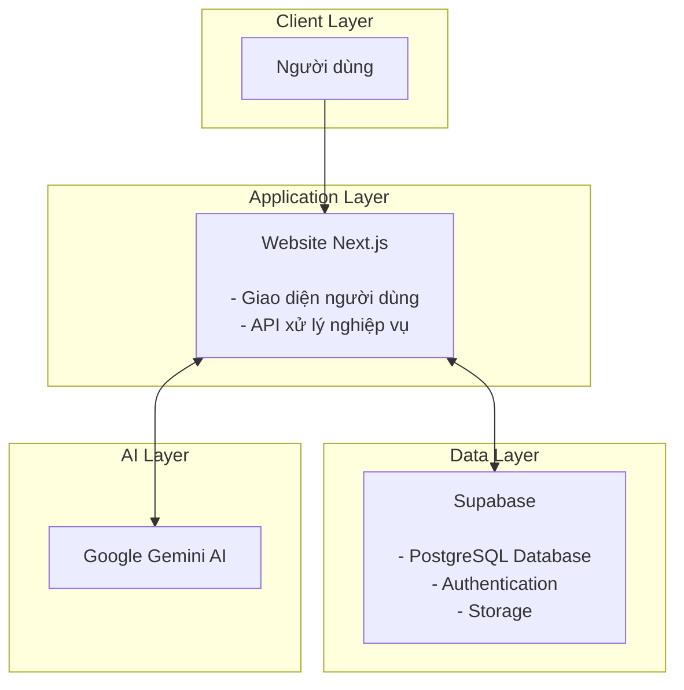
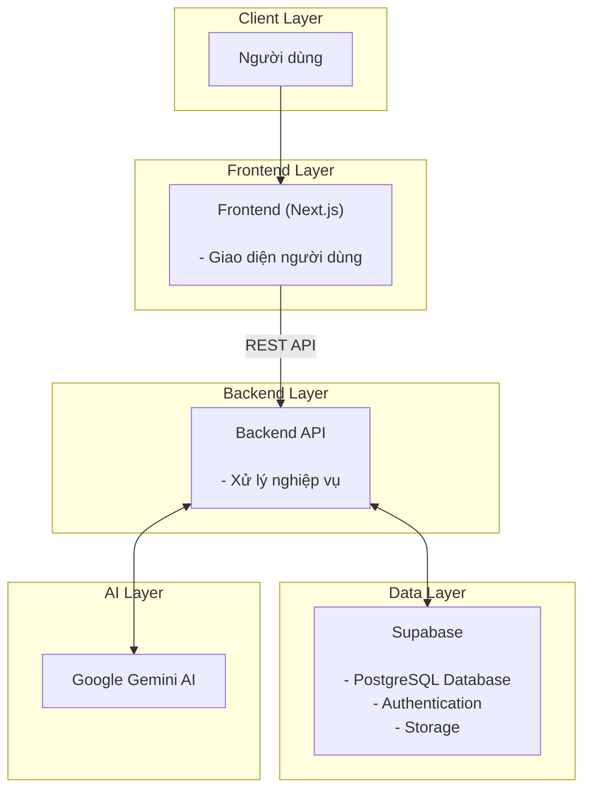
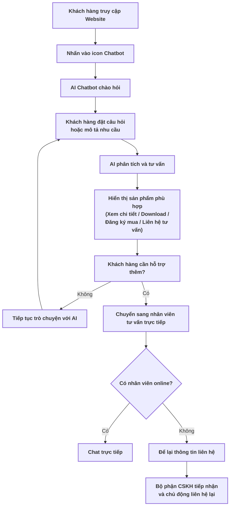
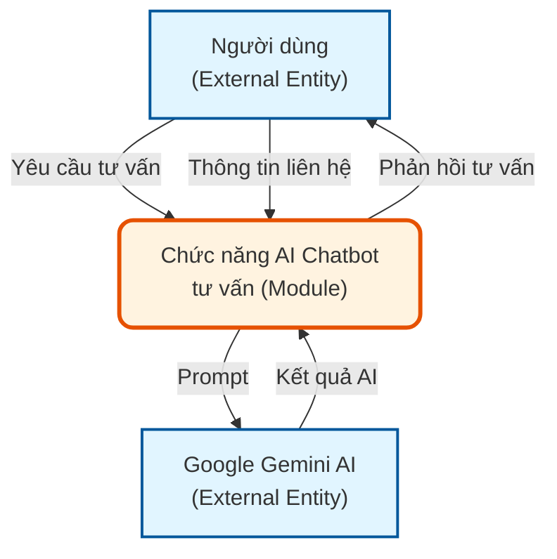
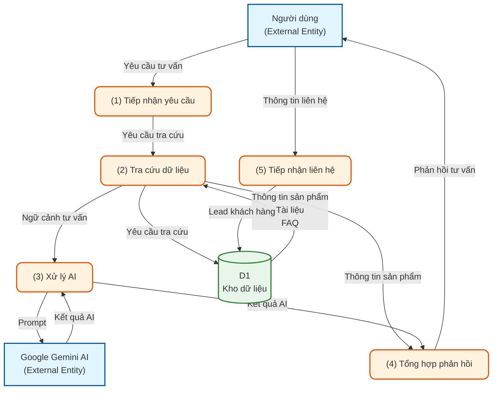

# BÁO CÁO ĐÁNH GIÁ VÀ ĐỀ XUẤT PHƯƠNG ÁN NÂNG CẤP

## Phần 1: Hiện trạng hệ thống

### 1. Công nghệ và bảo mật

#### 1.1. Công nghệ

- **Ngôn ngữ**: PHP
- **Framework**: FS Framework (Framework tự phát triển cũ)
- **Cơ sở dữ liệu**: MySQL (quản lý bằng phpMyAdmin)
- **Hosting**: Mắt Bão

Hệ thống hiện tại vẫn đáp ứng được nhu cầu vận hành, tuy nhiên kiến trúc công nghệ đã cũ, gây nhiều hạn chế trong việc mở rộng tính năng, nâng cấp giao diện, tối ưu hiệu năng và tích hợp các công nghệ mới như AI hoặc API từ bên thứ ba.

#### 1.2. Chức năng website hiện tại

**Trang chính:**

- **Sản phẩm**: Lọc theo
  - Lĩnh vực
  - Hãng sản xuất
  - Ứng dụng
  - Danh sách sản phẩm
  - Tìm kiếm theo từ khóa
- **Dịch vụ**
- **Tin tức**
- **Sự kiện**
- **Giới thiệu**
- **Liên hệ**
- **Chính sách**

Toàn bộ nội dung được lấy từ cơ sở dữ liệu và quản lý thông qua trang quản trị.

**Chức năng quản trị (Admin):**

- Quản lý người dùng Admin
- Quản lý sản phẩm (Lĩnh vực, Hãng sản xuất, Ứng dụng, Loại sản phẩm...)
- Quản lý Banner, Slideshow
- Quản lý Menu
- Quản lý Trang tĩnh
- Quản lý Tin tức
- Quản lý Dịch vụ
- Quản lý Sự kiện
- Quản lý Thư viện ảnh
- Quản lý Địa điểm & Liên hệ
- Quản lý đa ngôn ngữ
- Quản lý cấu hình Website và SEO

#### 1.3. Hạn chế của hệ thống

**Hạn chế về Hiệu năng:**

**Shared Hosting (Mắt Bão)**

- Chia sẻ tài nguyên: Website chia sẻ tài nguyên máy chủ với nhiều website khác, có thể bị ảnh hưởng khi các website khác có lưu lượng truy cập cao
- Giới hạn tài nguyên: Có giới hạn về CPU, RAM, băng thông
- Không kiểm soát được: Không thể cấu hình sâu máy chủ theo nhu cầu riêng

**Framework nội bộ (FS Framework)**

- Không có cộng đồng: Không được cộng đồng hỗ trợ, không có tài liệu rộng rãi
- Khó bảo trì: Nếu người phát triển rời đi, rất khó tìm người thay thế
- Cập nhật chậm: Không có cập nhật định kỳ từ cộng đồng, có thể có lỗ hổng bảo mật không được phát hiện

**Hạn chế về Bảo mật:**

**Cấu hình và Hạ tầng máy chủ**

- Lộ thông tin nhạy cảm: Thông tin kết nối cơ sở dữ liệu và một số tệp cấu hình có nguy cơ bị truy cập từ bên ngoài.
- Công nghệ lỗi thời: Nền tảng và thư viện cũ, tiềm ẩn các lỗ hổng bảo mật đã được công bố.

**Mã nguồn ứng dụng**

- Nguy cơ SQL Injection: Dữ liệu đầu vào chưa được kiểm soát và xử lý đầy đủ trước khi truy vấn cơ sở dữ liệu.
- Kiểm tra tệp tải lên chưa chặt chẽ: Chưa xác thực đầy đủ nội dung tệp, có nguy cơ tải lên tệp độc hại.
- Lọc dữ liệu đầu vào chưa hiệu quả: Cơ chế lọc thủ công dễ bị vượt qua bởi các kỹ thuật tấn công phổ biến.
- Xác thực chưa an toàn: Thiếu cơ chế chống CSRF, giới hạn đăng nhập và bảo vệ trước tấn công Brute Force.

---

### 2. Tốc độ và hiệu năng

#### 2.1. Tổng quan điểm số

| Chỉ số                            | Mobile              | Desktop             |
| --------------------------------- | ------------------- | ------------------- |
| Điểm Performance (Lab)            | 36/100 ❌           | 48/100 ❌           |
| Core Web Vitals (thực tế 28 ngày) | ✅ ĐẠT              | ❌ KHÔNG ĐẠT        |
| Tổng dung lượng trang             | 8.311 KiB (~8.1 MB) | 8.207 KiB (~8.0 MB) |

**Tóm tắt:** Cả hai thiết bị đều bị chấm điểm hiệu năng thấp trong bài test mô phỏng (lần tải đầu tiên), nhưng vì hai lý do khác nhau - Mobile chậm vì nội dung chính hiện quá lâu, Desktop chậm vì JavaScript "khoá" trang lại dù nội dung hiện ra nhanh.

#### 2.2. Core Web Vitals - Dữ liệu người dùng thực tế (28 ngày gần nhất)

Đây là số liệu đo từ người dùng Chrome thật, phản ánh trải nghiệm thực tế hàng ngày:

| Chỉ số       | Định nghĩa                                     | Chuẩn Google                                            | Mobile                 | Desktop               |
| ------------ | ---------------------------------------------- | ------------------------------------------------------- | ---------------------- | --------------------- |
| LCP          | Thời gian nội dung lớn nhất hiển thị hoàn toàn | <2.5s Tốt / 2.5-4s Cần cải thiện / >4s Kém        | 1.7s ✅                | 1.1s ✅               |
| INP          | Độ trễ phản hồi sau khi người dùng bấm/gõ      | <200ms Tốt / 200-500ms Cần cải thiện / >500ms Kém | 105ms ✅               | 62ms ✅               |
| CLS          | Mức độ bố cục bị xê dịch ngoài ý muốn          | <0.1 Tốt / 0.1-0.25 Cần cải thiện / >0.25 Kém     | 0 ✅                   | 0.38 ❌               |
| FCP          | Thời điểm nội dung đầu tiên xuất hiện          | <1.8s Tốt / 1.8-3s Cần cải thiện / >3s Kém        | 1.2s ✅                | 0.8s ✅               |
| TTFB         | Thời gian máy chủ phản hồi byte đầu tiên       | <0.8s Tốt / 0.8-1.8s Cần cải thiện / >1.8s Kém    | 0.6s ✅                | 0.5s ✅               |
| Kết quả cuối | -                                              | -                                                       | ✅ ĐẠT Core Web Vitals | ❌ KHÔNG ĐẠT (do CLS) |

**Nhận xét:** Người dùng thật trải nghiệm rất tốt trên cả hai thiết bị, ngoại trừ một điểm đáng lo: Desktop không đạt chuẩn Core Web Vitals chỉ vì CLS = 0.38 - bố cục trang bị nhảy vượt quá mức cho phép (0.1), đây là vấn đề đang xảy ra thật với người dùng, không chỉ trên lý thuyết.

#### 2.3. Dữ liệu phòng thí nghiệm (Lab) - Lượt tải trang đầu tiên

Đây là bài kiểm tra mô phỏng điều kiện xấu nhất (Mobile: mạng 4G chậm, thiết bị yếu; Desktop: chưa có cache), phản ánh khả năng tối ưu kỹ thuật thuần tuý của website.

**Bảng 5 chỉ số chính**

| Chỉ số      | Ý nghĩa                            | Chuẩn Google | 📱 Mobile        | 💻 Desktop   |
| ----------- | ---------------------------------- | ------------ | ---------------- | ------------ |
| FCP         | Nội dung đầu tiên xuất hiện        | <1.8s Tốt    | 1.1s ✅          | 0.3s ✅      |
| LCP         | Nội dung lớn nhất hiển thị xong    | <2.5s Tốt    | 7.9s ❌ Rất kém  | 1.4s ✅      |
| TBT         | Tổng thời gian JS chặn luồng chính | <200ms Tốt   | 410ms ⚠️         | 600ms ❌ Kém |
| CLS         | Bố cục bị xê dịch                  | <0.1 Tốt     | 0.782 ❌ Rất kém | 0.538 ❌ Kém |
| Speed Index | Tốc độ hiển thị toàn trang         | <3.4s Tốt    | 6.4s ❌ Kém      | 1.9s ✅      |

- **Mobile**: Trang bắt đầu hiện khá nhanh (FCP 1.1s), nhưng phần nội dung chính (ảnh banner, khối lớn nhất) phải đợi tới 7.9 giây mới hiện xong - quá chậm, người dùng cảm giác trang bị "treo". Đây là điểm yếu nặng nhất trên Mobile.
- **Desktop**: Ngược lại, nội dung hiện rất nhanh (FCP 0.3s, LCP 1.4s đều tốt), nhưng JavaScript chạy ngầm chiếm dụng trình duyệt tới 600ms, khiến người dùng thấy trang nhưng chưa _thao tác được_ ngay.
- **CLS** là vấn đề chung ở cả hai thiết bị trong bài test lab - bố cục bị nhảy rất nhiều trong lúc tải (0.782 Mobile, 0.538 Desktop), dù dữ liệu thực tế cho thấy Mobile không gặp vấn đề này.

#### 2.4. Vì sao điểm Performance thấp? (Breakdown điểm theo từng chỉ số)

Google tính điểm Performance 0-100 bằng cách cộng điểm từ 5 chỉ số. Bảng dưới cho thấy rõ "thủ phạm" ở mỗi thiết bị:

| Chỉ số      | Mobile              | Desktop             |
| ----------- | ------------------- | ------------------- |
| FCP         | +10                 | +10                 |
| LCP         | +1 ⬅ thủ phạm chính | +21                 |
| TBT         | +20                 | +6 ⬅ thủ phạm chính |
| CLS         | +1 ⬅ thủ phạm chính | +4                  |
| Speed Index | +4                  | +7                  |
| Tổng điểm   | 36                  | 48                  |

→ Mobile bị kéo điểm bởi LCP + CLS (nội dung hiện chậm, bố cục nhảy nhiều) → Desktop bị kéo điểm chủ yếu bởi TBT (JavaScript chặn tương tác quá lâu)

#### 2.5. Nguyên nhân kỹ thuật cụ thể gây chậm

**Nguyên nhân chung - ảnh hưởng cả 2 thiết bị**

| Vấn đề                              | Mobile            | Desktop           | Khuyến nghị khắc phục                           |
| ----------------------------------- | ----------------- | ----------------- | ----------------------------------------------- |
| Thời gian JS phải thực thi          | 2.8 giây          | 3.4 giây          | Tối ưu code, lazy loading, code splitting       |
| Trình duyệt bận xử lý (main thread) | 6.6 giây          | 9.8 giây          | Chuyển tác vụ nặng sang Web Workers             |
| JavaScript thừa, không dùng đến     | 631 KiB           | 631 KiB           | Tree-shaking, loại bỏ code chết                 |
| CSS thừa, không dùng đến            | 194 KiB           | 194 KiB           | Loại bỏ CSS không dùng, dùng CSS modules        |
| Ảnh thiếu khai báo width/height     | Có                | Có                | Khai báo kích thước rõ ràng, tránh layout shift |
| Số "tác vụ nặng" (long tasks)       | 12 việc           | 14 việc           | Phân tích và chia nhỏ tác vụ                    |
| Tài nguyên chặn hiển thị ban đầu    | 1.260 ms          | 460 ms            | Inline CSS quan trọng, defer/async JS           |
| Cache trình duyệt chưa tận dụng     | tiết kiệm 733 KiB | tiết kiệm 735 KiB | Cache headers phù hợp, service workers          |
| JavaScript chưa rút gọn (minify)    | tiết kiệm 3 KiB   | tiết kiệm 3 KiB   | Dùng build tools để minify                      |
| JavaScript cũ (legacy)              | tiết kiệm 55 KiB  | tiết kiệm 55 KiB  | Cập nhật thư viện lên bản mới                   |

**Nguyên nhân Mobile:**

- LCP rất kém (7.9s): cần preload tài nguyên quan trọng, tối ưu ảnh LCP, sử dụng CDN
- Tổng tài nguyên mạng: 8.311 KiB (~8.3 MB) - khá nặng cho mạng di động, cần nén hình ảnh, dùng WebP/AVIF, lazy loading
- Cải thiện phân phối ảnh: có thể tiết kiệm 4.186 KiB bằng cách dùng srcset/sizes, responsive images

**Nguyên nhân Desktop:**

- TBT cao (600ms): cần tối ưu JavaScript, giảm blocking time
- Buộc chỉnh lại luồng (Forced Reflow): trình duyệt phải tính lại bố cục nhiều lần do code đọc/ghi DOM không tối ưu - cần tránh đọc DOM ngay sau khi ghi DOM, batch DOM operations
- Cải thiện phân phối ảnh: có thể tiết kiệm 4.400 KiB
- DOM quá lớn: cây HTML có quá nhiều phần tử - cần giảm số lượng phần tử DOM, tránh lồng nhiều cấp, cân nhắc virtualization cho danh sách dài

#### 2.6. Kết luận

Desktop có phần cứng mạnh hơn nên tải nội dung nhanh hơn Mobile ở hầu hết chỉ số tốc độ, nhưng lại thua Mobile ở độ ổn định bố cục (CLS) - đây là lý do dù nhanh hơn, Desktop vẫn KHÔNG ĐẠT chuẩn Core Web Vitals trong khi Mobile ĐẠT.

---

### 3. Đánh giá Trải nghiệm người dùng (UI/UX)

#### 3.1. Đánh giá giao diện trên điện thoại

**• Tính đáp ứng giao diện (Responsive):**  
Website được thiết kế theo chuẩn Responsive, đảm bảo giao diện hiển thị ổn định trên các thiết bị di động. Các thành phần như menu, banner, nội dung, hình ảnh và nút chức năng tự động điều chỉnh theo kích thước màn hình, giúp người dùng thao tác thuận tiện mà không cần phóng to, thu nhỏ hoặc cuộn ngang. Qua quá trình kiểm tra, chưa ghi nhận các lỗi vỡ bố cục hoặc sai lệch giao diện trên các trang được đánh giá.

**• Lỗi hiển thị nội dung sự kiện:**  
Tại một số trang sự kiện, khi tiêu đề có độ dài lớn, hệ thống chưa tự động điều chỉnh khoảng cách (padding/margin) và chiều cao vùng hiển thị phù hợp. Điều này dẫn đến hiện tượng văn bản bị tràn, làm xô lệch bố cục và che khuất một phần nội dung hoặc thành phần giao diện phía dưới trên thiết bị di động. Mặc dù lỗi chỉ xuất hiện trong các trường hợp có tiêu đề dài, nhưng làm giảm tính thẩm mỹ và ảnh hưởng đến khả năng tiếp cận thông tin của người dùng.

**Cách xử lý:** Cần điều chỉnh CSS của khối hiển thị tiêu đề để hỗ trợ tự động xuống dòng, thiết lập chiều cao linh hoạt và khoảng cách phù hợp, đảm bảo bố cục luôn ổn định với các tiêu đề có độ dài khác nhau trên mọi kích thước màn hình.

#### 3.2. Đánh giá về luồng khách hàng điền form đăng ký tư vấn sản phẩm

**Các hạng mục đã tối ưu:**

Website mang lại trải nghiệm sử dụng tương đối tốt trên thiết bị di động và luồng đăng ký tư vấn được xây dựng đầy đủ, đáp ứng nhu cầu thao tác của người dùng.

- **Tính đáp ứng giao diện (Responsive):** Website được thiết kế theo chuẩn Responsive, đảm bảo giao diện hiển thị ổn định trên các thiết bị di động. Các thành phần như menu, banner, nội dung, hình ảnh và nút chức năng tự động điều chỉnh theo kích thước màn hình, không ghi nhận hiện tượng vỡ bố cục hoặc phải cuộn ngang trong quá trình kiểm tra.
- **Luồng đăng ký tư vấn rõ ràng:** Người dùng có thể dễ dàng truy cập biểu mẫu thông qua các nút chức năng như Liên hệ hoặc Đăng ký mua ngay tại trang sản phẩm. Biểu mẫu hiển thị đầy đủ các trường thông tin cần thiết và quy trình đăng ký diễn ra xuyên suốt, không phát sinh lỗi trong quá trình thao tác.
- **Kiểm tra dữ liệu đầu vào (Form Validation):** Hệ thống đã triển khai cơ chế kiểm tra dữ liệu cho các trường bắt buộc. Khi người dùng bỏ trống hoặc nhập thiếu thông tin, hệ thống hiển thị thông báo lỗi tương ứng, giúp hạn chế việc gửi các biểu mẫu không hợp lệ và nâng cao chất lượng dữ liệu tiếp nhận.

**Các hạng mục chưa tối ưu:**

Mặc dù luồng đăng ký tư vấn hoạt động ổn định, vẫn còn một số điểm có thể ảnh hưởng đến trải nghiệm người dùng.

- **Biểu tượng hỗ trợ trực tuyến trên điện thoại che khuất nút thao tác:** Trong một số trường hợp, biểu tượng hỗ trợ trực tuyến (Chat Widget) hiển thị chồng lên nút Gửi của biểu mẫu đăng ký tư vấn trên thiết bị di động. Hiện tượng này không xảy ra thường xuyên nhưng có thể gây khó khăn cho người dùng khi hoàn tất biểu mẫu, đặc biệt trên các thiết bị có màn hình nhỏ.
- **Biểu mẫu yêu cầu nhiều thông tin:** Biểu mẫu hiện tại thu thập nhiều trường thông tin ngay từ bước đầu, bao gồm họ tên, đơn vị công tác, địa chỉ, tỉnh/thành phố, email, số điện thoại, ghi chú và mã xác thực. Việc phải nhập nhiều dữ liệu trên thiết bị di động có thể làm tăng thời gian thao tác và ảnh hưởng đến tỷ lệ hoàn thành biểu mẫu của người dùng.

**Cách xử lý:**

- Điều chỉnh vị trí hoặc thứ tự hiển thị (z-index) của Chat Widget, hoặc tự động thu gọn widget khi người dùng mở biểu mẫu đăng ký để tránh che khuất các nút thao tác quan trọng.
- Rà soát và tối ưu số lượng trường thông tin trong biểu mẫu. Có thể chỉ giữ lại các trường bắt buộc như Họ tên, Số điện thoại, Email và Nhu cầu tư vấn ở bước đầu, các thông tin còn lại sẽ được nhân viên kinh doanh thu thập trong quá trình liên hệ nhằm giảm thao tác nhập liệu và tăng tỷ lệ gửi biểu mẫu thành công.
- Cân nhắc tích hợp chatbot hoặc AI tư vấn để hỗ trợ giải đáp các câu hỏi phổ biến về sản phẩm trước khi người dùng gửi yêu cầu. Giải pháp này giúp người dùng tiếp cận thông tin nhanh hơn, đồng thời giảm số lượng yêu cầu tư vấn lặp lại và nâng cao hiệu quả chăm sóc khách hàng.

---

### 4. Đánh giá Tối ưu SEO

**Tình trạng chung:** Hệ thống đang gặp các lỗi cấu trúc rất nặng và mang tính đồng bộ. Đây là lỗi phát sinh từ bộ khung lập trình gốc (Template Code) của website, nghĩa là toàn bộ các trang con khác trên hệ thống (Giới thiệu, Liên hệ, Chi tiết sản phẩm...) đều đang lặp lại các lỗi cấu trúc này, gây ảnh hưởng trực tiếp đến khả năng thu thập dữ liệu và xếp hạng của Google.

**Các hạn chế mang tính hệ thống:**

- **Thẻ tiêu đề chính (`<H1>`) bị gán cứng sai mục đích:** Hệ thống đang tự động đặt từ khóa định danh chính `<H1>` là cic.com.vn cho tất cả các trang danh mục thay vì tên riêng của trang đó. Việc lặp đi lặp lại tên miền ở thẻ `<H1>` khiến Google không thể nhận diện được chủ đề cốt lõi của từng trang con.
- **Lạm dụng và phân cấp sai cấu trúc thẻ tiêu đề (`<H3>`, `<H4>`):** Hệ thống đang gom và gán thẻ tiêu đề một cách máy móc, làm loãng cấu trúc dữ liệu.
  - _Dẫn chứng trang Sản phẩm:_ Biến toàn bộ thông tin địa chỉ, số điện thoại ở chân trang (Footer) thành thẻ `<H3>`.
  - _Dẫn chứng trang Tin tức:_ Bê nguyên danh sách toàn bộ bài viết ra ngoài danh mục và cấu hình hàng loạt thành 1.009 thẻ `<H3>` và 998 thẻ `<H4>` trên cùng một trang, khiến bot của Google bị quá tải và đánh giá cấu trúc trang là spam.
- **Thẻ mô tả (Meta Description) sinh tự động quá sơ sài:** Hệ thống đang tự tạo phần mô tả theo công thức cố định: \[Tên trang\],CIC (Trang sản phẩm đạt 12 ký tự, Trang tin tức đạt 11 ký tự). Nội dung này hoàn toàn không đạt chuẩn tối ưu của Google (yêu cầu từ 120 - 160 ký tự) và không có ô cấu hình riêng để nhân viên tự biên tập nội dung thu hút khách hàng click.
- **Về Sơ đồ trang web (Sitemap.xml) và Thẻ định danh (Canonical):** mặc dù website đã có tệp tin sitemap.xml hoạt động ở mức cơ bản để khai báo danh mục cho Google, nhưng hệ thống lại đang thiếu hoàn toàn thẻ định danh gốc (Canonical Tag) trên tất cả các trang (No canonical tag is set). Việc thiếu thẻ Canonical kết hợp với việc phân trang tin tức/sản phẩm quy mô lớn sẽ tạo ra rủi ro cực lớn về việc trùng lặp nội dung (Duplicate Content), khiến website bị Google phạt giảm tổng điểm uy tín.

**Cách xử lý:** Cần refactor lại các thành phần trong template (Heading, Meta Description, Canonical...).

---

## Phần 2: Đề xuất phương án nâng cấp

### 1. Đề xuất nâng cấp công nghệ

#### 1.1. Các phương án nâng cấp

**Phương án 1. Next.js Fullstack kết hợp Supabase (Khuyến nghị)**

**Mô hình kiến trúc hệ thống:**

**Mô tả**

Đề xuất refactor toàn bộ website sang Next.js theo mô hình Fullstack, trong đó một dự án duy nhất sẽ đảm nhiệm cả giao diện người dùng (Frontend) và các API xử lý nghiệp vụ (Backend).

Hệ thống sử dụng Supabase làm nền tảng Backend-as-a-Service (BaaS), bao gồm:

- PostgreSQL làm cơ sở dữ liệu.
- Authentication để quản lý đăng nhập người dùng (khi cần).
- Storage để lưu trữ hình ảnh, tài liệu và các tệp tải lên.

Các nghiệp vụ của website như quản lý sản phẩm, tin tức, biểu mẫu đăng ký tư vấn, tích hợp AI Chatbot hoặc các chức năng bán phần mềm sẽ được xử lý thông qua API của Next.js. Kiến trúc này giúp hệ thống đơn giản, dễ bảo trì nhưng vẫn đáp ứng khả năng mở rộng trong tương lai.

**Ưu điểm**

- Quản lý giao diện và API trong cùng một dự án, giảm độ phức tạp khi phát triển và bảo trì.
- Tối ưu SEO và tốc độ tải trang nhờ Server-Side Rendering (SSR) và Static Site Generation (SSG).
- Dễ tích hợp AI Chatbot, Email, cổng thanh toán và các API bên thứ ba.
- Tận dụng hệ sinh thái Cloud của Supabase giúp giảm chi phí quản trị máy chủ.
- Quy trình triển khai hiện đại, dễ dàng cập nhật và mở rộng hệ thống.

**Hạn chế**

- Cần thực hiện refactor toàn bộ mã nguồn hiện tại.
- Phải chuyển đổi dữ liệu từ MySQL sang PostgreSQL và kiểm thử toàn bộ chức năng trước khi đưa vào vận hành.

**Khả năng mở rộng**

Phương án này đáp ứng tốt định hướng phát triển của website CIC trong giai đoạn tới, bao gồm:

- Mở rộng danh mục sản phẩm phần mềm và các gói dịch vụ.
- Xây dựng tài khoản khách hàng để theo dõi lịch sử đăng ký tư vấn, đơn hàng hoặc giấy phép sử dụng phần mềm.
- Tích hợp AI Chatbot hỗ trợ tư vấn sản phẩm và chăm sóc khách hàng 24/7.
- Tích hợp Email Marketing, CRM hoặc các hệ thống quản lý khách hàng.
- Mở rộng thêm các chức năng như tải bản dùng thử, kích hoạt license hoặc quản lý tài liệu sản phẩm.
- Dễ dàng phát triển thêm các module mới mà không cần thay đổi kiến trúc tổng thể.

---

**Phương án 2. Tách riêng Frontend và Backend**

**Mô hình kiến trúc hệ thống**

**Mô tả**

Trong mô hình này, Next.js chỉ đảm nhiệm vai diện người dùng (Frontend), còn toàn bộ nghiệp vụ logic và các kết nối ngoại vi được xây dựng thành một hệ thống Backend API độc lập (đề xuất sử dụng NestJS).

- Xử lý AI Chatbot: Toàn bộ logic tích hợp, bảo mật API Key và điều phối luồng dữ liệu với Google Gemini AI sẽ được xử lý tập trung tại Backend API, giúp Frontend hoàn toàn nhẹ tải và bảo mật tuyệt đối.
- Lưu trữ dữ liệu: Backend API sẽ giao tiếp trực tiếp với PostgreSQL Database và Storage của Supabase để tra cứu dữ liệu tri thức (Sản phẩm, FAQ) và lưu thông tin liên hệ (Lead) của khách hàng.

**Ưu điểm**

- Phân tách rõ ràng giữa giao diện (Frontend) và nghiệp vụ logic (Backend).
- Bảo mật tối đa cho AI Chatbot: API Key của Google Gemini và cấu trúc Database được giấu hoàn toàn ở phía Backend API, ngăn chặn tuyệt đối các nguy cơ tấn công hoặc rò rỉ từ phía Client.
- Thuận lợi khi mở rộng: Dễ dàng phát triển đồng thời Website, Mobile App hoặc các hệ thống khác sử dụng chung một cổng API xử lý AI và dữ liệu.
- Dễ tối ưu hiệu năng: Có thể tối ưu hóa hoặc nâng cấp riêng module xử lý AI ở Backend mà không làm ảnh hưởng đến giao diện người dùng hiện tại.
- Có thể triển khai độc lập từng thành phần của hệ thống.

**Hạn chế**

- Chi phí phát triển, máy chủ vận hành và bảo trì cao hơn.
- Quá trình triển khai phức tạp hơn do phải quản lý, đồng bộ nhiều dịch vụ độc lập (Frontend, Backend API, Supabase, Gemini AI).
- Chưa thực sự cần thiết nếu quy mô hiện tại của website CIC chỉ ở mức cơ bản.

**Khả năng mở rộng**

Phương án này là bệ phóng hoàn hảo nếu trong tương lai CIC định hướng phát triển website thành một hệ sinh thái dịch vụ quy mô lớn, bao gồm:

- Tích hợp đa kênh AI Chatbot: Sử dụng chung một lõi Backend API xử lý AI để tích hợp chatbot lên cả Website, Mobile App, Facebook Messenger hoặc Zalo OA.
- Hệ thống bán phần mềm trực tuyến hoàn chỉnh (đặt hàng, thanh toán, tự động sinh và cấp license phần mềm).
- Kết nối đồng bộ dữ liệu với các hệ thống nội bộ doanh nghiệp như CRM, ERP, hoặc phần mềm kế toán.
- Xây dựng cổng thông tin riêng dành cho hệ thống đại lý hoặc đối tác tự quản lý.
- Phục vụ lượng lớn người dùng đồng thời với nhiều nghiệp vụ xử lý dữ liệu phức tạp.

#### 1.2. Đề xuất chuyển đổi cơ sở dữ liệu

Đề xuất chuyển đổi toàn bộ dữ liệu từ MySQL sang PostgreSQL trên nền tảng Supabase.

**Lợi ích**

- Nâng cao khả năng xử lý dữ liệu và hiệu năng truy vấn khi hệ thống phát triển.
- Hỗ trợ đầy đủ các tính năng SQL hiện đại và khả năng mở rộng tốt.
- Tích hợp trực tiếp với Authentication, Storage và các dịch vụ Cloud của Supabase.
- Dễ dàng sao lưu, phục hồi và quản trị dữ liệu.
- Tương thích tốt với Next.js và các thư viện ORM hiện đại.

Việc nâng cấp sẽ bao gồm quá trình migration dữ liệu từ MySQL sang PostgreSQL, đồng thời kiểm thử toàn bộ chức năng để đảm bảo dữ liệu được chuyển đổi đầy đủ và chính xác.

#### 1.3. Đề xuất hạ tầng triển khai

| Thành phần         | Công nghệ đề xuất                                             |
| ------------------ | ------------------------------------------------------------- |
| Frontend           | Next.js                                                       |
| Backend            | API của Next.js (Fullstack) hoặc Backend API độc lập (NestJS) |
| Database           | PostgreSQL (Supabase)                                         |
| Authentication     | Supabase Auth                                                 |
| File Storage       | Supabase Storage                                              |
| AI                 | Google Gemini                                                 |
| Triển khai Website | Vercel                                                        |

**Cache:** Trong giai đoạn đầu, hệ thống có thể tận dụng cơ chế cache sẵn của Next.js (Data Cache, Route Cache, ISR) để tối ưu hiệu năng mà chưa cần triển khai Redis. Khi số lượng người dùng, dữ liệu hoặc tần suất truy cập tăng cao, có thể bổ sung Redis để cache các dữ liệu truy cập thường xuyên như danh mục sản phẩm, cấu hình hệ thống hoặc kết quả tìm kiếm nhằm giảm tải cho cơ sở dữ liệu và nâng cao tốc độ phản hồi.

---

### 2. Đề xuất tích hợp AI

#### 2.1. Chức năng và luồng hoạt động

Đề xuất tích hợp AI Chatbot sử dụng Google Gemini nhằm hỗ trợ tư vấn sản phẩm phần mềm, nâng cao trải nghiệm khách hàng và tối ưu quy trình tiếp nhận khách hàng tiềm năng trên website.

AI Chatbot đóng vai trò là chuyên viên tư vấn bước đầu, hỗ trợ khách hàng từ giai đoạn tìm hiểu nhu cầu đến khi kết nối với bộ phận kinh doanh, giúp rút ngắn thời gian phản hồi và tăng khả năng chuyển đổi.

**Chức năng triển khai**

- Tư vấn sản phẩm theo nhu cầu: AI phân tích nhu cầu của khách hàng và đề xuất các sản phẩm hoặc giải pháp phù hợp.
- Tra cứu thông tin sản phẩm: Trả lời các câu hỏi về tính năng, phiên bản, giá bán, yêu cầu cài đặt, tài liệu hướng dẫn và các thông tin liên quan.
- Điều hướng nội dung trên website: Hỗ trợ tìm kiếm sản phẩm, tin tức, tài liệu và các nội dung cần thiết một cách nhanh chóng.
- Đề xuất sản phẩm trực quan: Sau khi xác định được nhu cầu, AI hiển thị các sản phẩm phù hợp dưới dạng thẻ thông tin (Product Card). Mỗi sản phẩm sẽ cung cấp các thao tác nhanh như:
  - Xem chi tiết sản phẩm
  - Tải tài liệu / Phiên bản dùng thử (nếu có)
  - Đăng ký mua
  - Liên hệ tư vấn
- Chuyển tiếp sang nhân viên tư vấn: Khi khách hàng cần báo giá, tư vấn chuyên sâu hoặc hỗ trợ ngoài khả năng của AI, hệ thống sẽ chuyển tiếp sang bộ phận chăm sóc khách hàng. Nếu có nhân viên trực tuyến, khách hàng sẽ được hỗ trợ ngay; nếu ngoài giờ làm việc, AI sẽ đề nghị khách hàng để lại thông tin liên hệ để được phản hồi trong thời gian sớm nhất.
- Ghi nhận khách hàng tiềm năng: Lưu lại các yêu cầu tư vấn và thông tin liên hệ để hỗ trợ đội ngũ kinh doanh trong quá trình chăm sóc và theo dõi khách hàng.

**Luồng hoạt động đề xuất:**

**Lợi ích**

- Hỗ trợ khách hàng 24/7, kể cả ngoài giờ làm việc.
- Rút ngắn thời gian tìm kiếm thông tin và lựa chọn sản phẩm phù hợp.
- Đề xuất đúng sản phẩm dựa trên nhu cầu, đồng thời cung cấp ngay các thao tác như xem chi tiết, tải tài liệu, đăng ký mua hoặc liên hệ tư vấn, giúp khách hàng dễ dàng thực hiện bước tiếp theo.
- Giảm tải cho bộ phận chăm sóc khách hàng khi AI xử lý các câu hỏi phổ biến.
- Chuyển tiếp kịp thời các khách hàng có nhu cầu mua hàng sang bộ phận kinh doanh, đồng thời ghi nhận thông tin để tiếp tục chăm sóc khi chưa thể hỗ trợ ngay.
- Hình thành quy trình tư vấn khép kín từ AI tư vấn → giới thiệu sản phẩm → khách hàng thực hiện hành động (xem chi tiết, tải tài liệu, đăng ký mua) → nhân viên tiếp nhận và chăm sóc, góp phần nâng cao trải nghiệm người dùng và tăng tỷ lệ chuyển đổi.

#### 2.2. Sơ đồ luồng dữ liệu khi tích hợp AI chatbot mới

**Sơ đồ luồng dữ liệu mức 0:**

Sơ đồ này tập trung mô tả riêng luồng hoạt động của tính năng AI Chatbot Tư vấn trên website CIC. Hai thực thể ngoài tương tác với module này:

- Người dùng: gửi yêu cầu tư vấn/thông tin liên hệ, nhận phản hồi tư vấn.
- Google Gemini AI: dịch vụ AI bên thứ ba được module gọi đến để sinh nội dung tư vấn.

**Sơ đồ luồng dữ liệu mức 1:**

Sơ đồ Mức 1 phân tách chi tiết hoạt động bên trong của Module AI Chatbot thành 5 bước xử lý khép kín:

- Tiếp nhận yêu cầu: Nhận câu hỏi đầu vào từ phía Người dùng.
- Tra cứu dữ liệu: Tìm kiếm các thông tin liên quan trong kho dữ liệu để làm tài liệu tham khảo cho AI.
- Xử lý AI: Chuyển câu hỏi kèm tài liệu tham khảo sang cho Google Gemini AI để nhờ phân tích và soạn câu trả lời.
- Tổng hợp phản hồi: Nhận kết quả từ AI, kết hợp thêm định dạng hiển thị trực quan (như Thẻ sản phẩm) để gửi lại cho Người dùng.
- Tiếp nhận liên hệ: Ghi nhận lại thông tin của Người dùng khi họ có nhu cầu chuyển sang gặp nhân viên tư vấn trực tiếp.

---

### 3. Lộ trình chuyển đổi

#### 3.1. Mục tiêu và nguyên tắc chuyển đổi

Quá trình chuyển đổi từ hệ thống PHP/FS Framework/MySQL hiện tại sang nền tảng Next.js Fullstack kết hợp Supabase (PostgreSQL) được thực hiện theo nguyên tắc "chuyển đổi song song - kiểm soát rủi ro - không gián đoạn", đảm bảo:

- Toàn bộ dữ liệu (sản phẩm, tin tức, hình ảnh, tài liệu) được chuyển đổi đầy đủ, chính xác, không thất thoát.
- Toàn bộ thứ hạng từ khóa và lưu lượng truy cập tự nhiên (organic traffic) hiện có được bảo toàn tối đa.
- Các lỗi cấu trúc SEO tồn đọng (Heading, Meta Description, Canonical, Sitemap) được khắc phục triệt để ngay trong quá trình xây dựng hệ thống mới, không mang lỗi cũ sang nền tảng mới.
- Song song với tối ưu SEO, hệ thống mới được chuẩn hóa để các công cụ AI tạo sinh (ChatGPT, Gemini, Perplexity, Claude...) có thể thu thập, hiểu đúng ngữ cảnh và trích dẫn nội dung (GEO - Generative Engine Optimization), do đây là kênh tiếp cận khách hàng mới đang tăng trưởng song song với tìm kiếm truyền thống. Vì phần lớn nguyên nhân gây lỗi SEO (Heading sai, thiếu Meta Description, thiếu Canonical, dữ liệu không có cấu trúc) cũng đồng thời là rào cản với GEO, hai mục tiêu này được xử lý gộp trong cùng một lần tối ưu kỹ thuật thay vì tách thành dự án riêng.
- Website cũ và website mới không vận hành song song quá lâu để tránh nội dung trùng lặp (Duplicate Content).

#### 3.2. Các giai đoạn triển khai

**Giai đoạn 1 - Chuẩn bị và Kiểm toán (Audit)**

- Crawl toàn bộ website hiện tại bằng công cụ (ví dụ Screaming Frog) để lập danh sách đầy đủ các URL đang tồn tại, đang được Google lập chỉ mục (index).
- Lập bảng ánh xạ URL (URL Mapping) đối chiếu từng URL cũ với URL tương ứng trên hệ thống mới, làm cơ sở cấu hình redirect ở Giai đoạn 4.
- Ghi nhận baseline SEO gồm thứ hạng từ khóa hiện tại, lưu lượng truy cập, số trang được index trên Google Search Console - dùng làm mốc so sánh sau khi chuyển đổi.
- Kiểm tra hiện trạng khả năng truy cập của các AI crawler (GPTBot, ClaudeBot, Google-Extended, PerplexityBot...) qua robots.txt hiện tại, làm cơ sở đối chiếu sau khi chuyển đổi sang hệ thống mới.
- Backup toàn bộ mã nguồn PHP và dữ liệu MySQL hiện tại trước khi thực hiện bất kỳ thay đổi nào.

**Giai đoạn 2 - Chuyển đổi dữ liệu (Data Migration)**

- Migration dữ liệu từ MySQL sang PostgreSQL trên nền tảng Supabase, đảm bảo giữ nguyên toàn bộ nội dung, hình ảnh, tài liệu đính kèm.
- Giữ nguyên các trường metadata quan trọng cho SEO (slug/đường dẫn, tiêu đề, mô tả) trong quá trình chuyển đổi để làm nền tảng cho Giai đoạn 3.
- Kiểm thử đối chiếu số lượng bản ghi, tính toàn vẹn dữ liệu giữa hệ thống cũ và hệ thống mới trước khi bàn giao cho bước dựng giao diện.

**Giai đoạn 3 - Xây dựng hệ thống mới và Tối ưu kỹ thuật cho SEO và GEO**

Đây là giai đoạn khắc phục toàn bộ các lỗi cấu trúc đã ghi nhận ở phần đánh giá hiện trạng, đồng thời chuẩn hóa hệ thống để tương thích tốt với cả công cụ tìm kiếm truyền thống (SEO) lẫn công cụ AI tạo sinh (GEO), tích hợp trực tiếp vào template của hệ thống mới:

- Chuẩn hóa thẻ H1: mỗi trang có một thẻ H1 duy nhất, phản ánh đúng chủ đề/tên sản phẩm/tên bài viết của trang đó, không còn gán cứng tên miền.
- Tái cấu trúc phân cấp Heading (H2 - H6): loại bỏ việc gán hàng loạt thông tin footer hoặc danh sách bài viết thành H3/H4; heading chỉ dùng đúng ngữ nghĩa phân cấp nội dung.
- Bổ sung ô cấu hình Meta Description riêng cho từng trang, khuyến nghị 120 - 160 ký tự, cho phép biên tập viên chỉnh sửa nội dung thu hút.
- Thêm Canonical Tag tự động cho toàn bộ trang nhằm loại bỏ rủi ro trùng lặp nội dung, đặc biệt với các trang phân trang (pagination) sản phẩm/tin tức.
- Tạo lại Sitemap.xml động, tự động cập nhật khi có nội dung mới, khai báo chuẩn theo chuẩn Google.
- Cấu hình Robots.txt phù hợp với cấu trúc URL mới, đồng thời cho phép các bot AI phổ biến (GPTBot, ClaudeBot, Google-Extended, PerplexityBot, Amazonbot...) thu thập dữ liệu thay vì áp dụng cấu hình chặn mặc định.
- Bổ sung dữ liệu có cấu trúc (Schema.org/JSON-LD) đầy đủ cho trang sản phẩm (tên, mô tả, hãng sản xuất, lĩnh vực ứng dụng) và bài viết tin tức/sự kiện (tiêu đề, ngày đăng, tác giả), cùng Schema dạng FAQPage cho các câu hỏi thường gặp - vừa hỗ trợ hiển thị rich snippet trên Google, vừa giúp AI đọc hiểu và trích dẫn chính xác nội dung.
- Tạo file llms.txt ở thư mục gốc website, tóm tắt ngắn gọn về CIC, lĩnh vực hoạt động, danh mục sản phẩm chính và đường link tới các trang quan trọng, giúp AI nắm được tổng quan website nhanh hơn.
- Thiết kế mẫu trình bày nội dung theo hướng answer-first cho trang sản phẩm và bài viết tư vấn (nêu thông tin cốt lõi ngay đoạn mở đầu) và bổ sung khối Hỏi-Đáp (Q&A) cho từng dòng sản phẩm, giúp cả người đọc lẫn AI dễ nắm bắt và trích dẫn nội dung.

**Giai đoạn 4 - Thiết lập chuyển hướng 301 (Redirect Mapping)**

- Đây là bước quan trọng nhất để không mất thứ hạng SEO. Toàn bộ URL cũ trong bảng ánh xạ ở Giai đoạn 1 phải được cấu hình redirect 301 (chuyển hướng vĩnh viễn) sang URL tương ứng trên hệ thống mới, theo nguyên tắc 1-1.
- Ưu tiên xử lý và kiểm tra kỹ các URL đang có traffic/thứ hạng cao trước.
- Kiểm tra không để xảy ra redirect chain (chuyển hướng nhiều lớp) hoặc redirect loop (lặp vô hạn).
- Với các URL không còn nội dung tương ứng, cân nhắc điều hướng về trang danh mục liên quan gần nhất thay vì trả về lỗi 404.

**Giai đoạn 5 - Kiểm thử trên môi trường Staging**

- Kiểm thử toàn bộ chức năng nghiệp vụ (sản phẩm, tin tức, biểu mẫu đăng ký tư vấn...).
- Kiểm thử hiệu năng và trải nghiệm bằng Lighthouse, Core Web Vitals.
- Dùng Screaming Frog quét lại toàn bộ URL redirect để xác nhận không còn lỗi.
- Kiểm tra dữ liệu có cấu trúc bằng công cụ Rich Results Test và xác nhận các bot AI (GPTBot, ClaudeBot...) có thể truy cập, đọc đúng nội dung trang.
- Thiết lập noindex/robots.txt disallow trên môi trường staging để tránh Google và các AI crawler index nhầm nội dung thử nghiệm.

**Giai đoạn 6 - Triển khai chính thức (Go-live)**

- Lựa chọn thời điểm triển khai vào khung giờ có lượng truy cập thấp để giảm ảnh hưởng người dùng.
- Deploy hệ thống mới lên môi trường production (Vercel), trỏ domain chính thức.
- Submit Sitemap.xml mới lên Google Search Console ngay sau khi go-live.
- Theo dõi Google Search Console theo thời gian thực để phát hiện sớm lỗi crawl phát sinh.

**Giai đoạn 7 - Giám sát sau triển khai (Post-launch Monitoring)**

Trong 30 - 90 ngày đầu sau khi chuyển đổi, cần giám sát chặt chẽ để phát hiện và xử lý kịp thời các vấn đề phát sinh:

- Theo dõi báo cáo Coverage trên Google Search Console để phát hiện lỗi crawl, trang bị loại khỏi chỉ mục.
- Theo dõi biến động thứ hạng từ khóa hằng ngày, so sánh với baseline đã ghi nhận ở Giai đoạn 1.
- Theo dõi lưu lượng truy cập tự nhiên (organic traffic) trên công cụ phân tích, so sánh với giai đoạn trước chuyển đổi.
- Theo dõi thêm lưu lượng truy cập tham chiếu từ các nguồn AI (referral từ chatgpt.com, perplexity.ai, gemini.google.com...) trên công cụ phân tích, làm cơ sở đánh giá hiệu quả của các hạng mục GEO đã triển khai.
- Kiểm tra nhật ký máy chủ (server log) để xác nhận Googlebot đã crawl và index các trang mới.
- Xử lý ngay các lỗi 404 hoặc redirect sai phát sinh trong quá trình theo dõi.

#### 3.3. Các lưu ý để không mất thứ hạng SEO và duy trì khả năng hiển thị trên AI

- Giữ nguyên cấu trúc URL nếu có thể; nếu bắt buộc thay đổi, phải có redirect 301 tương ứng cho từng URL, không bỏ sót.
- Không xóa hoặc tắt website cũ đột ngột - chỉ chuyển hướng sau khi đã xác nhận redirect hoạt động chính xác.
- Nội dung trên trang mới phải giữ nguyên hoặc tốt hơn nội dung cũ, không cắt giảm nội dung đã được Google đánh giá tốt.
- Cập nhật và submit Sitemap.xml mới ngay khi go-live, đồng thời khai báo "Change of Address" nếu có thay đổi tên miền/cấu trúc lớn.
- Không chặn nhầm các bot AI qua robots.txt hoặc cấu hình bảo mật (firewall/CDN), vì đây là điều kiện tiên quyết để nội dung có thể xuất hiện trong câu trả lời của các công cụ AI.
- Giám sát sát sao 30 - 90 ngày đầu tiên sau triển khai, đây là giai đoạn Google và các AI engine đánh giá lại toàn bộ website.