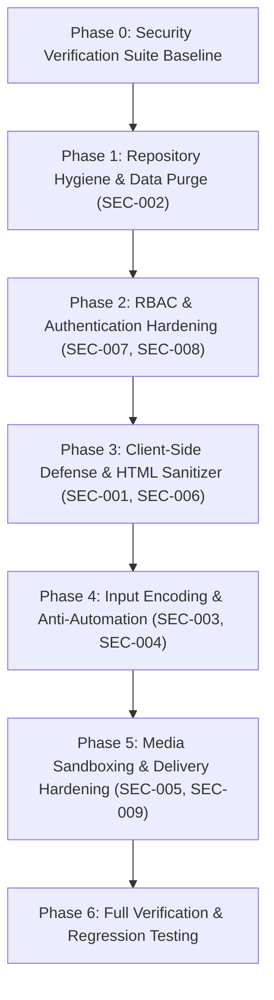

# Security Implementation Plan: Remediation of Findings SEC-001 through SEC-009

This document establishes the end-to-end implementation plan to remediate all 9 confirmed security findings discovered during the comprehensive Security Audit of the CIC Web Platform.

The remediations are structured into sequential, dependency-ordered phases from **P1 (High)** through **P2 (Medium)** and **P3 (Low)**, designed to eliminate critical attack vectors without causing functional regressions or breaking legitimate CMS authoring workflows.

---

## User Review Required

> [!IMPORTANT]
> **Dependency Addition**: Remediating **SEC-001** (Stored XSS) requires installing a production-grade, battle-tested HTML sanitizer library (\`sanitize-html\` and \`@types/sanitize-html\`). This is necessary to safely sanitize rich-text markup generated by CKEditor while neutralizing scripts, unauthorized iframes, and inline event handlers.

> [!WARNING]
> **Repository Data Purge (SEC-002)**: Two historical database dumps (\`cic14005_cic_fs.sql\` and \`export_data.sql\` totaling > 120MB) will be untracked from Git via \`git rm --cached\` and blocked in \`.gitignore\`. The actual local files on your machine will be preserved, but will no longer be tracked or pushed to remote repositories.

> [!NOTE]
> **Rate Limiting Defaults (SEC-004)**: Rate limiting will be introduced using an in-memory sliding window cache with sensible thresholds:
> - \`/cms/login\`: 5 attempts per 60 seconds per IP.
> - \`/api/forms/submit\` & Contact Action: 10 submissions per minute per IP.

---

## Open Questions

None. All 9 findings are grounded in repository source code, fully verified against local runtime behaviors, and have concrete reproduction evidence in [\`docs/security/findings.json\`](file:///d:/Workspace/CIC/old_page/cic-web/docs/security/findings.json).

---

## Proposed Changes

The implementation is broken down into 7 logical phases:



---

### Phase 0: Test Baseline & Security Fixture Suite

Establish automated verification scripts to validate every vulnerability before and after applying changes.

#### [NEW] [verify-security-remediation.ts](file:///d:/Workspace/CIC/old_page/cic-web/scripts/verify-security-remediation.ts)
- Implement standalone unit tests checking:
  1. HTML Sanitizer strips active XSS vectors (\`<script>\`, \`\`, \`<svg onload>\`, \`javascript:\` URIs).
  2. Email variable escaper replaces \`&\`, \`<\`, \`>\`, \`"\`, \`'\`.
  3. Role hierarchy check rejects non-admin escalating to admin.
  4. In-memory rate limiter throttles excessive requests beyond the threshold.
  5. Media route rejects soft-deleted assets even when queried with slash-containing paths.

---

### Phase 1: Repository Hygiene & Data Purge (SEC-002 - High)

Eliminate tracked production database dumps and compiled bytecode from Git tracking.

#### [MODIFY] [.gitignore](file:///d:/Workspace/CIC/old_page/cic-web/.gitignore)
- Add rules to permanently ignore:
  ```gitignore
  # Security: ETL database dumps & artifacts
  db_migrate/*.sql
  db_migrate/__pycache__/
  *.pyc
  ```

#### [DELETE] [cic14005_cic_fs.sql](file:///d:/Workspace/CIC/old_page/cic-web/db_migrate/cic14005_cic_fs.sql) (From Git Tracking)
- Untrack \`db_migrate/cic14005_cic_fs.sql\` and \`db_migrate/export_data.sql\` using \`git rm --cached\`.
- Untrack \`db_migrate/__pycache__/*.pyc\`.

#### [VERIFY] [check-repository-security.mjs](file:///d:/Workspace/CIC/old_page/cic-web/scripts/check-repository-security.mjs)
- Run \`npm run check:repository-security\` to verify that zero sensitive files are tracked.

---

### Phase 2: RBAC & Authentication Hardening (SEC-007, SEC-008 - High & Low)

Prevent vertical privilege escalation and eradicate stale cache windows.

#### [MODIFY] [repository.ts](file:///d:/Workspace/CIC/old_page/cic-web/src/features/users/server/repository.ts)
- In \`updateUserRecord\`, add an invariant check before role assignment:
  - If target user currently holds an administrator role, require \`actor.isAdministrator\`.
  - If the new \`input.roleId\` belongs to an \`admin\` or \`superadmin\` role, require \`actor.isAdministrator\`.
  - Throw an explicit \`AppError('Permission denied: Only administrators can assign administrative roles.', 'FORBIDDEN')\`.

#### [MODIFY] [actions.ts](file:///d:/Workspace/CIC/old_page/cic-web/src/features/users/server/actions.ts)
- Import \`invalidateCmsPrincipalCache\` from \`@/server/auth/guards\`.
- Call \`invalidateCmsPrincipalCache(user.id)\` in:
  - \`updateCmsUserAction\`
  - \`updateCmsUserStatusAction\`
  - \`bulkUpdateCmsUserStatusAction\`
  - \`deleteCmsUserAction\`

---

### Phase 3: Client-Side Defense & HTML Sanitization Engine (SEC-001, SEC-006 - High & Medium)

Sanitize all stored rich text before DOM mounting and enforce a strict Content Security Policy.

#### [NEW] [sanitize.ts](file:///d:/Workspace/CIC/old_page/cic-web/src/shared/lib/sanitize.ts)
- Create a centralized \`sanitizeHtmlContent(rawHtml: string): string\` using \`sanitize-html\`.
- Configure an explicit allowlist of safe formatting tags (\`p\`, \`b\`, \`i\`, \`u\`, \`strong\`, \`em\`, \`h1-h6\`, \`ul\`, \`ol\`, \`li\`, \`table\`, \`thead\`, \`tbody\`, \`tr\`, \`th\`, \`td\`, \`blockquote\`, \`code\`, \`pre\`, \`span\`, \`div\`, \`img\`, \`a\`, \`iframe\`).
- Restrict attributes:
  - \`img\`: \`src\`, \`alt\`, \`title\`, \`width\`, \`height\`, \`loading\`, \`referrerpolicy\`.
  - \`a\`: \`href\`, \`target\`, \`rel\` (strictly enforcing \`rel="noopener noreferrer"\` and filtering \`javascript:\` protocols).
  - \`iframe\`: only allow specific whitelisted hosts (e.g. \`www.youtube.com\`, \`player.vimeo.com\`).
- Strip all \`<script>\`, \`onload\`, \`onerror\`, \`onclick\`, and other active event handlers.

#### [MODIFY] [content.ts](file:///d:/Workspace/CIC/old_page/cic-web/src/shared/lib/content.ts)
- Integrate \`sanitizeHtmlContent\` into \`normalizeHtmlContent\`.

#### [MODIFY] Component Call Sites with `dangerouslySetInnerHTML`
- Update all direct call sites to pass through \`sanitizeHtmlContent\`:
  - [`src/web/features/projects/ProjectDetailRuntimeView.tsx`](file:///d:/Workspace/CIC/old_page/cic-web/src/web/features/projects/ProjectDetailRuntimeView.tsx)
  - [`src/web/features/events/components/eventUtils.ts`](file:///d:/Workspace/CIC/old_page/cic-web/src/web/features/events/components/eventUtils.ts) (\`cleanEventHtml\`)
  - [`src/web/components/ServicesView.tsx`](file:///d:/Workspace/CIC/old_page/cic-web/src/web/components/ServicesView.tsx) (\`cleanCmsHtml\`)
  - [`src/web/components/ProductDetailView.tsx`](file:///d:/Workspace/CIC/old_page/cic-web/src/web/components/ProductDetailView.tsx) (\`cleanProductHtml\`)
  - [`src/cms/modules/news/components/ArticlePreviewModal.tsx`](file:///d:/Workspace/CIC/old_page/cic-web/src/cms/modules/news/components/ArticlePreviewModal.tsx)
  - [`src/web/components/PublicLegalPageView.tsx`](file:///d:/Workspace/CIC/old_page/cic-web/src/web/components/PublicLegalPageView.tsx)

#### [MODIFY] [next.config.ts](file:///d:/Workspace/CIC/old_page/cic-web/next.config.ts)
- Add \`Content-Security-Policy\` header to \`headers()\` method:
  ```ts
  {
    key: 'Content-Security-Policy',
    value: [
      "default-src 'self'",
      "script-src 'self' 'unsafe-inline' 'unsafe-eval'",
      "style-src 'self' 'unsafe-inline'",
      "img-src 'self' data: blob: https://www.cic.com.vn https://cic.com.vn https://*.supabase.co",
      "font-src 'self' data:",
      "frame-src 'self' https://www.youtube.com https://player.vimeo.com",
      "connect-src 'self' https://*.supabase.co",
      "object-src 'none'",
      "base-uri 'self'",
    ].join('; '),
  }
  ```

---

### Phase 4: Input Encoding & Anti-Automation (SEC-003, SEC-004 - Medium)

Prevent email phishing injection and mitigate brute force / automated spam.

#### [MODIFY] [tokens.ts](file:///d:/Workspace/CIC/old_page/cic-web/src/lib/email/tokens.ts)
- Add \`escapeHtml(str: string): string\` utility to encode special HTML entities.
- Ensure all token replacements in \`interpolateTokens\` pass dynamic values through \`escapeHtml\` unless explicitly marked as raw trusted HTML.

#### [MODIFY] [mutations.ts](file:///d:/Workspace/CIC/old_page/cic-web/src/features/forms/server/mutations.ts)
- In \`submitDynamicForm\`, apply \`escapeHtml\` to all \`formattedValues\` values rendered in table rows.

#### [MODIFY] [actions.ts](file:///d:/Workspace/CIC/old_page/cic-web/src/features/contact/server/actions.ts)
- In \`submitContactAction\`, apply \`escapeHtml\` to \`customerName\`, \`input.email\`, \`input.telephone\`, \`contactSubject\`, and \`input.message\` in email bodies.

#### [NEW] [rate-limit.ts](file:///d:/Workspace/CIC/old_page/cic-web/src/server/auth/rate-limit.ts)
- Implement an in-memory sliding window rate limiter:
  ```ts
  export function checkRateLimit(key: string, limit: number, windowMs: number): { allowed: boolean; remaining: number; resetMs: number }
  ```
- Integrate rate limiting check in:
  - [`src/app/cms/login/actions.ts`](file:///d:/Workspace/CIC/old_page/cic-web/src/app/cms/login/actions.ts) (\`loginAction\`)
  - [`src/app/api/forms/submit/route.ts`](file:///d:/Workspace/CIC/old_page/cic-web/src/app/api/forms/submit/route.ts)
  - [`src/features/contact/server/actions.ts`](file:///d:/Workspace/CIC/old_page/cic-web/src/features/contact/server/actions.ts)

---

### Phase 5: Media Sandboxing & Delivery Hardening (SEC-005, SEC-009 - Medium)

Close soft-delete bypass in media routing and neutralize malicious SVG uploads.

#### [MODIFY] [route.ts](file:///d:/Workspace/CIC/old_page/cic-web/src/app/api/media/[id]/route.ts)
- Remove the unconditional bypass \`if (decodedId.includes('/')) { storagePath = decodedId; }\`.
- Always query \`cic_media_assets\` matching either \`id = ${decodedId}\` OR \`storage_path = ${decodedId}\` with condition \`AND deleted_at IS NULL\`.
- If the asset's \`mime_type\` is \`image/svg+xml\`, set response header \`Content-Disposition: attachment; filename="..."\` to prevent inline script execution when viewed directly.

#### [MODIFY] [route.ts](file:///d:/Workspace/CIC/old_page/cic-web/src/app/api/upload/route.ts)
- For \`image/svg+xml\` uploads, validate the XML structure and strip any \`<script>\`, \`<foreignObject>\`, or \`on*\` inline event handlers before uploading to Supabase Storage.

---

### Phase 6: Full Verification & Regression Testing

Execute all verification checks to ensure 100% test passing and zero functional regressions.

---

## Verification Plan

### Automated Tests
1. **Repository Security Check**:
   \`\`\`powershell
   npm run check:repository-security
   \`\`\`
   - Must pass with exit code 0 (confirming no tracked database dumps or bytecode).

2. **Security Remediation Test Suite**:
   \`\`\`powershell
   npx tsx scripts/verify-security-remediation.ts
   \`\`\`
   - Must pass 100% of assertion checks covering XSS sanitization, email escaping, privilege checks, rate limiter, and media resolver.

3. **Cloudflare Skill Finding & Coverage Validators**:
   \`\`\`powershell
   node .agents/skills/security-audit/validate-findings.cjs docs/security/findings.json
   node .agents/skills/security-audit/validate-coverage-ledger.cjs docs/security/coverage-ledger.json
   \`\`\`
   - Both must report \`PASS: 9 findings valid\` and \`PASS: 9 coverage units valid\`.

4. **Production Build & Lint Validation**:
   \`\`\`powershell
   npm run typecheck
   npm run build
   \`\`\`
   - Ensure zero TypeScript or Next.js build errors.

### Manual Verification
1. Test CMS Login with rapid repeated attempts to verify rate limit error triggering.
2. Submit a contact form with \`<b>test</b> <script>alert(1)</script>\` and verify that the resulting email contains escaped text \`&lt;b&gt;...&lt;/b&gt;\` without raw HTML injection.
3. Access a soft-deleted media asset path and verify that HTTP 404 is returned instead of a valid signed URL.
4. Verify HTTP response headers on \`http://localhost:3000\` using browser DevTools / curl to confirm presence of \`Content-Security-Policy\`.
