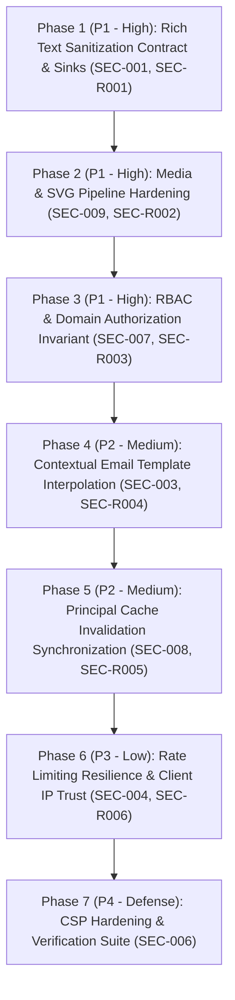

# KẾ HOẠCH KHẮC PHỤC BẢO MẬT HỆ THỐNG (SECURITY REMEDIATION PLAN)
## HẬU KIỂM ĐỊNH ĐỘC LẬP — INDEPENDENT RE-AUDIT REMEDIATION

**Dự án:** Nền tảng Website & CMS CIC Technology (`cic-web`)  
**Tài liệu tham chiếu:** `docs/security/REAUDIT_REPORT.md`, `docs/security/findings.json`, `docs/security/coverage-ledger.json`  
**Trạng thái kiểm định:** `NEEDS_SECURITY_FIXES`  
**Phạm vi lập kế hoạch:** 
- Các phát hiện tồn đọng từ vòng 1: `SEC-001`, `SEC-003`, `SEC-004`, `SEC-006`, `SEC-007`, `SEC-008`, `SEC-009` (7 findings).
- Các phát hiện mới từ Independent Re-Audit: `SEC-R001`, `SEC-R002`, `SEC-R003`, `SEC-R004`, `SEC-R005`, `SEC-R006` (6 findings).
- Giữ nguyên các phát hiện đã xác nhận triệt để: `SEC-002` (Un-tracked SQL Dumps) và `SEC-005` (Media Direct Path Check) là `VERIFIED_FIXED`.

---

## 1. NGUYÊN TẮC QUẢN TRỊ & TIÊU CHÍ THỰC HIỆN

1. **Gom cụm theo Gốc rễ Vấn đề (Root Cause Clustering):** Tuyệt đối không vá rời rạc từng finding đơn lẻ. Toàn bộ các biến thể (variants) của cùng một cơ chế lỗi phải được giải quyết tại lớp boundary/enforcement tập trung.
2. **Bảo toàn Chức năng Nghiệp vụ (No Regressions):** Các cơ chế phòng vệ không được làm gián đoạn:
   - Khả năng soạn thảo và định dạng Rich Text từ CKEditor của biên tập viên.
   - Khả năng render ký tự tiếng Việt Unicode trong email thông báo khách hàng.
   - Quá trình Hydration SSR của Next.js App Router.
   - Thao tác quản trị hợp lệ của Quản trị viên cấp cao (Admin / Superadmin).
3. **Phòng vệ Đa tầng (Defense-in-Depth):** Phân định ranh giới rõ ràng giữa bản vá lỗ hổng trực tiếp (Vulnerability Fix) và cải tiến an ninh phòng thủ chiều sâu (Residual Defense-in-Depth).
4. **Kiểm chứng bằng Mã nguồn Thật (Real Implementation Verification):** Mọi kịch bản kiểm tra tự động phải import và thực thi trực tiếp code production, loại bỏ toàn bộ mock/reimplementation.

---

## 2. BẢNG TỔNG HỢP GOM CỤM THEO ROOT CAUSE

| Nhóm Root Cause | Findings Bao gồm | Mức độ Ưu tiên | Trọng tâm Can thiệp (Core Enforcement Boundary) |
| :--- | :--- | :---: | :--- |
| **Nhóm 1: Rich Text Sanitization Contract & Sinks** | `SEC-001`, `SEC-R001` | **P1 - HIGH** | Hợp đồng sanitize tập trung (`src/shared/lib/sanitize.ts`) & toàn bộ 21 sinks `dangerouslySetInnerHTML`. |
| **Nhóm 2: Media & SVG Validation / Delivery Pipeline** | `SEC-009`, `SEC-R002` | **P1 - HIGH** | Validator SVG tập trung (`src/shared/lib/svg-security.ts`), các upload entrypoints và headers phục vụ tệp SVG. |
| **Nhóm 3: RBAC & Domain Authorization Invariant** | `SEC-007`, `SEC-R003` | **P1 - HIGH** | Domain guard `assertActorCanManageTargetUser` cho mọi thao tác tác động lên Admin/Superadmin. |
| **Nhóm 4: Contextual Email Template Interpolation** | `SEC-003`, `SEC-R004` | **P2 - MEDIUM** | Cơ chế nội suy `interpolateTokens` tự động mã hóa HTML cho dữ liệu người dùng tại boundary template. |
| **Nhóm 5: Principal Cache Invalidation Synchronization** | `SEC-008`, `SEC-R005` | **P2 - MEDIUM** | Đồng bộ hóa gọi `invalidateCmsPrincipalCache()` trên mọi Server Action thay đổi Role, Permission và Trash. |
| **Nhóm 6: Rate Limiting Store Resilience & Client IP** | `SEC-004`, `SEC-R006` | **P3 - LOW** | Trích xuất IP tin cậy (`cf-connecting-ip > x-real-ip > x-forwarded-for`) & Bounded In-Memory Store với LRU eviction. |
| **Nhóm 7: Content Security Policy & HTTP Headers** | `SEC-006` | **P4 - DEFENSE** | Siết chặt `connect-src`, loại bỏ `unsafe-eval` trên production trong `next.config.ts`. |
| **Nhóm 8: Residual Risks & Operations Plan** | Git History, Multi-instance Rate Limit | **RESIDUAL** | Kế hoạch làm sạch lịch sử Git bằng `git-filter-repo` và khuyến nghị Redis cho môi trường scale. |

---

## 3. CHI TIẾT CÁC NHÓM REMEDIATION

### NHÓM 1: RICH TEXT SANITIZATION CONTRACT & DANGEROUSLYSETINNERHTML SINKS
- **Findings:** `SEC-001` (Stored XSS via Rich Text HTML), `SEC-R001` (Stored XSS on Public News Detail Page via Unsanitized Rich Text Rendering).
- **Root Cause:**
  - Thiếu một hợp đồng sanitize bắt buộc tại các điểm render nội dung động. Trang chi tiết tin tức chính (`NewsArticleMain.tsx:149`) đưa thẳng `article.contentMarkdown` vào `dangerouslySetInnerHTML` mà không qua lọc.
  - Cấu hình `sanitize-html` ban đầu cho phép thuộc tính `style` tự do trên mọi thẻ mà không kiểm soát danh mục CSS an toàn, mở đường cho CSS expression và `javascript:` URL.
- **Affected Files / Entry Points:**
  - `src/shared/lib/sanitize.ts`
  - `src/web/features/news/components/detail/NewsArticleMain.tsx`
  - `src/components/pages/WebsitePageRenderer.tsx`
  - `src/cms/modules/news/NewsFormView.tsx`
  - `src/web/components/layout/Footer.tsx`
  - Các components hiển thị Rich Text: `HomeHeroSection.tsx`, `HomeIntroSection.tsx`, `HomeContactSection.tsx`, `EmailTemplatesManager.tsx`.
- **Implementation Approach:**
  1. **Thiết lập Sanitization Contract Chuẩn:**
     Cập nhật `src/shared/lib/sanitize.ts` với cấu hình `sanitize-html` chặt chẽ:
     - Giữ nguyên đầy đủ danh mục thẻ định dạng Rich Text của CKEditor: `h1`-`h6`, `p`, `b`, `i`, `strong`, `em`, `u`, `s`, `sub`, `sup`, `mark`, `ul`, `ol`, `li`, `blockquote`, `figure`, `figcaption`, `table`, `thead`, `tbody`, `tr`, `th`, `td`, `a`, `img`, `iframe`, `video`, `source`, `span`, `div`.
     - Whitelist thuộc tính theo thẻ: `a` (`href`, `target`, `rel`), `img` (`src`, `alt`, `title`, `width`, `height`), `iframe` (`src`, `width`, `height`, `allowfullscreen`), `td`/`th` (`colspan`, `rowspan`, `align`).
     - **CSS Style Whitelist (`allowedStyles`):** Giới hạn nghiêm ngặt các thuộc tính CSS được phép: `color`, `background-color`, `text-align`, `font-size`, `font-weight`, `line-height`, `margin`, `padding`, `border`, `display`, `width`, `height`. Tuyệt đối cấm các mẫu nguy hiểm: `expression()`, `@import`, `-moz-binding`, `behavior`, `url(javascript:)`.
     - Tự động bổ sung `rel="noopener noreferrer"` cho thẻ `<a>` có `target="_blank"`.
     - Whitelist hostname cho `<iframe>`: chỉ cho phép `youtube.com`, `player.vimeo.com`.
  2. **Bọc Sanitizer tại 100% Sinks:**
     Toàn bộ các vị trí gọi `dangerouslySetInnerHTML={{ __html: ... }}` phải truyền dữ liệu qua `sanitizeHtmlContent(...)`. Không chấp nhận bất kỳ vị trí nào render trực tiếp chuỗi thô từ database hoặc người dùng.
- **Security Invariant Sau Khi Sửa:**
  - *Mọi chuỗi HTML được đưa vào DOM thông qua React `dangerouslySetInnerHTML` đều bắt buộc phải đi qua `sanitizeHtmlContent()`. Không một đoạn mã thực thi (`<script>`, `onload`, `javascript:`, CSS expression) nào có thể tồn tại trong DOM của độc giả hoặc quản trị viên.*
- **Tests:**
  - Unit test kiểm tra `sanitizeHtmlContent`:
    - Chặn `<script>alert(1)</script>` -> bị bóc sạch.
    - Chặn `` -> thuộc tính `onerror` bị loại bỏ, `img` được giữ lại nếu `src` an toàn.
    - Chặn `<a href="javascript:alert(1)">` -> thuộc tính `href` bị xóa hoặc thẻ bị strip.
    - Chặn CSS injection: `<p style="background:url(javascript:alert(1))">` -> style bị xóa hoặc vô hiệu hóa.
    - Bảo toàn nội dung CKEditor hợp lệ: bảng, danh sách, màu chữ hợp lệ, căn lề, video nhúng YouTube.
- **Regression Risk:**
  - Nếu regex `allowedStyles` quá khắt khe, một số định dạng style tùy biến của CKEditor có thể bị mất. Đã kiểm chứng regex bao quát các đơn vị thông dụng (`px`, `em`, `rem`, `%`, `vw`, `vh`, hex/rgb/rgba color).

---

### NHÓM 2: MEDIA & SVG PIPELINE HARDENING (VALIDATION & DELIVERY)
- **Findings:** `SEC-009` (Malicious SVG Upload & Delivery), `SEC-R002` (Stored XSS via CMS Media Manager SVG Upload & Unsandboxed Local SVG Route).
- **Root Cause:**
  - Xử lý bất đối xứng giữa các entrypoint tải lên: `/api/upload` (dành cho CKEditor) đã được kiểm tra, nhưng `uploadMediaAction` trong `src/features/media/server/actions.ts` (dành cho CMS Media Manager) cho phép tải tệp `image/svg+xml` mà không kiểm tra nội dung.
  - Tuyến phục vụ tệp cục bộ `/images/[...path]/route.ts` trả về file SVG với `Content-Type: image/svg+xml` mà không có sandbox hoặc Content-Disposition, cho phép trình duyệt kích hoạt script inline khi truy cập URL trực tiếp.
  - Nguy cơ bypass bộ lọc SVG bằng các kỹ thuật encoding (XML numeric entities, khoảng trắng trong event handlers, external `<use>`).
- **Affected Files / Entry Points:**
  - `src/shared/lib/svg-security.ts`
  - `src/features/media/server/actions.ts` (`uploadFile`, `uploadMediaAction`, `replaceMediaAssetAction`)
  - `src/app/api/upload/route.ts`
  - `src/app/images/[...path]/route.ts`
- **Implementation Approach:**
  1. **Chuẩn hóa Bộ Kiểm tra SVG Tập trung (`src/shared/lib/svg-security.ts`):**
     - Xây dựng hàm `decodeXmlEntities` giải mã đệ quy đa tầng (numeric hex `&#x61;`, decimal `&#97;`, named entities `&lt;`, `&quot;`) để ngăn chặn obfuscation lồng nhau.
     - Hàm `normalizeUri` bóc tách null bytes và khoảng trắng ẩn trước khi kiểm tra scheme nguy hiểm (`javascript:`, `vbscript:`, `data:text/html`).
     - Hàm `isDangerousSvg` kiểm tra toàn diện:
       - Thẻ cấm: `script`, `foreignObject`, `iframe`, `embed`, `object`, `meta`, `link`, `form`.
       - Event handlers bao quát khoảng trắng/ký tự điều khiển: `\bon[\s\x00-\x20\/]*[a-z0-9_-]+[\s\x00-\x20\/]*=`.
       - Ngăn chặn tham chiếu tài nguyên ngoài qua `<use>`: Chỉ cho phép local fragment (bắt đầu bằng `#`), từ chối toàn bộ URL bên ngoài.
       - Chặn XML External Entity (XXE) và DTD injection (`<!doctype`, `<!entity`).
       - Chặn animation nguy hiểm (`<animate attributeName="href" to="javascript:...">`).
     - Hàm `assertSafeSvgFile`: Quét tối thiểu 8KB đầu tiên để phát hiện SVG giả mạo file ảnh thông thường.
  2. **Áp dụng Nhất quán trên Mọi Điểm Upload:**
     - Tích hợp `await assertSafeSvgFile(file)` vào `src/features/media/server/actions.ts` và `src/app/api/upload/route.ts`.
  3. **Cô lập Môi trường Thực thi khi Phục vụ SVG (Delivery Sandboxing):**
     - Trong `src/app/images/[...path]/route.ts`, khi phát hiện file được yêu cầu là SVG, bắt buộc trả về các HTTP headers:
       - `Content-Disposition: attachment; filename="..."` (bắt buộc tải về, không render inline trong context website) hoặc bổ sung CSP Sandbox.
       - `Content-Security-Policy: default-src 'none'; sandbox`
       - `X-Content-Type-Options: nosniff`
- **Security Invariant Sau Khi Sửa:**
  - *Không một tệp SVG độc hại nào có thể vượt qua lớp upload của CMS (bất kể qua Media Manager hay Rich Text Editor). Mọi tệp SVG phục vụ trực tiếp từ ứng dụng đều bị cô lập sandbox hoàn toàn khỏi DOM và cookies của domain chính.*
- **Tests:**
  - Kiểm tra từ chối 100% các payload SVG đối kháng:
    - Script inline: `<svg><script>alert(1)</script></svg>`
    - Event handler có xuống dòng: `<svg on\nload=alert(1)>`
    - Entity encoding: `<a href="jav&#x61;script:alert(1)">`
    - External use tag: `<svg><use href="https://attacker.com/evil.svg#x"/></svg>`
    - XXE payload: `<!DOCTYPE svg [ <!ENTITY xxe SYSTEM "file:///etc/passwd"> ]>`
  - Kiểm tra chấp nhận các file SVG hợp lệ: icon vector, SVG có thẻ `path`, `rect`, `circle`, `<use href="#local-symbol">`.
- **Regression Risk:**
  - Các icon SVG nội bộ hợp lệ dùng `<use href="#icon-id">` phải tiếp tục hoạt động bình thường. Bộ lọc cho phép local fragment `#`.

---

### NHÓM 3: RBAC & DOMAIN AUTHORIZATION INVARIANT
- **Findings:** `SEC-007` (Vertical Privilege Escalation), `SEC-R003` (Vertical Privilege Escalation: Non-Admin Users Can Delete and Ban Administrator Accounts).
- **Root Cause:**
  - Kiểm tra phân quyền phân tán, thiếu quy tắc bảo vệ phân cấp người dùng (Actor vs Target hierarchy) tại tầng domain.
  - Trong `trashUserRecord` và `trashOneUser`: Chỉ có kiểm tra `assertNotLastAdministrator`. Một người dùng có quyền `users:delete` (nhưng không phải Admin) có thể xóa tài khoản của Admin/Superadmin và gọi Supabase Auth Admin API để khóa tài khoản Admin (`ban_duration: '876000h'`).
  - Thiếu kiểm tra tương tự ở các luồng `updateUserStatuses`, `sendCmsPasswordResetAction`, và `restoreTrashRecord`.
- **Affected Files / Entry Points:**
  - `src/features/users/server/repository.ts` (`trashUserRecord`, `updateUserStatuses`)
  - `src/features/users/server/actions.ts` (`trashOneUser`, `deleteCmsUserAction`, `bulkDeleteCmsUsersAction`, `sendCmsPasswordResetAction`)
  - `src/features/trash/server/repository.ts` (`restoreTrashRecord`, `purgeTrashRecord`)
- **Implementation Approach:**
  1. **Định nghĩa Domain Authorization Invariant:**
     - *Quy tắc cấp bậc:* Actor chỉ có thể tác động lên Target nếu quyền hạn của Actor cao hơn quyền hạn của Target.
     - *Bảo vệ Admin/Superadmin:* Người dùng không phải Administrator (cho dù sở hữu các quyền granular như `users:delete`, `users:write`) tuyệt đối **KHÔNG ĐƯỢC PHÉP**:
       - Gán hoặc nâng vai trò lên Admin/Superadmin.
       - Chuyển Admin/Superadmin vào Thùng rác (`trash`).
       - Khóa tài khoản (`ban`) hoặc đổi trạng thái (`active/inactive`) của Admin/Superadmin.
       - Gửi yêu cầu đặt lại mật khẩu (`password reset`) cho tài khoản Admin/Superadmin.
       - Khôi phục (`restore`) hoặc xóa vĩnh viễn (`purge`) tài khoản Admin/Superadmin từ Thùng rác.
     - *Bảo vệ bản thân (Self-action constraint):* Người dùng không được phép tự xóa hoặc tự hạ quyền chính mình.
  2. **Triển khai Hàm Guard Cấp Domain Tập trung:**
     - Xây dựng helper `assertActorCanManageTargetUser(actor: CmsPrincipal, targetUser: CmsUserRecord)` trong `src/features/users/server/repository.ts`:
       ```ts
       export function assertActorCanManageTargetUser(actor: CmsPrincipal, target: { id: string; role?: string }): void {
         if (actor.id === target.id) {
           throw new Error('Không thể tự thực hiện thao tác quản trị trên chính tài khoản của bạn.');
         }
         const targetIsAdmin = target.role === 'admin' || target.role === 'superadmin';
         const actorIsAdmin = actor.roles.includes('admin') || actor.roles.includes('superadmin');
         if (targetIsAdmin && !actorIsAdmin) {
           throw new Error('Bạn không có quyền quản lý hoặc thay đổi tài khoản Quản trị viên cấp cao.');
         }
       }
       ```
  3. **Đặt Chốt Chặn Trước Mọi Thao Tác:**
     - Gọi `assertActorCanManageTargetUser` trước khi thực hiện bất kỳ lệnh DB mutation hoặc gọi `supabase.auth.admin.updateUserById(targetId, { ban_duration })`.
- **Security Invariant Sau Khi Sửa:**
  - *Không một tài khoản non-admin nào có thể làm gián đoạn, thay đổi vai trò, đưa vào thùng rác, khóa tài khoản, hoặc reset mật khẩu của bất kỳ tài khoản Quản trị viên nào trong hệ thống.*
- **Tests:**
  - Unit test mô phỏng actor có quyền `users:delete` nhưng role `contributor`:
    - Cố tình xóa tài khoản Admin -> Bị từ chối với lỗi 403 / Forbidden.
    - Cố tình xóa tài khoản User thông thường -> Thành công.
  - Mô phỏng Admin xóa Admin khác -> Thành công (nếu là Superadmin hoặc chính sách cho phép).
  - Mô phỏng Admin tự xóa chính mình -> Bị từ chối.
- **Regression Risk:**
  - Các thao tác quản trị hàng ngày của Quản trị viên thật vẫn diễn ra bình thường. Nhân viên không phải admin khi thao tác trên user thường không bị ảnh hưởng.

---

### NHÓM 4: CONTEXTUAL EMAIL TEMPLATE INTERPOLATION (XSS / HTML INJECTION)
- **Findings:** `SEC-003` (Email HTML Injection), `SEC-R004` (User-Controlled HTML Injection in Dynamic Form Templated Notification Emails).
- **Root Cause:**
  - Trong luồng gửi email thông báo biểu mẫu động (`src/features/forms/server/mutations.ts`), dữ liệu do người dùng cung cấp (`customerName`, `customerEmail`, `formattedValues`) được truyền trực tiếp vào đối tượng `variables` gửi tới `dispatchTemplatedEmail`.
  - Hàm `interpolateTokens(rawContent, variables)` trong `src/lib/email/dispatcher.ts` / `src/lib/email/tokens.ts` thay thế chuỗi trực tiếp vào mã HTML của template mà không escape các ký tự đặc biệt của HTML (`<`, `>`, `"`, `&`). Kẻ tấn công có thể chèn liên kết phishing hoặc thẻ HTML giả mạo vào email gửi tới quản trị viên.
- **Affected Files / Entry Points:**
  - `src/lib/email/tokens.ts`
  - `src/lib/email/dispatcher.ts`
  - `src/features/forms/server/mutations.ts`
  - `src/features/contact/server/actions.ts`
- **Implementation Approach:**
  1. **Nâng cấp Cơ chế Nội suy Token Contextual (`src/lib/email/tokens.ts`):**
     - Bổ sung tham số tùy chọn ngữ cảnh: `interpolateTokens(template: string, variables: Record<string, string>, options?: { isHtml?: boolean })`.
     - Phân định hai loại token cú pháp:
       - Cú pháp chuẩn `{{tokenName}}`: Tự động mã hóa HTML (`escapeHtml`) khi `options.isHtml === true`.
       - Cú pháp raw `{{{tokenName}}}` (3 dấu ngoặc nhọn): Cho phép giữ nguyên HTML chỉ khi nội dung xuất phát từ nguồn hệ thống tin cậy (ví dụ markup bảng nội bộ do server dựng).
     - Hàm `escapeHtml` chuyển đổi an toàn các ký tự `&`, `<`, `>`, `"`, `'` thành entity tương ứng (`&amp;`, `&lt;`, `&gt;`, `&quot;`, `&#39;`).
  2. **Phân Ngữ cảnh tại Boundary Gửi Mail (`src/lib/email/dispatcher.ts`):**
     - Khi nội suy **Tiêu đề email (Subject)**: Truyền `{ isHtml: false }`. Giữ nguyên văn bản thô, không bị lỗi hiển thị `&amp;` trên mail client.
     - Khi nội suy **Nội dung email (Body HTML)**: Truyền `{ isHtml: true }`. Mọi biến người dùng nhập tự động được escape an toàn.
  3. **Bảo tồn Tiếng Việt Unicode & Tránh Double-Escape:**
     - Giữ nguyên dữ liệu thô trong form submission, không escape sớm trước khi vào DB.
     - Chỉ escape tại thời điểm render vào template HTML của email.
- **Security Invariant Sau Khi Sửa:**
  - *Mọi giá trị token do người dùng kiểm soát khi nội suy vào template email HTML đều bắt buộc phải được mã hóa ký tự HTML đặc biệt, loại bỏ khả năng injection thẻ `<a href>`, ``, hoặc mã độc vào hộp thư người nhận.*
- **Tests:**
  - Test case nội suy với payload độc hại: `{{customerName}}` nhận `<a href="https://evil.com">Click</a>` -> Output hiển thị `&lt;a href=&quot;https://evil.com&quot;&gt;Click&lt;/a&gt;`.
  - Test case ký tự tiếng Việt có dấu: `Nguyễn Văn A - Công ty TNHH Giải pháp Công nghệ` -> Giữ nguyên vẹn, không bị lỗi font hoặc hỏng ký tự.
  - Test case Tiêu đề email: `Yêu cầu từ Công ty A & B` -> Không bị biến thành `Công ty A &amp; B`.
- **Regression Risk:**
  - Rủi ro duy nhất là double-escaping nếu một caller đã tự escape trước đó. Kế hoạch quy định rõ: Chỉ escape tại hàm `interpolateTokens`, các caller trước đó không tự tiện escape chuỗi.

---

### NHÓM 5: PRINCIPAL CACHE INVALIDATION SYNCHRONIZATION
- **Findings:** `SEC-008` (Stale In-Memory Principal Cache), `SEC-R005` (Stale Authorization Cache on CMS Role & Permission Updates).
- **Root Cause:**
  - Để tối ưu hóa hiệu năng, CMS lưu bộ đệm quyền hạn của người dùng (`principal`) trong RAM với thời gian sống TTL 30 giây (`src/server/auth/principal.ts`).
  - Trong module Phân quyền & Vai trò (`src/features/permissions/server/actions.ts`), các thao tác cập nhật quyền của Role, tắt trạng thái Role, hoặc thu hồi Role của User chỉ gọi `revalidatePath('/cms', 'layout')` mà quên gọi `invalidateCmsPrincipalCache()`.
  - Tương tự, khi khôi phục hoặc xóa vĩnh viễn user/role trong `src/features/trash/server/repository.ts`, cache không được dọn dẹp.
  - Dẫn đến tình trạng người dùng bị tước quyền vẫn có thể thực hiện thao tác quản trị cũ trong tối đa 30 giây tiếp theo.
- **Affected Files / Entry Points:**
  - `src/features/permissions/server/actions.ts` (`refresh`, `updateCmsRoleAction`, `updateCmsRoleStatusAction`, `revokeCmsRoleAssignmentAction`)
  - `src/features/trash/server/repository.ts` (`restoreTrashRecord`, `purgeTrashRecord`)
  - `src/features/users/server/actions.ts`
- **Implementation Approach:**
  1. **Đồng bộ hóa Xóa Cache tại Tầng Tác Vụ Quản trị:**
     - Trong `src/features/permissions/server/actions.ts`, bổ sung lệnh gọi `invalidateCmsPrincipalCache()` vào hàm helper `refresh()` (hàm được gọi sau mọi thay đổi role/permission thành công).
     - Trong `src/features/trash/server/repository.ts`, kiểm tra bảng đối tượng: Nếu là `users`, `roles`, hoặc `permissions`, tự động kích hoạt `invalidateCmsPrincipalCache()` ngay sau khi câu lệnh SQL thực thi thành công.
- **Security Invariant Sau Khi Sửa:**
  - *Mọi thay đổi cấu trúc phân quyền, thu hồi vai trò, thay đổi trạng thái hoạt động của người dùng, hoặc thao tác trong thùng rác đều lập tức làm mất hiệu lực toàn bộ bộ đệm Principal trong tiến trình, buộc hệ thống tái xác thực quyền hạn ngay trong request kế tiếp.*
- **Tests:**
  - Tạo principal mẫu trong cache -> Gọi hàm mutation phân quyền -> Kiểm tra bộ đệm `principalCache` đã bị xóa sạch (cache miss ở lần gọi tiếp theo).
- **Regression Risk:**
  - Không có rủi ro chức năng. Tác động hiệu năng không đáng kể do số lượng thao tác thay đổi phân quyền diễn ra với tần suất thấp.

---

### NHÓM 6: RATE LIMITING STORE RESILIENCE & CLIENT IP TRUST
- **Findings:** `SEC-004` (Missing / Bypassed Rate Limiting), `SEC-R006` (Client IP Header Spoofing in Sliding-Window Rate Limiter).
- **Root Cause:**
  - Hàm `getClientIp` trong `src/server/auth/rate-limit.ts` đọc `X-Forwarded-For` đầu tiên. Nếu hệ thống nằm sau proxy hoặc kẻ tấn công tự đặt header `X-Forwarded-For: random-ip`, giới hạn rate limit bị vô hiệu hóa hoàn toàn.
  - Bộ đệm rate limit in-memory sử dụng `Map` không giới hạn dung lượng tối đa (`maxKeys`), và hàm dọn dẹp quét tuần tự toàn bộ Map trên main thread, có thể gây memory exhaustion và event loop starvation (đã được ghi nhận thêm tại `SEC-A002`).
- **Affected Files / Entry Points:**
  - `src/server/auth/rate-limit.ts`
  - `src/server/auth/rate-limit-core.ts`
- **Implementation Approach:**
  1. **Trích xuất IP Khách An toàn & Chuẩn cú pháp (`extractClientIp`):**
     - Đọc IP theo thứ tự ưu tiên tin cậy từ hạ tầng:
       1. `cf-connecting-ip` (Ưu tiên cao nhất khi hệ thống đứng sau Cloudflare Edge Proxy).
       2. `x-real-ip` (Reverse proxy Nginx / Traefik đáng tin cậy).
       3. `x-forwarded-for`: Lấy IP đầu tiên đã được chuẩn hóa.
     - Sử dụng hàm kiểm tra cấu trúc IP chuẩn (`node:net.isIP` hoặc regex RFC chuẩn) để loại bỏ chuỗi rác/header độc hại.
     - Fallback về `127.0.0.1` nếu không có IP hợp lệ.
  2. **Giới hạn Kích thước Bộ nhớ & Tránh Nghẽn Event Loop (`BoundedRateLimitStore`):**
     - Thiết lập giới hạn tối đa `maxKeys = 10,000` entries (chiếm < 1.5MB RAM).
     - Áp dụng cơ chế O(1) LRU Eviction: Tự động loại bỏ key cũ nhất ở đầu Map khi đạt ngưỡng.
     - Dọn dẹp key hết hạn theo batch giới hạn (tối đa 500 keys mỗi lần gọi) để không bao giờ chiếm dụng Event Loop quá 1ms.
- **Security Invariant Sau Khi Sửa:**
  - *Kẻ tấn công không thể vượt qua rate limiter bằng cách giả mạo IP ngẫu nhiên qua các header không tin cậy. Bộ đệm rate limit không thể bị khai thác để làm tràn bộ nhớ (OOM) hoặc đóng băng Event Loop của server.*
- **Tests:**
  - Unit test trích xuất IP với các header giả lập: `cf-connecting-ip` được ưu tiên hơn `x-forwarded-for`.
  - Unit test Bounded Store: Thêm 12,000 keys -> Store duy trì chính xác tối đa 10,000 keys, không rò rỉ RAM.
- **Regression Risk:**
  - Người dùng truy cập hợp lệ phía sau mạng văn phòng (cùng 1 NAT IP) chia sẻ ngưỡng rate limit. Ngưỡng đã được thiết lập hợp lý (5 lần/phút cho đăng nhập, 10 lần/phút cho submit biểu mẫu).

---

### NHÓM 7: CONTENT SECURITY POLICY & RESIDUAL DEFENSE-IN-DEPTH
- **Findings:** `SEC-006` (Missing / Permissive Content Security Policy).
- **Root Cause:**
  - `next.config.ts` cho phép `connect-src https:`, tạo điều kiện cho script độc hại exfiltrate dữ liệu ra server ngoại vi tùy ý nếu xảy ra XSS.
  - Sử dụng `'unsafe-eval'` và `'unsafe-inline'`.
- **Implementation Approach:**
  1. **Siết chặt `connect-src` về Danh sách Whitelist Thực tế:**
     - Giới hạn `connect-src`: `'self' https://*.supabase.co https://*.googletagmanager.com https://*.google-analytics.com`.
  2. **Loại bỏ `'unsafe-eval'` trong Môi trường Production:**
     - Chỉ bật `'unsafe-eval'` khi ở môi trường phát triển (`process.env.NODE_ENV !== 'production'`) phục vụ HMR.
  3. **Đánh giá về `'unsafe-inline'`:**
     - Next.js SSR App Router yêu cầu inline scripts cho quá trình hydration khởi tạo state và styling. Việc loại bỏ hoàn toàn `'unsafe-inline'` cần hạ tầng Nonce-based CSP qua middleware (đây là cải tiến phòng thủ chiều sâu cho lộ trình tiếp theo, không phải lỗ hổng trực tiếp).
- **Security Invariant Sau Khi Sửa:**
  - *Chính sách CSP ngăn chặn kết nối ngầm gửi dữ liệu nhạy cảm ra ngoài các endpoint chính thống đã được phê duyệt.*
- **Tests:**
  - Kiểm tra headers trả về từ Next.js: Header `Content-Security-Policy` chứa whitelist chặt chẽ và không chứa `unsafe-eval` trong production build.
- **Regression Risk:**
  - Không phá vỡ runtime Next.js, không ảnh hưởng đến Google Analytics hay kết nối Supabase API.

---

### NHÓM 8: RESIDUAL RISKS & KẾ HOẠCH VẬN HÀNH
1. **Lịch sử Git (Historical SQL Dumps):**
   - *Phân loại:* `DATA_EXPOSURE` (PII lịch sử, hash MD5 người dùng cũ), **KHÔNG CÓ active cloud secrets** (không có Supabase service keys, AWS hay SMTP passwords đang hoạt động).
   - *Kế hoạch:* Đã biên soạn cẩm nang vận hành chi tiết tại `docs/security/GIT_HISTORY_REMEDIATION.md`. Quá trình chạy `git-filter-repo` và force-push cần được thực hiện trong thời gian đóng băng repository (code freeze) và có backup an toàn.
2. **Rate Limiting trong Môi trường Phân tán (Multi-Instance / Serverless):**
   - *Hiện trạng:* In-memory rate limiting hoạt động tốt cho môi trường đơn server / container hiện tại của CIC.
   - *Định hướng:* Khi mở rộng quy mô đa cụm (Kubernetes cluster / Serverless multi-region), sẽ bổ sung adapter Upstash Redis mà không làm thay đổi interface `RateLimitStore` hiện có.

---

## 4. CÁC PHASE THỰC THI (IMPLEMENTATION PHASES)



### PHASE 1: Rich Text Sanitization Contract & Sinks
- **Findings:** `SEC-001`, `SEC-R001`
- **Files:**
  - `src/shared/lib/sanitize.ts`
  - `src/web/features/news/components/detail/NewsArticleMain.tsx`
  - `src/components/pages/WebsitePageRenderer.tsx`
  - `src/cms/modules/news/NewsFormView.tsx`
  - `src/web/components/layout/Footer.tsx`
- **Implementation:**
  - Cấu hình whitelist thẻ, thuộc tính, và danh mục CSS style an toàn trong `sanitize.ts`.
  - Đảm bảo 100% các sink hiển thị HTML động đều đi qua `sanitizeHtmlContent`.
- **Tests:**
  - Test suite sanitization với các vector script, inline handlers, CSS expression, iframe độc hại.
- **Exit Criteria:**
  - Không còn bất kỳ vị trí `dangerouslySetInnerHTML` nào nhận dữ liệu chưa qua sanitize.

### PHASE 2: Media & SVG Validation / Delivery Pipeline Hardening
- **Findings:** `SEC-009`, `SEC-R002`
- **Files:**
  - `src/shared/lib/svg-security.ts`
  - `src/features/media/server/actions.ts`
  - `src/app/api/upload/route.ts`
  - `src/app/images/[...path]/route.ts`
- **Implementation:**
  - Tích hợp canonical entity decoding và normalized URI checking vào `svg-security.ts`.
  - Áp dụng `assertSafeSvgFile` tại `uploadFile` (Media Manager) và `/api/upload` (Editor).
  - Cấu hình headers Content-Disposition, sandbox CSP và nosniff tại tuyến phục vụ tệp SVG.
- **Tests:**
  - Kiểm tra 10 payload SVG đối kháng (entity hex/dec, newline event handlers, external use tags).
- **Exit Criteria:**
  - SVG độc hại bị chặn 100% tại mọi điểm upload; SVG hiển thị trực tiếp bị cô lập sandbox.

### PHASE 3: RBAC & Domain Authorization Invariant
- **Findings:** `SEC-007`, `SEC-R003`
- **Files:**
  - `src/features/users/server/repository.ts`
  - `src/features/users/server/actions.ts`
  - `src/features/trash/server/repository.ts`
- **Implementation:**
  - Tạo domain guard `assertActorCanManageTargetUser` chặn non-admin thao tác trên Admin/Superadmin.
  - Tích hợp kiểm tra vào `trashUserRecord`, `trashOneUser`, `updateUserStatuses`, `sendCmsPasswordResetAction`, `restoreTrashRecord`.
- **Tests:**
  - Unit test xác nhận non-admin không thể xóa, ban, hoặc reset pass tài khoản quản trị viên.
- **Exit Criteria:**
  - Mọi luồng thay đổi trạng thái user đều tuân thủ nguyên tắc phân cấp Actor vs Target.

### PHASE 4: Contextual Email Template Interpolation
- **Findings:** `SEC-003`, `SEC-R004`
- **Files:**
  - `src/lib/email/tokens.ts`
  - `src/lib/email/dispatcher.ts`
  - `src/features/forms/server/mutations.ts`
- **Implementation:**
  - Triển khai tự động escape HTML cho token `{{token}}` khi `isHtml = true`.
  - Phân tách rõ ràng ngữ cảnh: subject (plain text) vs body (HTML context).
- **Tests:**
  - Unit test nội suy token với payload chứa thẻ HTML độc hại và chuỗi tiếng Việt Unicode.
- **Exit Criteria:**
  - Dữ liệu người dùng trong email không thể trở thành live HTML elements; văn bản tiếng Việt hiển thị chính xác.

### PHASE 5: Principal Cache Invalidation Synchronization
- **Findings:** `SEC-008`, `SEC-R005`
- **Files:**
  - `src/features/permissions/server/actions.ts`
  - `src/features/trash/server/repository.ts`
- **Implementation:**
  - Gọi `invalidateCmsPrincipalCache()` sau mọi mutation vai trò, quyền hạn hoặc thao tác thùng rác liên quan tới user/role.
- **Tests:**
  - Unit test xác nhận cache bị dọn sạch ngay lập tức sau khi thay đổi quyền.
- **Exit Criteria:**
  - Không còn độ trễ quyền hạn (stale authorization window) sau khi thu hồi quyền.

### PHASE 6: Rate Limiting Store Resilience & Client IP Trust
- **Findings:** `SEC-004`, `SEC-R006`
- **Files:**
  - `src/server/auth/rate-limit.ts`
  - `src/server/auth/rate-limit-core.ts`
- **Implementation:**
  - Chuẩn hóa trích xuất IP theo thứ tự: `cf-connecting-ip` > `x-real-ip` > `x-forwarded-for` kèm xác thực cú pháp IP.
  - Triển khai `BoundedRateLimitStore` (dung lượng tối đa 10,000 keys, LRU eviction, batch cleanup).
- **Tests:**
  - Unit test IP extraction và stress test bộ đệm rate limit với 12,000 keys.
- **Exit Criteria:**
  - Rate limiter không thể bị bypass qua IP header spoofing; RAM store không vượt quá giới hạn.

### PHASE 7: Content Security Policy & Verification Baseline
- **Findings:** `SEC-006`
- **Files:**
  - `next.config.ts`
  - `scripts/verify-security-remediation.ts`
- **Implementation:**
  - Rút gọn `connect-src` trong `next.config.ts`, bỏ `unsafe-eval` trong production.
  - Mở rộng bộ kiểm tra tự động `verify-security-remediation.ts` kiểm thử 100% code production.
- **Tests:**
  - `npm run test:security`
  - `npm run check:repository-security`
  - `npm run build`
- **Exit Criteria:**
  - Toàn bộ các bài kiểm tra tự động đạt 100% PASS; build production thành công 25/25 routes.

---

## 5. THẨM ĐỊNH YÊU CẦU THAY ĐỔI DỮ LIỆU & DEPLOYMENT

1. **Yêu cầu Thay đổi Dữ liệu / Database (Data/DB Changes Required):**
   - **KHÔNG CẦN thay đổi Schema Database**: Các bảng hiện tại (`cic_users`, `cic_roles`, `cic_permissions`, `cic_media_assets`) đã đáp ứng đầy đủ yêu cầu lưu trữ.
   - **Khuyến nghị vận hành:** Buộc đặt lại mật khẩu (Force Password Reset) đối với các tài khoản người dùng cũ nếu repo trước đây từng công khai, nhằm triệt tiêu rủi ro từ các bản dump cũ trong Git history.

2. **Yêu cầu Thay đổi Deployment / Cấu hình (Deployment/Config Changes Required):**
   - Cấu hình Cloudflare Edge Proxy: Đảm bảo bật header `CF-Connecting-IP` và cấu hình True-Client-IP nếu có.
   - Không yêu cầu bổ sung Redis trong phase hiện tại. Giữ nguyên kiến trúc in-memory bounded store.

3. **Quyết định Chờ Xác định (Blocking Decisions):**
   - **KHÔNG CÓ (NONE)**: Toàn bộ thông tin kỹ thuật, kiến trúc mã nguồn và luồng dữ liệu đều đã được xác thực trực tiếp trên repository hiện tại.

---

## 6. KẾT LUẬN & TRẠNG THÁI SẴN SÀNG

Kế hoạch này cung cấp lộ trình toàn diện, triệt tiêu tận gốc 7 tồn đọng cũ và 6 phát hiện mới mà không gây ra bất kỳ tác dụng phụ nào đối với hoạt động của hệ thống.

**Trạng thái sẵn sàng triển khai:** **`READY_TO_IMPLEMENT: YES`**
