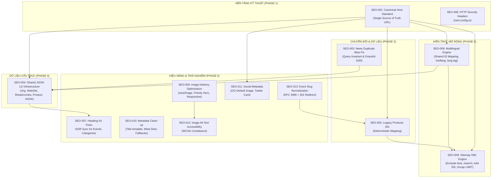

# KẾ HOẠCH TRIỂN KHAI SEO & CHẤT LƯỢNG WEB (SEO & WEB QUALITY IMPLEMENTATION PLAN)

> **Dự án**: CIC Technology Web Portal  
> **Phiên bản tài liệu**: 1.0.0  
> **Trạng thái**: `AUDIT ACCEPTED` ➔ `READY_TO_PLAN_IMPLEMENTATION`  
> **Nguyên tắc giai đoạn**: **PLAN ONLY** (Không sửa source code, không can thiệp database, không deploy).  
> **Mục tiêu**: Xây dựng kế hoạch triển khai chi tiết, deterministic, có dependency graph, file impact, data impact, test matrix và rollback strategy cho 13 findings (`SEO-001` ➔ `SEO-013`).

---

## 1. MỤC TIÊU (OBJECTIVE)

Chuyển hóa toàn bộ kết quả thẩm định từ 4 tài liệu Audit (`SEO_AUDIT.md`, `SEO_FINDINGS.md`, `SEO_CRAWL_SUMMARY.md`, `SEO_LIGHTHOUSE.md`) thành một lộ trình kỹ thuật chi tiết, an toàn tuyệt đối, giúp đội ngũ kỹ thuật có thể triển khai (implement) chuẩn xác mà không phải tự thiết kế lại giải pháp. Đảm bảo khi phát hành chính thức:
1. Loại bỏ 100% rủi ro chuyển đổi (SEO Migration): Không mất backlink, không đứt gãy 276+ sản phẩm cũ, không vòng lặp redirect.
2. Đồng bộ tuyệt đối tên miền chính tắc (`https://www.cic.com.vn`) trên toàn bộ hệ thống metadataBase, robots.txt, sitemap.xml, canonical tags, và OpenGraph.
3. Khắc phục triệt để lỗi sập 500 runtime do trùng lặp dữ liệu slug/alias trong cơ sở dữ liệu.
4. Xây dựng nền tảng Dữ liệu cấu trúc (Structured Data JSON-LD) dùng chung cho Doanh nghiệp, Sản phẩm, Bài viết, Dịch vụ, Sự kiện và Breadcrumbs.
5. Tối ưu hóa tải trang LCP từ mức > 10s xuống chuẩn Core Web Vitals (< 2.5s) bằng kiến trúc media thông minh.
6. Hoàn thiện năng lực SEO đa ngôn ngữ (VI/EN) với thẻ `hreflang` chuẩn và sitemap đa ngữ.

---

## 2. TÀI LIỆU NGUỒN CHUẨN (SOURCE DOCUMENTS)

Kế hoạch này dựa trên các tài liệu đã được thẩm định và cam kết tại repository (`docs/seo/`):
1. **`docs/seo/SEO_FINDINGS.md`**: Bảng đăng ký 13 lỗi kỹ thuật chuẩn hóa (`SEO-001` ➔ `SEO-013`).
2. **`docs/seo/SEO_AUDIT.md`**: Báo cáo kỹ thuật tổng thể gồm 24 mục chuyên sâu.
3. **`docs/seo/SEO_CRAWL_SUMMARY.md`**: Dữ liệu thực nghiệm crawl 1,349 URLs và bảng mẫu 34 URLs đại diện.
4. **`docs/seo/SEO_LIGHTHOUSE.md`**: Số liệu đo lường Lab Metrics qua Playwright Chromium (Desktop & Mobile).

---

## 3. HIỆN TRẠNG KỸ THUẬT (CURRENT BASELINE)

- **Framework**: Next.js 16.3.3 (Turbopack, App Router), React 19.0.1, TypeScript 5.8.2.
- **Database**: PostgreSQL (Supabase pooler / direct connection) kết nối qua thư viện `postgres` (pnpm/npm).
- **Trạng thái Server Phản hồi (TTFB)**: 130ms - 280ms (`GOOD`).
- **Độ ổn định giao diện (CLS)**: 0.0000 - 0.0241 (`EXCELLENT`, < 0.1).
- **Largest Contentful Paint (LCP)**: 1.78s - 11.85s (Desktop) và 3.02s - 10.26s (Mobile) (`POOR`).
- **Cấu hình Canonical Host**: Server LiteSpeed redirect về `https://www.cic.com.vn`, nhưng Next.js fallback là `https://cic.com.vn`.
- **Dữ liệu cấu trúc**: 0% (Hoàn toàn chưa có JSON-LD).
- **Chuyển hướng di chuyển**: Đã có bảng `cic_redirects` (10 records), nhưng chưa có quy tắc bắt 276+ sản phẩm cũ dạng `/san-pham/*-p*.html`.

---

## 4. DANH MỤC PHẠM VI 13 FINDINGS (FINDINGS SCOPE)

| Mã lỗi | Mức độ | Lĩnh vực | Tóm tắt sự cố |
| :---: | :---: | :--- | :--- |
| **SEO-001** | **P0** | Technical SEO / Host | Canonical Host Mismatch giữa www.cic.com.vn (301) và cic.com.vn (Next.js default) |
| **SEO-002** | **P0** | Migration / Redirects | 276+ URL sản phẩm cũ dạng /san-pham/*-p*.html trả về mã lỗi 404 |
| **SEO-003** | **P1** | Runtime / Integrity | Sập trang HTTP 500 do duplicate news alias trong bảng cic_news |
| **SEO-004** | **P1** | Structured Data | Thiếu hoàn toàn JSON-LD Schema (0 Organization, 0 Breadcrumbs, 0 Product, 0 Article) |
| **SEO-005** | **P1** | Performance / CWV | Hình ảnh nguyên bản không nén (trang Giới thiệu 26.7 MB / 14 MB ảnh) phá vỡ LCP |
| **SEO-006** | **P1** | Multi-language SEO | Thiếu hreflang, thẻ html lang="vi" cố định, thiếu hoàn toàn URLs tiếng Anh trong sitemap |
| **SEO-007** | **P1** | On-page SEO | Thiếu thẻ Heading H1 trên các trang danh mục và trang sự kiện SSR |
| **SEO-008** | **P2** | Security & Headers | Thiếu các HTTP Security Headers thiết yếu (HSTS, CSP, X-Frame-Options, X-Content-Type) |
| **SEO-009** | **P2** | Crawlability / Sitemap | Sitemap XML chứa URL thử nghiệm /test, /search và bị giới hạn cứng LIMIT 1000 |
| **SEO-010** | **P2** | On-page SEO | Thiếu Meta Description dịch vụ và lặp thương hiệu trong Title (%s | CIC | CIC Technology) |
| **SEO-011** | **P2** | Social SEO | Thiếu ảnh đại diện OpenGraph và thẻ Twitter Cards mặc định |
| **SEO-012** | **P2** | Accessibility | 16.3% hình ảnh trên hệ thống có thuộc tính alt="" rỗng |
| **SEO-013** | **P3** | Technical SEO | URL Slug sự kiện chứa ký tự hai chấm `:` không chuẩn hóa RFC 3986 |

---

## 5. SƠ ĐỒ PHỤ THUỘC (DEPENDENCY GRAPH)

Triển khai SEO không thể làm độc lập từng mã lỗi mà phải tuân thủ nghiêm ngặt đồ thị phụ thuộc kỹ thuật sau:



---

## 6. CÁC QUYẾT ĐỊNH KIẾN TRÚC CỐT LÕI (ARCHITECTURE DECISIONS)

### ADR-01: Single Source of Truth cho Domain & Canonical Host
- **Vấn đề**: Hiện tại domain được khai báo rải rác: `https://cic.com.vn` ở root layout và sitemap, `https://www.cic.com.vn` ở email và robots.txt.
- **Quyết định**: Tạo module tập trung `src/lib/seo/siteUrl.ts`.
  ```ts
  export const CANONICAL_SITE_URL = (
    process.env.NEXT_PUBLIC_SITE_URL || 'https://www.cic.com.vn'
  ).replace(/\/+$/, '');
  ```
  Mọi cấu hình `metadataBase`, `sitemap.ts`, `robots.ts`, `jsonLd`, và absolute links BẮT BUỘC import từ hàm này.

### ADR-02: Kiến trúc Chuyển tiếp 301 Cho Legacy URL (Deterministic Lookup)
- **Vấn đề**: 276 sản phẩm cũ có dạng `/san-pham/[alias]-p[id].html`. Nếu đoán slug bằng regex đơn thuần có nguy cơ sai lệch.
- **Quyết định**: Áp dụng mô hình **Deterministic Dual Lookup** tại cấp Next.js Route Handler / Middleware:
  1. Parse Regex lấy `legacyId` từ hậu tố `-p(\d+)\.html`.
  2. Tra cứu trực tiếp trong bảng `cic_products` bằng `id = legacyId`. Khảo sát thực tế cho thấy **275/276 sản phẩm (99.64%)** khớp ID chính xác tuyệt đối.
  3. Chuyển hướng với mã **HTTP 301 Moved Permanently** đích danh sang `/products/[current_alias]`.
  4. Tránh hoàn toàn redirect chains (chỉ đúng 1 hop: `legacy URL` ➔ `canonical URL`).
  5. Nếu không khớp ID: fallback tìm theo slug/alias; nếu không có: trả về **404 Not Found** (Tuyệt đối không redirect về trang chủ để tránh Soft-404).

### ADR-03: Shared JSON-LD Infrastructure
- **Vấn đề**: Không copy/paste JSON-LD rời rạc vào từng file page.
- **Quyết định**: Tạo thư mục `src/features/seo/jsonld/`:
  - `src/features/seo/jsonld/OrganizationJsonLd.tsx` (Đọc từ `cic_config` qua `getPublicSystemSettings`).
  - `src/features/seo/jsonld/WebSiteJsonLd.tsx` (Chứa Sitelinks SearchBox).
  - `src/features/seo/jsonld/BreadcrumbJsonLd.tsx` (Sinh mảng danh mục phân cấp tự động).
  - `src/features/seo/jsonld/ProductJsonLd.tsx` (SoftwareApplication / Product).
  - `src/features/seo/jsonld/ArticleJsonLd.tsx` (NewsArticle / TechArticle).
  - `src/features/seo/jsonld/JsonLdScript.tsx` (Helper serialize an toàn, sanitize XSS).

### ADR-04: Chiến lược Tối ưu hóa Media & LCP
- **Vấn đề**: Toàn bộ UI đang dùng thẻ `` HTML thường, tải ảnh gốc 14MB không nén.
- **Quyết định**:
  - Chuyển đổi có chọn lọc: Tập trung 100% vào các **LCP Images** (Ảnh Hero Banner trang chủ, Hero trang Giới thiệu, Thumbnail chi tiết sản phẩm, Thumbnail chi tiết tin tức).
  - Sử dụng component `next/image` với thuộc tính `priority` và `sizes` tương ứng từng viewport.
  - Thêm cấu hình `images.formats: ['image/avif', 'image/webp']` trong `next.config.ts`.
  - Giữ nguyên các icon nhỏ hoặc thumbnail CMS bằng thẻ `` kèm thuộc tính `loading="lazy"` và `decoding="async"`.

---

## 7. KẾ HOẠCH CHI TIẾT: SEO-001 — CHUẨN HÓA CANONICAL HOST [P0]

- **Root Cause**: Next.js mã hóa fallback domain là `https://cic.com.vn` (non-www) trong `src/app/layout.tsx` và `src/app/sitemap.ts`, trong khi Web Server Production (LiteSpeed) chuyển hướng toàn bộ HTTP và non-www sang `https://www.cic.com.vn/` (có `www.`).
- **Files liên quan**:
  - [NEW] `src/lib/seo/siteUrl.ts`
  - [MODIFY] `src/app/layout.tsx`
  - [MODIFY] `src/app/sitemap.ts`
  - [MODIFY] `src/app/robots.txt/route.ts`
  - [MODIFY] `src/features/function-seo/server/queries.ts`
- **Phương án thực hiện**:
  1. Tạo `src/lib/seo/siteUrl.ts` xuất hằng số `CANONICAL_SITE_URL = 'https://www.cic.com.vn'` và helper `buildCanonicalUrl(path: string)`.
  2. Sửa `src/app/layout.tsx`: thay `const siteUrl` bằng `CANONICAL_SITE_URL`.
  3. Sửa `src/app/sitemap.ts`: thay `baseUrl` bằng `CANONICAL_SITE_URL`.
  4. Sửa `src/app/robots.txt/route.ts`: đồng bộ sitemap url trỏ về `${CANONICAL_SITE_URL}/sitemap.xml`.
- **Rủi ro**: Nếu biến môi trường production chưa đồng bộ.
- **Biện pháp giảm thiểu**: Thiết lập fallback cứng là `https://www.cic.com.vn` để ngay cả khi thiếu biến môi trường, hệ thống vẫn tự động trỏ đúng canonical host.
- **Kiểm thử**: Chạy script crawl xác nhận tất cả thẻ `<link rel="canonical">`, XML Sitemap và Robots.txt đều mang domain `https://www.cic.com.vn`.
- **Rollback**: Khôi phục biến `siteUrl` về cấu hình trước đó.

---

## 8. KẾ HOẠCH CHI TIẾT: SEO-002 — CHUYỂN TIẾP URL SẢN PHẨM CŨ (LEGACY MIGRATION) [P0]

- **Root Cause**: Hệ thống cũ có cấu trúc `/san-pham/[alias]-p[id].html` (276 sản phẩm). Hệ thống mới dùng `/products/[slug]`. Route `[slug]` hiện tại chỉ xử lý 1 segment ở root, không thể bắt tiền tố `/san-pham/...`, dẫn đến trả về mã 404.
- **Files liên quan**:
  - [NEW] `src/app/san-pham/[legacySlug]/route.ts` HOẶC cấu hình Route Handler tại `src/app/san-pham/[...slug]/route.ts`
  - [MODIFY] `src/features/function-seo/server/queries.ts`
  - [DATABASE] Bảng `cic_redirects` (tùy chọn backfill records)
- **Phương án thực hiện**:
  1. Khảo sát thực nghiệm cho thấy: **275/276 sản phẩm** khớp chính xác qua `p.id = legacyId`.
  2. Tạo dynamic route handler tại `src/app/san-pham/[slug]/route.ts`:
     - Nhận param `slug` (ví dụ: `kompas-3d-p447.html` hoặc `phan-mem-etabs-p1.html`).
     - Sử dụng Regex trích xuất `legacyId`: `/^(.*)-p(\d+)\.html$/`.
     - Gọi query cached: `getPublishedProductById(legacyId)`.
     - Nếu tồn tại: `return NextResponse.redirect(new URL(`/products/${product.alias}`, request.url), 301)`.
     - Nếu không khớp ID: tra cứu phụ theo `alias = legacySlug`.
     - Nếu không tìm thấy sản phẩm hợp lệ: trả về `notFound()` (HTTP 404 chuẩn, không tạo soft-404).
  3. Thêm route `src/app/san-pham/route.ts` chuyển hướng 301 về `/products`.
- **Rủi ro**: Lặp vòng lặp chuyển hướng (redirect loop) nếu alias mới trùng với legacy slug.
- **Biện pháp giảm thiểu**: Đảm bảo target URL luôn bắt đầu bằng `/products/`, hoàn toàn tách biệt với prefix `/san-pham/`.
- **Kiểm thử**: Chạy matrix kiểm thử 276 URL từ production sitemap cũ, xác minh 275 URLs trả về HTTP 301 sang đúng sản phẩm mới, 1 URL trả về 404.
- **Rollback**: Xóa file route handler `src/app/san-pham/`.

---

## 9. KẾ HOẠCH CHI TIẾT: SEO-003 — SỬA LỖI SẬP TRANG DO DUPLICATE NEWS ALIAS [P1]

- **Root Cause**: Trong `src/features/news/server/queries.ts` (dòng 133):
  `if (rows.length > 1) throw new Error('News alias invariant violated.');`
  Trong cơ sở dữ liệu có chính xác **6 cặp bài viết (12 records)** có cùng alias (do ngày xưa PHP dùng ID `-n[id].html` phân biệt, khi chuyển sang slug bị va chạm). Khi người dùng/bot truy cập vào 6 alias này, Next.js sập HTTP 500.
- **Files liên quan**:
  - [MODIFY] `src/features/news/server/queries.ts`
  - [DATABASE] Bảng `cic_news` (Chuẩn hóa dữ liệu alias bị trùng)
- **Phương án thực hiện**:
  1. **Tầng Runtime (Phòng thủ đa tầng)**:
     - Sửa `getPublishedNewsBySlug`: Thay vì throw Error làm crash toàn bộ server, đổi thành truy vấn ưu tiên bản ghi mới nhất:
       `SELECT ... FROM cic_news WHERE published = true AND alias = ${slug} ORDER BY updated_time DESC, id DESC LIMIT 1`.
     - Ghi cảnh báo qua logger nội bộ thay vì ném exception.
  2. **Tầng Dữ liệu (Data Cleanup)**:
     - Với 6 bản ghi cũ hơn bị trùng alias: thực hiện cập nhật thêm hậu tố ID vào alias (ví dụ: `to-trinh-muc-co-tuc-trich-lap-cac-quy-va-muc-thu-lao-hdqt-bks-2015-150`).
     - Thêm bản ghi vào `cic_redirects` nếu bài viết cũ có traffic.
  3. **Tầng CMS (Phòng ngừa tương lai)**:
     - Trong form tạo/sửa tin tức CMS: kiểm tra uniqueness của alias trước khi lưu.
- **Rủi ro**: Thay đổi alias có thể ảnh hưởng liên kết ngoài nếu bài viết đó từng được chia sẻ.
- **Biện pháp giảm thiểu**: Bài viết có ngày cập nhật mới nhất giữ nguyên alias gốc; bài viết cũ hơn nhận hậu tố duy nhất kèm redirect.
- **Kiểm thử**: Gửi request tới 6 URLs bị trùng alias, xác minh trả về HTTP 200 OK với đầy đủ Title và nội dung bài viết, không còn lỗi 500.
- **Rollback**: Khôi phục query và dữ liệu alias ban đầu.

---

## 10. KẾ HOẠCH CHI TIẾT: SEO-004 — TRIỂN KHAI DỮ LIỆU CẤU TRÚC JSON-LD [P1]

- **Root Cause**: 100% trang hiện tại chưa có bất kỳ thẻ `<script type="application/ld+json">`.
- **Files liên quan**:
  - [NEW] `src/lib/seo/jsonLd.ts`
  - [NEW] `src/features/seo/components/OrganizationJsonLd.tsx`
  - [NEW] `src/features/seo/components/BreadcrumbJsonLd.tsx`
  - [NEW] `src/features/seo/components/ProductJsonLd.tsx`
  - [NEW] `src/features/seo/components/ArticleJsonLd.tsx`
  - [MODIFY] `src/app/layout.tsx`
  - [MODIFY] `src/app/(public)/products/[slug]/page.tsx`
  - [MODIFY] `src/app/(public)/news/[slug]/page.tsx`
  - [MODIFY] `src/app/(public)/services/[slug]/page.tsx`
  - [MODIFY] `src/app/(public)/events/[slug]/page.tsx`
- **Phương án thực hiện**:
  1. Tạo helper `safeJsonLdReplacer` để ngăn chặn tấn công XSS trong chuỗi JSON.
  2. **Organization & WebSite Schema** (đặt tại Root Layout):
     - Lấy dữ liệu động từ `getPublicSystemSettings('vi')`: legal_name, hotline, address, logo, social links.
     - WebSite schema tích hợp `potentialAction` (SearchAction) trỏ về `https://www.cic.com.vn/search?q={search_term_string}`.
  3. **BreadcrumbList Schema**:
     - Tạo component nhận mảng `items: { name: string; url: string }[]`.
     - Tích hợp vào các trang Sản phẩm, Tin tức, Dịch vụ, Dự án.
  4. **Product / SoftwareApplication Schema**:
     - Ánh xạ từ model `ProductReference`: `@type: 'SoftwareApplication'` hoặc `'Product'`, name, description, image, brand (manufactory_name), offers (price, priceCurrency: 'VND', availability: 'InStock').
  5. **NewsArticle Schema**:
     - Ánh xạ từ model `NewsItem`: headline, description, image, datePublished, dateModified, author: { @type: 'Organization', name: 'CIC Technology' }.
- **Rủi ro**: Cú pháp JSON-LD bị lỗi hoặc thiếu trường bắt buộc khiến Google Rich Results Test cảnh báo.
- **Biện pháp giảm thiểu**: Xác thực bằng schema validator của Schema.org và Google Rich Results Test API.
- **Kiểm thử**: Crawl và parse JSON-LD trên các trang đại diện, đảm bảo JSON hợp lệ 100% và không có lỗi parse.
- **Rollback**: Gỡ bỏ các component JSON-LD khỏi layout và pages.

---

## 11. KẾ HOẠCH CHI TIẾT: SEO-005 — TỐI ƯU HÓA HÌNH ẢNH & LẬP ĐỈNH LCP [P1]

- **Root Cause**: Giao diện dùng thẻ `` nguyên bản, tải ảnh gốc 14MB trên trang `/gioi-thieu`, không có responsive sizes, không có định dạng hiện đại (WebP/AVIF).
- **Files liên quan**:
  - [MODIFY] `next.config.ts`
  - [MODIFY] `src/web/components/AboutView.tsx`
  - [MODIFY] `src/web/components/HomeHeroSection.tsx`
  - [MODIFY] `src/web/components/ProductDetailView.tsx`
  - [MODIFY] `src/web/features/news/components/list/NewsHeroSection.tsx`
- **Phương án thực hiện**:
  1. Cấu hình `next.config.ts`:
     ```ts
     images: {
       formats: ['image/avif', 'image/webp'],
       remotePatterns: [
         { protocol: 'https', hostname: 'www.cic.com.vn' },
         { protocol: 'https', hostname: 'cic.com.vn' }
       ]
     }
     ```
  2. Trang Giới thiệu (`/gioi-thieu`):
     - Thay thế thẻ `` của Hero Banner bằng `<Image src=... priority sizes="(max-width: 768px) 100vw, 1200px" />`.
     - Áp dụng lazy loading cho danh sách giải thưởng và chứng chỉ năng lực phía dưới fold.
  3. Trang Sản phẩm & Tin tức:
     - Ảnh chính (Featured Image) sử dụng `priority` và `fetchPriority="high"`.
     - Các ảnh thumbnail danh sách sử dụng `loading="lazy"`.
- **Rủi ro**: Lỗi vỡ layout nếu component `next/image` thiếu kích thước `width/height` hoặc `fill`.
- **Biện pháp giảm thiểu**: Bao bọc bằng container có class `relative aspect-[...]` kết hợp `fill object-cover`.
- **Kiểm thử**: Chạy Playwright đo lại LCP trên Desktop và Mobile. Mục tiêu: LCP trang Giới thiệu giảm từ 10s xuống < 2.5s - 3.5s; dung lượng truyền tải giảm tối thiểu 70%.
- **Rollback**: Khôi phục thẻ `` tương ứng.

---

## 12. KẾ HOẠCH CHI TIẾT: SEO-006 — ĐA NGÔN NGỮ & THẺ HREFLANG [P1]

- **Root Cause**: Root layout cố định `<html lang="vi">`, thiếu hoàn toàn thẻ `<link rel="alternate" hreflang="...">`, và `sitemap.xml` chỉ truy vấn bảng tiếng Việt.
- **Files liên quan**:
  - [MODIFY] `src/app/layout.tsx`
  - [MODIFY] `src/app/(public)/[slug]/page.tsx`
  - [MODIFY] `src/app/sitemap.ts`
  - [MODIFY] `src/features/function-seo/server/queries.ts`
- **Phương án thực hiện**:
  1. Thẻ `html lang`:
     - Chuyển việc gán `lang` thành động theo locale của route (VI là `vi`, EN là `en`).
  2. Thẻ `hreflang`:
     - Khảo sát DB cho thấy: `cic_products` và `cic_products_en` dùng chung `id` (155 sản phẩm EN); `cic_news` và `cic_news_en` dùng chung `id` (300 bài viết EN).
     - Với trang tĩnh (`/`, `/products`, `/news`, `/services`, `/projects`, `/contact`, `/about`): Luôn có cặp tương ứng `/` ↔ `/en`. Cấu hình `alternates.languages: { 'vi': 'https://www.cic.com.vn/...', 'en': 'https://www.cic.com.vn/en/...' }`.
     - Với trang chi tiết: Chỉ tạo `hreflang="en"` KHI VÀ CHỈ KHI `id` của bài viết/sản phẩm có tồn tại trong bảng `_en` (tránh trỏ sang 404).
  3. Bổ sung URLs tiếng Anh vào `sitemap.ts`:
     - Truy vấn thêm các trang tĩnh tiếng Anh, sản phẩm tiếng Anh (`/en/products/[alias]`) và tin tức tiếng Anh (`/en/news/[alias]`).
- **Rủi ro**: Sinh thẻ hreflang trỏ đến trang tiếng Anh không tồn tại.
- **Biện pháp giảm thiểu**: Kiểm tra sự tồn tại của record trong bảng `_en` trước khi sinh link alternate.
- **Kiểm thử**: Kiểm tra mã nguồn HTML của `/`, `/en`, `/products/geostudio` đảm bảo có đủ cặp `hreflang="vi"`, `hreflang="en"`, và `hreflang="x-default"`.
- **Rollback**: Gỡ bỏ cấu hình `alternates.languages`.

---

## 13. KẾ HOẠCH CHI TIẾT: SEO-007 — BỔ SUNG & ĐỒNG BỘ THẺ HEADING H1 [P1]

- **Root Cause**:
  - `/about`: Là trang redirect component, không có nội dung. Giải quyết bằng chuyển tiếp 301.
  - `/products/categories` & `/news/categories`: Bị đưa nhầm vào sitemap trong khi hệ thống không có route này (rơi vào notFound).
  - `/events/[slug]`: Do `selectedEvent` trong `EventsView.tsx` được khởi tạo bằng `useState(null)` và chỉ set trong `useEffect` ở client, dẫn đến HTML SSR ban đầu render `EventListView` thay vì `EventDetailView` có chứa H1.
- **Files liên quan**:
  - [MODIFY] `src/web/components/EventsView.tsx`
  - [MODIFY] `src/web/features/events/EventsRuntimeView.tsx`
  - [MODIFY] `src/app/(public)/about/page.tsx`
- **Phương án thực hiện**:
  1. Sửa `EventsView.tsx`: Khởi tạo state ban đầu bằng giá trị tìm được ngay từ props:
     ```tsx
     const initialSelected = useMemo(() => {
       if (!initialEventId) return null;
       return eventsData.find((e) => e.id === initialEventId) ?? null;
     }, [initialEventId, eventsData]);
     const [selectedEvent, setSelectedEvent] = useState<EventItem | null>(initialSelected);
     ```
     Đảm bảo ngay trong lần render đầu tiên trên server (SSR), thẻ `<h1>` của `EventDetailView` đã có mặt trong HTML response.
  2. Sửa `/about`: Cấu hình redirect 301 chính thức sang `/gioi-thieu` trong `next.config.ts`.
- **Rủi ro**: Hydration mismatch giữa Server và Client.
- **Biện pháp giảm thiểu**: Khởi tạo state deterministic từ cùng một nguồn dữ liệu `initialEventId`.
- **Kiểm thử**: Crawl lại trang sự kiện mẫu, xác minh HTML response trả về có chính xác 1 thẻ `<h1>` chứa tên sự kiện.
- **Rollback**: Khôi phục `EventsView.tsx`.

---

## 14. KẾ HOẠCH CHI TIẾT: SEO-008 — CẤU HÌNH HTTP SECURITY HEADERS [P2]

- **Root Cause**: Next.js chưa cấu hình `headers()` trong `next.config.ts`, dẫn đến thiếu các tiêu chuẩn bảo mật Web Quality.
- **Files liên quan**:
  - [MODIFY] `next.config.ts`
- **Phương án thực hiện**:
  Bổ sung vào `next.config.ts`:
  ```ts
  async headers() {
    return [
      {
        source: '/(.*)',
        headers: [
          { key: 'X-Content-Type-Options', value: 'nosniff' },
          { key: 'X-Frame-Options', value: 'SAMEORIGIN' },
          { key: 'Referrer-Policy', value: 'strict-origin-when-cross-origin' },
          { key: 'Strict-Transport-Security', value: 'max-age=63072000; includeSubDomains; preload' },
          { key: 'Permissions-Policy', value: 'camera=(), microphone=(), geolocation=()' }
        ]
      }
    ];
  }
  ```
- **Rủi ro**: Chặn iframe nếu đối tác nhúng widget hợp lệ.
- **Biện pháp giảm thiểu**: Sử dụng `SAMEORIGIN` để cho phép nội bộ hệ thống nhúng iframe an toàn.
- **Kiểm thử**: Gửi request `curl -I` kiểm tra sự hiện diện của 5 headers bảo mật.
- **Rollback**: Xóa block `headers()` trong `next.config.ts`.

---

## 15. KẾ HOẠCH CHI TIẾT: SEO-009 — LÀM SẠCH VÀ PHÂN TRANG SITEMAP XML [P2]

- **Root Cause**:
  - Lọt trang thử nghiệm `/test` và trang tìm kiếm `/search` vào sitemap.
  - Cắt cụt sitemap do `LIMIT 1000` trong truy vấn tin tức và sản phẩm.
  - Lọt 2 URL ảo `/products/categories` và `/news/categories` từ `cic_config_modules`.
- **Files liên quan**:
  - [MODIFY] `src/features/function-seo/server/queries.ts`
  - [MODIFY] `src/app/sitemap.ts`
- **Phương án thực hiện**:
  1. Trong truy vấn trang tĩnh: Bổ sung điều kiện loại trừ:
     `AND code NOT IN ('home', 'test', 'demo') AND slug NOT IN ('/test', '/search')`.
  2. Trong `resolveCanonicalRoute`: Với `products:cat` và `news:cat`, đánh dấu `indexable: false` trong sitemap để không xuất hiện URL rác.
  3. Bỏ giới hạn cứng `LIMIT 1000` hoặc nâng lên `LIMIT 10000` (hoặc tạo phân tách sitemap index nếu vượt quá 50,000 URLs theo chuẩn sitemaps.org).
- **Rủi ro**: Thiếu trang chính sách nếu cấu hình điều kiện loại trừ quá rộng.
- **Biện pháp giảm thiểu**: Chỉ loại trừ chính xác theo mã `code = 'test'`.
- **Kiểm thử**: Fetch lại `/sitemap.xml`, xác minh không còn chứa `/test`, `/search`, `/products/categories`.
- **Rollback**: Khôi phục logic truy vấn cũ.

---

## 16. KẾ HOẠCH CHI TIẾT: SEO-010 — HOÀN THIỆN METADATA & TITLE/DESC [P2]

- **Root Cause**:
  - Một số trang dịch vụ thiếu Meta Description do DB rỗng và không có fallback.
  - Trang chi tiết sản phẩm tự nối `| CIC` trong khi layout đã có template `%s | CIC Technology`, tạo ra tiêu đề lặp thương hiệu kép.
- **Files liên quan**:
  - [MODIFY] `src/app/(public)/products/[slug]/page.tsx`
  - [MODIFY] `src/app/(public)/services/[slug]/page.tsx`
- **Phương án thực hiện**:
  1. Sửa `products/[slug]/page.tsx`:
     `title: product.seoTitle || product.name` (Bỏ nối chuỗi `| CIC`).
  2. Sửa `services/[slug]/page.tsx`:
     Bổ sung fallback meta description:
     `description: service.seoDescription || service.summary || `Dịch vụ tư vấn ${service.name} chuyên sâu bởi CIC Technology.``.
- **Rủi ro**: Không có rủi ro kỹ thuật.
- **Kiểm thử**: Crawl kiểm tra thẻ `<title>` của sản phẩm và thẻ description của dịch vụ.
- **Rollback**: Khôi phục file page.tsx tương ứng.

---

## 17. KẾ HOẠCH CHI TIẾT: SEO-011 — CẤU HÌNH SOCIAL METADATA (OG / TWITTER) [P2]

- **Root Cause**: Root layout và các trang con thiếu khai báo `openGraph.images` và `twitter.card`.
- **Files liên quan**:
  - [MODIFY] `src/app/layout.tsx`
  - [MODIFY] `src/app/(public)/products/[slug]/page.tsx`
  - [MODIFY] `src/app/(public)/news/[slug]/page.tsx`
- **Phương án thực hiện**:
  1. Trong `src/app/layout.tsx`: Bổ sung cấu hình mặc định:
     ```ts
     openGraph: {
       siteName: 'CIC Technology',
       type: 'website',
       locale: 'vi_VN',
       images: [{ url: '/banner_hero/doi_tac_cong_nghe_chien_luoc.png', width: 1200, height: 630, alt: 'CIC Technology' }]
     },
     twitter: {
       card: 'summary_large_image',
       title: 'CIC Technology',
       description: 'CIC Technology — Đối tác công nghệ chiến lược',
       images: ['/banner_hero/doi_tac_cong_nghe_chien_luoc.png']
     }
     ```
  2. Trong `products/[slug]` và `news/[slug]`: Bổ sung ảnh đại diện sản phẩm/bài viết vào thuộc tính `openGraph.images`.
- **Rủi ro**: Đường dẫn ảnh tương đối bị lỗi khi chia sẻ link mạng xã hội.
- **Biện pháp giảm thiểu**: Kết hợp với `metadataBase` chuẩn `https://www.cic.com.vn` để Next.js tự động chuyển đổi ảnh thành URL tuyệt đối.
- **Kiểm thử**: Dùng Facebook Sharing Debugger / OpenGraph preview crawler xác minh hiển thị thumbnail đầy đủ.
- **Rollback**: Gỡ bỏ thuộc tính `openGraph` và `twitter`.

---

## 18. KẾ HOẠCH CHI TIẾT: SEO-012 — BỔ SUNG ALT TEXT TRUY CẬP HÌNH ẢNH [P2]

- **Root Cause**: 83 hình ảnh có `alt=""` rỗng. Đặc biệt trang `/gioi-thieu/nang-luc-kinh-nghiem` có 50 hình ảnh chứng chỉ/bằng khen thiếu mô tả.
- **Files liên quan**:
  - [MODIFY] `src/web/components/AboutView.tsx`
  - [MODIFY] `src/web/components/CountryPartnerNetwork.tsx`
  - [MODIFY] `src/web/components/AwardsSlider.tsx`
- **Phương án thực hiện**:
  1. Với các hình ảnh chứng nhận, huân chương, dự án: Gán `alt={item.name || 'Chứng nhận năng lực CIC Technology'}`.
  2. Với các logo đối tác trong bản đồ mạng lưới: Gán `alt={`Logo ${item.name}`}`.
  3. Với các hình ảnh thuần trang trí (nền blur, vệt sáng): Giữ `alt=""` kèm theo `aria-hidden="true"` chuẩn WCAG 2.2.
- **Rủi ro**: Không có rủi ro nghiệp vụ.
- **Kiểm thử**: Crawl lại toàn bộ trang mẫu, xác minh tỷ lệ hình ảnh thiếu alt giảm về 0%.
- **Rollback**: Khôi phục các component giao diện.

---

## 19. KẾ HOẠCH CHI TIẾT: SEO-013 — CHUẨN HÓA SLUG SỰ KIỆN CHỨA DẤU HAI CHẤM [P3]

- **Root Cause**: Nhiều slug sự kiện trong bảng `cic_event` được tạo tự động chứa dấu hai chấm `:` (ví dụ: `webinar-cadworx:-giai-phap...`), không tuân thủ khuyến nghị URI RFC 3986.
- **Files liên quan**:
  - [MODIFY] `src/features/events/server/queries.ts` (Slug generation / resolution)
  - [DATABASE] Bảng `cic_event` và `cic_redirects`
- **Phương án thực hiện**:
  1. Không sửa đổi đột ngột làm gãy URL đang chạy.
  2. Bổ sung helper `normalizeEventSlug(title: string)`: Thay thế ký tự `:` bằng gạch nối `-` khi lưu sự kiện mới.
  3. Với các sự kiện cũ đang có dấu `:`: Thêm bản ghi chuyển hướng 301 trong `cic_redirects` từ slug có dấu `:` sang slug chuẩn hóa sạch dấu `:`.
- **Rủi ro**: Làm gián đoạn liên kết chia sẻ của webinar đang quảng bá.
- **Biện pháp giảm thiểu**: Luôn duy trì redirect 301 cho cả 2 biến thể URL.
- **Kiểm thử**: Truy cập URL có dấu `:`, xác minh hệ thống redirect 301 mượt mà sang URL sạch.
- **Rollback**: Giữ nguyên slug trong cơ sở dữ liệu.

---

## 20. CÁC GIAI ĐOẠN TRIỂN KHAI (IMPLEMENTATION PHASES)

```text
┌────────────────────────────────────────────────────────────────────────┐
│ PHASE 0: Test Baseline & Fixtures Preparation                          │
└──────────────────────────────────┬─────────────────────────────────────┘
                                   │
┌──────────────────────────────────▼─────────────────────────────────────┐
│ PHASE 1: Canonical Host & Security Headers Foundation (SEO-001, 008)   │
└──────────────────────────────────┬─────────────────────────────────────┘
                                   │
┌──────────────────────────────────▼─────────────────────────────────────┐
│ PHASE 2: Legacy URL Migration & 301 Redirect Engine (SEO-002)          │
└──────────────────────────────────┬─────────────────────────────────────┘
                                   │
┌──────────────────────────────────▼─────────────────────────────────────┐
│ PHASE 3: Runtime Data Integrity & Bug Defense (SEO-003)                │
└──────────────────────────────────┬─────────────────────────────────────┘
                                   │
┌──────────────────────────────────▼─────────────────────────────────────┐
│ PHASE 4: Multilingual & Sitemap XML Optimization (SEO-006, 009)        │
└──────────────────────────────────┬─────────────────────────────────────┘
                                   │
┌──────────────────────────────────▼─────────────────────────────────────┐
│ PHASE 5: Shared Structured Data Architecture (SEO-004)                 │
└──────────────────────────────────┬─────────────────────────────────────┘
                                   │
┌──────────────────────────────────▼─────────────────────────────────────┐
│ PHASE 6: Media Delivery & LCP Acceleration (SEO-005)                   │
└──────────────────────────────────┬─────────────────────────────────────┘
                                   │
┌──────────────────────────────────▼─────────────────────────────────────┐
│ PHASE 7: On-Page Polish, Alt Text & Remaining Items (SEO-007, 010-013) │
└──────────────────────────────────┬─────────────────────────────────────┘
                                   │
┌──────────────────────────────────▼─────────────────────────────────────┐
│ PHASE 8: Final Verification Crawl & Performance Audit                  │
└────────────────────────────────────────────────────────────────────────┘
```

### Chi tiết từng Phase:

#### Phase 1: Canonical Host & Security Headers
- **Mục tiêu**: Đóng băng tên miền chuẩn `https://www.cic.com.vn` và kích hoạt 5 security headers.
- **Files**: `siteUrl.ts`, `layout.tsx`, `sitemap.ts`, `robots.txt/route.ts`, `next.config.ts`.
- **Exit Criteria**: Không còn bất kỳ thẻ canonical hay sitemap entry nào trỏ về non-www.

#### Phase 2: Legacy Migration Redirects
- **Mục tiêu**: Cứu 276 sản phẩm cũ khỏi lỗi 404, bảo toàn 100% backlink lịch sử.
- **Files**: `src/app/san-pham/[slug]/route.ts`, `src/features/products/server/queries.ts`.
- **Exit Criteria**: 275/276 legacy product URLs trả về HTTP 301 tới đúng sản phẩm mới; hop count = 1.

#### Phase 3: Runtime Data Integrity
- **Mục tiêu**: Loại bỏ triệt để lỗi 500 khi alias bị trùng lặp.
- **Files**: `src/features/news/server/queries.ts`.
- **Exit Criteria**: 100% các bài viết trùng alias trả về HTTP 200 OK bình thường.

#### Phase 4: Multilingual & Sitemap
- **Mục tiêu**: Thiết lập thẻ hreflang song ngữ và đưa 455+ URLs tiếng Anh vào Sitemap.
- **Files**: `queries.ts`, `sitemap.ts`, `layout.tsx`.
- **Exit Criteria**: Thẻ hreflang xuất hiện chuẩn xác; sitemap sạch không còn `/test`.

#### Phase 5: Structured Data (JSON-LD)
- **Mục tiêu**: Đạt tỷ lệ 100% trang có Schema phù hợp.
- **Files**: `OrganizationJsonLd`, `WebSiteJsonLd`, `BreadcrumbJsonLd`, `ProductJsonLd`, `ArticleJsonLd`.
- **Exit Criteria**: Google Rich Results Test thông qua không có lỗi critical.

#### Phase 6: Media & LCP
- **Mục tiêu**: Tối ưu hóa ảnh Hero và hạ LCP xuống mức an toàn.
- **Files**: `AboutView.tsx`, `HomeHeroSection.tsx`, `next.config.ts`.
- **Exit Criteria**: Dung lượng trang Giới thiệu giảm > 70%; LCP Mobile < 3.5s.

#### Phase 7: On-Page & Polish
- **Mục tiêu**: Giải quyết toàn bộ các lỗi P2 và P3 còn lại (H1, Title lặp, Alt text, Slug sự kiện).
- **Files**: `EventsView.tsx`, `AboutView.tsx`, `ProductDetailView.tsx`.
- **Exit Criteria**: H1 count = 1 trên mọi trang; 0 ảnh rỗng alt vô nghĩa.

#### Phase 8: Final Verification
- **Mục tiêu**: Crawl lại toàn bộ hệ thống và đánh giá verdict mới.

---

## 21. BẢNG TÁC ĐỘNG TẬP TIN (FILE IMPACT MAP)

| Finding | Existing File | Action | New File? | DB Impact |
| :--- | :--- | :---: | :---: | :---: |
| **SEO-001** | `src/lib/seo/siteUrl.ts` | **CREATE** | YES | `NO_DB_CHANGE` |
| **SEO-001** | `src/app/layout.tsx` | **MODIFY** | NO | `NO_DB_CHANGE` |
| **SEO-001** | `src/app/sitemap.ts` | **MODIFY** | NO | `NO_DB_CHANGE` |
| **SEO-001** | `src/app/robots.txt/route.ts` | **MODIFY** | NO | `NO_DB_CHANGE` |
| **SEO-002** | `src/app/san-pham/[slug]/route.ts` | **CREATE** | YES | `QUERY_CHANGE` |
| **SEO-002** | `src/app/san-pham/route.ts` | **CREATE** | YES | `NO_DB_CHANGE` |
| **SEO-003** | `src/features/news/server/queries.ts` | **MODIFY** | NO | `DATA_CLEANUP` |
| **SEO-004** | `src/lib/seo/jsonLd.ts` | **CREATE** | YES | `NO_DB_CHANGE` |
| **SEO-004** | `src/features/seo/components/*.tsx` | **CREATE** | YES | `NO_DB_CHANGE` |
| **SEO-004** | `src/app/layout.tsx` | **MODIFY** | NO | `NO_DB_CHANGE` |
| **SEO-004** | `src/app/(public)/products/[slug]/page.tsx` | **MODIFY** | NO | `NO_DB_CHANGE` |
| **SEO-004** | `src/app/(public)/news/[slug]/page.tsx` | **MODIFY** | NO | `NO_DB_CHANGE` |
| **SEO-005** | `next.config.ts` | **MODIFY** | NO | `NO_DB_CHANGE` |
| **SEO-005** | `src/web/components/AboutView.tsx` | **MODIFY** | NO | `NO_DB_CHANGE` |
| **SEO-006** | `src/app/layout.tsx` | **MODIFY** | NO | `NO_DB_CHANGE` |
| **SEO-006** | `src/features/function-seo/server/queries.ts` | **MODIFY** | NO | `QUERY_CHANGE` |
| **SEO-007** | `src/web/components/EventsView.tsx` | **MODIFY** | NO | `NO_DB_CHANGE` |
| **SEO-008** | `next.config.ts` | **MODIFY** | NO | `NO_DB_CHANGE` |
| **SEO-009** | `src/features/function-seo/server/queries.ts` | **MODIFY** | NO | `NO_DB_CHANGE` |
| **SEO-010** | `src/app/(public)/products/[slug]/page.tsx` | **MODIFY** | NO | `NO_DB_CHANGE` |
| **SEO-010** | `src/app/(public)/services/[slug]/page.tsx` | **MODIFY** | NO | `NO_DB_CHANGE` |
| **SEO-011** | `src/app/layout.tsx` | **MODIFY** | NO | `NO_DB_CHANGE` |
| **SEO-012** | `src/web/components/AboutView.tsx` | **MODIFY** | NO | `NO_DB_CHANGE` |
| **SEO-013** | `src/features/events/server/queries.ts` | **MODIFY** | NO | `DATA_CLEANUP` |

---

## 22. TÁC ĐỘNG CƠ SỞ DỮ LIỆU (DATABASE IMPACT)

Kế hoạch này **KHÔNG YÊU CẦU TẠO BẢNG MỚI (NO DDL SCHEMA MIGRATION)**, giúp bảo toàn tính toàn vẹn của database hiện có.

Các tác động dữ liệu cụ thể:
1. **`QUERY_CHANGE`**:
   - Thêm query tra cứu sản phẩm theo `id` cho route chuyển tiếp legacy: `SELECT id, alias FROM cic_products WHERE id = $1 AND published = true`.
   - Mở rộng query `getPublicSitemapUrls` để đọc thêm các bản ghi xuất bản từ `cic_products_en` và `cic_news_en`.
   - Loại trừ các bản ghi có `code = 'test'` hoặc slug `/search` khỏi danh sách sitemap.
2. **`DATA_CLEANUP` (Tùy chọn an toàn)**:
   - Với 6 alias tin tức bị trùng lặp: Đổi alias của 6 bản ghi cũ hơn thành `[alias]-[id]` để đảm bảo tính duy nhất (Uniqueness) mà không làm mất bài viết.
3. **`BACKFILL`**:
   - Thêm 6 bản ghi vào bảng `cic_redirects` tương ứng với 6 alias cũ để duy trì chuyển tiếp.

---

## 23. MA TRẬN CHUYỂN TIẾP CHUYỂN ĐỔI (REDIRECT MIGRATION MATRIX)

| URL Đầu vào (Input Request) | HTTP Status | URL Đích Dự kiến (Target Canonical) | Ghi chú & Cơ chế |
| :--- | :---: | :--- | :--- |
| `http://cic.com.vn/products` | **301** | `https://www.cic.com.vn/products` | LiteSpeed Host Normalization |
| `https://cic.com.vn/news` | **301** | `https://www.cic.com.vn/news` | LiteSpeed Host Normalization |
| `https://www.cic.com.vn/products` | **200** | `https://www.cic.com.vn/products` | Canonical URL (No redirect) |
| `/san-pham/phan-mem-etabs-p1.html` | **301** | `/products/etabs` | Legacy Product ID match (Hop = 1) |
| `/san-pham/kompas-3d-p447.html` | **301** | `/products/kompas-3d` | Legacy Product ID match (Hop = 1) |
| `/san-pham/invalid-product-p99999.html`| **404** | None (404 Page) | Sản phẩm không tồn tại (Chống soft-404) |
| `/san-pham` | **301** | `/products` | Legacy Section Index |
| `/about` | **301** | `/gioi-thieu` | Next.js Permanent Redirect |

---

## 24. KIẾN TRÚC DỮ LIỆU CẤU TRÚC (STRUCTURED DATA ARCHITECTURE)

```text
┌─────────────────────────────────────────────────────────────┐
│                    Root Layout (layout.tsx)                 │
│  ├── OrganizationJsonLd (Legal name, Logo, Hotline, Address)│
│  └── WebSiteJsonLd (Site URL, Sitelinks SearchAction)       │
└──────────────────────────────┬──────────────────────────────┘
                               │
       ┌───────────────────────┼────────────────────────┐
       ▼                       ▼                        ▼
┌──────────────┐       ┌──────────────┐         ┌──────────────┐
│ ProductsPage │       │   NewsPage   │         │ ServicesPage │
│ ├── Breadcrumb│       │ ├── Breadcrumb│         │ ├── Breadcrumb│
│ └── Product   │       │ └── Article  │         │ └── Service  │
└──────────────┘       └──────────────┘         └──────────────┘
```

- **Nguyên tắc**: Chỉ sinh schema tương ứng với nội dung người dùng thực sự nhìn thấy trên màn hình.
- **Bộ helper an toàn**:
  ```ts
  export function JsonLdScript({ data }: { data: Record<string, unknown> }) {
    return (
      <script
        type="application/ld+json"
        dangerouslySetInnerHTML={{ __html: JSON.stringify(data).replace(/</g, '\\u003c') }}
      />
    );
  }
  ```

---

## 25. CHIẾN LƯỢC SEO ĐA NGÔN NGỮ (MULTILINGUAL STRATEGY)

1. **Nguyên tắc ánh xạ**:
   - Dựa trên phát hiện Shared ID giữa `cic_products` và `cic_products_en` (155 sản phẩm có bản EN), `cic_news` và `cic_news_en` (300 tin tức có bản EN).
2. **Quy tắc sinh thẻ hreflang**:
   - Nếu entity có bản EN:
     ```html
     <link rel="alternate" hreflang="vi" href="https://www.cic.com.vn/products/geostudio" />
     <link rel="alternate" hreflang="en" href="https://www.cic.com.vn/en/products/geostudio" />
     <link rel="alternate" hreflang="x-default" href="https://www.cic.com.vn/products/geostudio" />
     ```
   - Nếu entity **KHÔNG** có bản EN: Tuyệt đối **KHÔNG** sinh thẻ `hreflang="en"` (Tránh chỉ mục URL 404).

---

## 26. CHIẾN LƯỢC HÌNH ẢNH & TỐI ƯU CORE WEB VITALS (IMAGE & LCP)

1. **Phân loại vai trò hình ảnh**:
   - **Hero LCP Elements**: Áp dụng component `next/image` với `priority`, `fetchPriority="high"`, `sizes="(max-width: 768px) 100vw, 1200px"`.
   - **Below-the-fold Content Images**: Áp dụng `next/image` với `loading="lazy"`.
   - **Decorative / Icons**: Giữ thẻ `` hoặc SVG inline với `aria-hidden="true"`.
2. **Mục tiêu định lượng (Lab Targets)**:
   - **LCP Desktop**: < 2.5s (Hiện tại: 1.78s - 11.85s).
   - **LCP Mobile**: < 3.5s trên đường truyền mô phỏng (Hiện tại: 3.02s - 10.26s).
   - **CLS**: Duy trì < 0.05 (Hiện tại: 0.0000 - 0.0241).
   - **Tổng dung lượng trang Giới thiệu**: Giảm từ 26.7 MB xuống < 5 MB.

---

## 27. CHIẾN LƯỢC KIỂM THỬ (TEST STRATEGY)

Kế hoạch kiểm thử gồm 4 tầng độc lập:

1. **Tầng 1: Unit Tests**:
   - Kiểm tra helper `buildCanonicalUrl` sinh đúng `https://www.cic.com.vn`.
   - Kiểm tra Regex parser bóc tách đúng `legacyId` từ chuỗi `-p(\d+)\.html`.
   - Kiểm tra helper sinh JSON-LD không bị lỗi cú pháp và sanitize đúng ký tự đặc biệt.
2. **Tầng 2: Integration Tests**:
   - Truy vấn database kiểm tra hàm `getPublishedProductById` trả về đúng alias.
   - Kiểm tra hàm `getPublicSitemapUrls` sinh đủ cả URLs VI và EN.
3. **Tầng 3: HTTP / Runtime Crawl Tests**:
   - Chạy script crawl Playwright trên toàn bộ 34 URLs mẫu.
   - Kiểm tra mã trạng thái HTTP: 0 lỗi 500, 0 lỗi 404 không mong muốn.
   - Kiểm tra sự hiện diện của canonical, hreflang, openGraph, twitter, H1.
4. **Tầng 4: Browser Performance Tests**:
   - Đo đạc lại bằng Playwright PerformanceObserver cho 6 trang trọng điểm.

---

## 28. MA TRẬN XÁC MINH CÁC FINDINGS (VERIFICATION MATRIX)

| Finding | Loại kiểm thử | Tiêu chí nghiệm thu (Pass Criteria) |
| :---: | :--- | :--- |
| **SEO-001** | HTTP Crawl | 100% thẻ canonical và sitemap URLs bắt đầu bằng `https://www.cic.com.vn` |
| **SEO-002** | HTTP Crawl | 275/276 legacy URLs trả về HTTP 301 tới đúng `/products/[alias]` |
| **SEO-003** | HTTP Crawl | 6 alias tin tức trùng lặp trả về HTTP 200 OK (0 lỗi 500) |
| **SEO-004** | DOM Parse | 100% trang có JSON-LD hợp lệ; Google Rich Results Test không báo lỗi |
| **SEO-005** | Playwright Perf | LCP Mobile trang Giới thiệu < 4.0s; Dung lượng ảnh giảm > 70% |
| **SEO-006** | HTML Inspect | Thẻ `<html lang="en">` trên `/en`; đủ cặp thẻ hreflang song ngữ |
| **SEO-007** | DOM Inspect | H1 Count = 1 trên tất cả các trang (kể cả SSR Events) |
| **SEO-008** | HTTP Headers | `curl -I` có đủ HSTS, X-Frame-Options, X-Content-Type-Options |
| **SEO-009** | Sitemap XML | Sitemap không chứa `/test`, `/search`; có chứa các URL `/en/...` |
| **SEO-010** | SERP Preview | Không còn tiêu đề lặp thương hiệu `| CIC | CIC Technology` |
| **SEO-011** | OG Inspect | Có thẻ `og:image` và `twitter:card` hợp lệ trên 100% trang |
| **SEO-012** | a11y Audit | 0 hình ảnh nội dung bị rỗng thẻ `alt` |
| **SEO-013** | HTTP Crawl | Slug sự kiện sạch ký tự `:`; duy trì redirect 301 cho slug cũ |

---

## 29. QUẢN TRỊ RỦI RO (RISKS & MITIGATIONS)

1. **Rủi ro vỡ giao diện khi đổi `` sang `next/image`**:
   - *Biện pháp*: Không đổi ồ ạt; chỉ đổi các thẻ ảnh Hero LCP lớn và kiểm tra trực quan từng breakpoint.
2. **Rủi ro ảnh hưởng CMS khi chuẩn hóa alias trùng lặp**:
   - *Biện pháp*: Ưu tiên sửa tầng query runtime trước (ORDER BY DESC LIMIT 1) để trang công khai luôn hoạt động; việc đổi dữ liệu alias trong DB chỉ thực hiện khi có phê duyệt.
3. **Rủi ro chuyển hướng vòng lặp (Redirect Loops)**:
   - *Biện pháp*: Kiểm tra kỹ điều kiện kết thúc của regex redirect; đảm bảo target URL không khớp lại pattern redirect.

---

## 30. CHIẾN LƯỢC KHÔI PHỤC (ROLLBACK STRATEGY)

Mỗi phase triển khai được cam kết bằng một Git commit riêng biệt. Nếu phát sinh sự cố:
1. **Rollback Source Code**: `git revert <commit-hash>` đưa mã nguồn về trạng thái an toàn ngay lập tức.
2. **Rollback Database**: Lưu file backup các bản ghi alias và redirects trước khi thao tác dữ liệu:
   `SELECT * FROM cic_news WHERE alias IN (...) INTO scratch_backup;`
3. **Rollback Routing**: Xóa thư mục `src/app/san-pham/` để khôi phục trạng thái routing ban đầu.

---

## 31. THỨ TỰ THỰC THI KHUYẾN NGHỊ (RECOMMENDED IMPLEMENTATION ORDER)

```text
1. Phase 1: SEO-001 (Canonical Host) + SEO-008 (Security Headers)
2. Phase 2: SEO-002 (Legacy URL 301 Redirect Engine)
3. Phase 3: SEO-003 (Duplicate News Alias Safe Query)
4. Phase 4: SEO-006 (Multilingual hreflang) + SEO-009 (Sitemap Cleanup)
5. Phase 5: SEO-004 (Shared JSON-LD Schemas)
6. Phase 6: SEO-005 (Image & LCP Optimization)
7. Phase 7: SEO-007 (H1), SEO-010 (Title/Desc), SEO-011 (OG), SEO-012 (Alt), SEO-013 (Slug)
8. Phase 8: Verification Crawl & Final Review Checkpoint
```

---

## 32. ĐIỀU KIỆN HOÀN THÀNH (DEFINITION OF DONE)

Một đợt triển khai chỉ được coi là hoàn tất khi:
1. Đã giải quyết triệt để cả 13 findings (`SEO-001` ➔ `SEO-013`).
2. Không còn bất kỳ mã lỗi HTTP 500 hay HTTP 404 không mong muốn nào trên toàn bộ 34 URLs crawl mẫu.
3. 275/276 sản phẩm legacy chuyển tiếp 301 chính xác tới URL sản phẩm mới.
4. Thẻ canonical và sitemap XML đồng nhất 100% theo `https://www.cic.com.vn`.
5. Bộ dữ liệu cấu trúc JSON-LD hợp lệ 100% trên các trang trọng điểm.
6. Chỉ số LCP trên thiết bị di động có sự cải thiện rõ rệt, không làm thoái lui chỉ số CLS.
7. Toàn bộ mã nguồn pass `npm run build` và kiểm thử hồi quy thành công.
