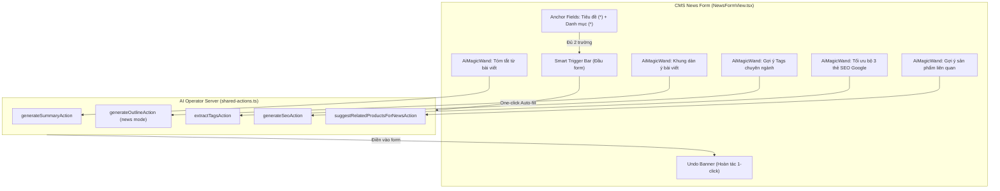

# Kế hoạch Triển khai AI Co-pilot cho Module Tin tức CMS

> **Mục tiêu:** Tích hợp trợ lý AI Co-pilot thông minh vào Form soạn thảo tin tức CMS ([`NewsFormView.tsx`](file:///d:/Workspace/CIC/old_page/cic-web/src/cms/modules/news/NewsFormView.tsx)) theo đúng kiến trúc và trải nghiệm thành công của module Sản phẩm: Smart Trigger Bar 1-click, Banner hoàn tác (Undo), và các Cây đũa thần độc lập (`AiMagicWand`).

---

## 1. Tổng quan Kiến trúc & Thành phần

---

## 2. Danh sách các File ảnh hưởng

| STT | File | Trách nhiệm |
| :---: | :--- | :--- |
| 1 | `src/features/ai-operator/server/shared-actions.ts` | Bổ sung Server Action `suggestRelatedProductsForNewsAction` và hoàn thiện prompt chuyên biệt cho bài viết tin tức. |
| 2 | `src/cms/modules/news/NewsFormView.tsx` | Tích hợp Smart Trigger Bar, Undo Banner, các `AiMagicWand` tại ô Tóm tắt, Khung bài viết, Thẻ Tags, Khối SEO, Sản phẩm liên quan, cùng state quản lý snapshot hoàn tác. |
| 3 | `scripts/verify-news-ai-copilot.ts` | Script kiểm thử tự động xác thực các server action AI hoạt động trơn tru với dữ liệu tin tức. |

---

## 3. Các bước triển khai chi tiết (Bite-sized Tasks)

### Task 1: Bổ sung AI Server Action cho Tin tức trong `shared-actions.ts`
- **Mục tiêu:** Bổ sung action `suggestRelatedProductsForNewsAction` để AI tự động đối chiếu tiêu đề/nội dung bài viết với danh mục sản phẩm CIC và trả về danh sách ID sản phẩm phù hợp nhất.
- **Chi tiết:**
  - Định nghĩa `SuggestRelatedProductsInput` (`title`, `content`, `availableProducts: Array<{ id: string | number; name: string }>`).
  - Sử dụng `getLlmProvider()` gọi Gemini Flash phân tích ngữ cảnh và chọn ra 1-4 sản phẩm thích hợp nhất (ví dụ bài về BIM -> gợi ý Revit, Cubicost, EnjiCAD; bài về địa kỹ thuật -> gợi ý Plaxis, GeoStudio).
  - Tối ưu hóa prompt `generateOutlineAction` khi `moduleType === 'news'` để tạo dàn bài báo chí/kỹ thuật chuẩn (1. Bối cảnh & Đặt vấn đề, 2. Giải pháp công nghệ cốt lõi, 3. Hiệu quả ứng dụng & Tương lai).

### Task 2: Tích hợp Smart Trigger Bar & Undo Banner vào `NewsFormView.tsx`
- **Mục tiêu:** Cung cấp trải nghiệm 1-click tự động điền toàn bộ các trường còn thiếu sau khi người dùng nhập Tiêu đề và chọn Danh mục.
- **Chi tiết:**
  - Định nghĩa state:
    * `isAnchorsReady = Boolean(title.trim()) && Boolean(categoryId)`
    * `hasAiAutoFilled` (boolean)
    * `isAutoFilling` (boolean)
    * `undoSnapshot` (lưu giá trị ban đầu của summary, tags, seo, relatedProducts)
  - Thêm Smart Trigger Bar ngay dưới Section 1 (Thông tin bài viết):
    * Khi chưa đủ: hiển thị đếm `(x/2)` trường bắt buộc.
    * Khi đủ: chuyển sang màu cam nổi bật kèm nút `✦ Gợi ý điền nhanh với AI`.
  - Hàm `handleSmartAutoFill`:
    * Chạy song song `Promise.all`: Tóm tắt + Thẻ Tags + Bộ 3 SEO + Gợi ý sản phẩm liên quan.
    * Chỉ cập nhật các trường đang trống (hoặc ghi đè an toàn có snapshot).
    * Giữ nguyên 100% hình ảnh và bài viết người dùng đã nhập.
  - Thêm Undo Banner thông báo hoàn tác với nút `Hoàn tác về ban đầu`.

### Task 3: Tích hợp các cây đũa thần `AiMagicWand` cục bộ
- **Mục tiêu:** Cho phép người dùng chỉnh sửa hoặc sinh lại từng trường riêng lẻ bất cứ lúc nào.
- **Chi tiết:**
  - **Đũa thần tại Tóm tắt (`summary`):**
    * Nút `Tóm tắt từ bài viết` — nếu đã có nội dung trong RichText thì tóm tắt từ nội dung; nếu chưa thì sinh tóm tắt từ tiêu đề.
  - **Đũa thần tại Trình soạn thảo (`content`):**
    * Nút `Khung dàn bài` — chèn template đề mục bài viết kỹ thuật vào CKEditor mà không làm mất nội dung trước đó (có confirm nếu đã có nội dung dài).
  - **Đũa thần tại ô Thẻ Tags (`tagsText`):**
    * Nút `Gợi ý Tags` — bóc tách các tag công nghệ ngắn gọn, ngăn cách bởi dấu phẩy.
  - **Đũa thần tại khối SEO (`seoTitle`, `seoDescription`, `seoKeyword`):**
    * Nút `Tối ưu SEO` — sinh trọn bộ 3 thẻ chuẩn Google Desktop/Mobile.
  - **Đũa thần tại khối Sản phẩm liên quan:**
    * Nút `Gợi ý sản phẩm` — tự động tích chọn các sản phẩm phù hợp.

### Task 4: Kiểm thử và xác thực thực tế
- **Mục tiêu:** Đảm bảo không có lỗi runtime, không gãy TypeScript và kiểm tra thực tế trên trình duyệt.
- **Chi tiết:**
  - Chạy script kiểm thử backend: `node --import tsx --conditions=react-server scripts/verify-news-ai-copilot.ts`.
  - Chạy `npm run typecheck:foundation`.
  - Kiểm tra trực quan trên giao diện CMS tại `http://localhost:3000/cms/news` (tạo tin tức mới, thử nhập tiêu đề -> kích hoạt Smart Trigger Bar -> bấm Tự động điền -> thử Hoàn tác -> thử từng cây đũa thần).

### Task 5: Thực hiện quy trình Git
- `git pull origin refactor/nextjs-fullstack`
- `git add .`
- `git commit -m "feat(cms-news): integrate AI co-pilot with smart auto-fill, undo banner, and individual magic wands"`
- `git pull origin refactor/nextjs-fullstack`
- `git push origin refactor/nextjs-fullstack`
